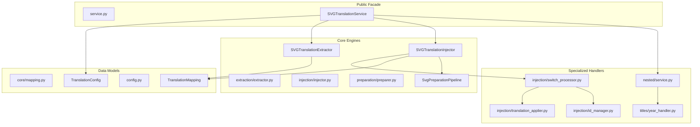
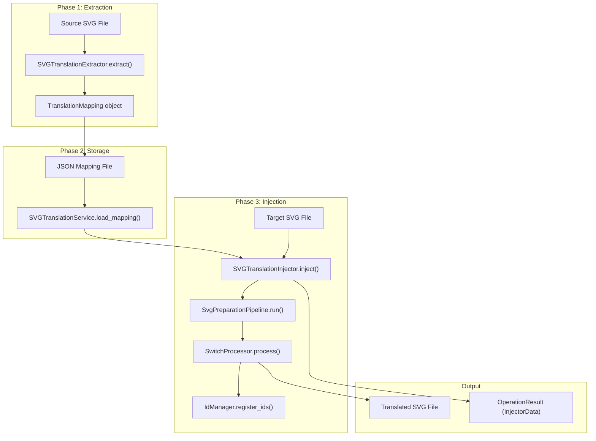

# Overview

> **Relevant source files**
>
> -   [CLAUDE.md](https://github.com/MrIbrahem/CopySVGTranslation/blob/d984a401/CLAUDE.md?plain=1)
> -   [CopySVGTranslation/**init**.py](https://github.com/MrIbrahem/CopySVGTranslation/blob/d984a401/CopySVGTranslation/__init__.py)
> -   [CopySVGTranslation/nested/**init**.py](https://github.com/MrIbrahem/CopySVGTranslation/blob/d984a401/CopySVGTranslation/nested/__init__.py)
> -   [README.md](https://github.com/MrIbrahem/CopySVGTranslation/blob/d984a401/README.md?plain=1)
> -   [requirements.txt](https://github.com/MrIbrahem/CopySVGTranslation/blob/d984a401/requirements.txt)

## Purpose and Scope

This document provides a high-level introduction to **CopySVGTranslation**, a Python library for managing multilingual content in SVG files. It covers the system's architecture, core workflows, and key capabilities. The tool is designed to automate the extraction of translation pairs from source SVGs and the injection of those translations into target SVGs, utilizing standard SVG `<switch>` elements and `systemLanguage` attributes.

**Sources:** [README.md L1-L13](https://github.com/MrIbrahem/CopySVGTranslation/blob/d984a401/README.md?plain=1#L1-L13)

[CLAUDE.md L5-L8](https://github.com/MrIbrahem/CopySVGTranslation/blob/d984a401/CLAUDE.md?plain=1#L5-L8)

## What is CopySVGTranslation?

CopySVGTranslation is a tool that extracts translation pairs from multilingual SVG files and applies them to other SVG files by inserting or updating `<text systemLanguage="XX">` elements within `<switch>` blocks. The system enables efficient management of multilingual SVG content by:

-   **Extracting** existing translations from source SVG files into a structured `TranslationMapping` [CopySVGTranslation/core/mapping.py L46-L51](https://github.com/MrIbrahem/CopySVGTranslation/blob/d984a401/CopySVGTranslation/core/mapping.py#L46-L51)
-   **Injecting** translations from mappings into target SVG files using the `SVGTranslationInjector` [CopySVGTranslation/injection/injector.py L24-L26](https://github.com/MrIbrahem/CopySVGTranslation/blob/d984a401/CopySVGTranslation/injection/injector.py#L24-L26)
-   **Tracking** which languages are present and which are newly added via `InjectorStats` [CopySVGTranslation/injection/injector.py L12-L21](https://github.com/MrIbrahem/CopySVGTranslation/blob/d984a401/CopySVGTranslation/injection/injector.py#L12-L21)
-   **Normalizing** SVG structure to ensure proper translation support through a sequential `PreparationStep` pipeline [CopySVGTranslation/preparation/preparer.py L12-L25](https://github.com/MrIbrahem/CopySVGTranslation/blob/d984a401/CopySVGTranslation/preparation/preparer.py#L12-L25)
-   **Validating** and fixing nested element issues (e.g., nested `<tspan>` or `<a>` tags) that prevent reliable translation [CopySVGTranslation/nested/service.py L13-L18](https://github.com/MrIbrahem/CopySVGTranslation/blob/d984a401/CopySVGTranslation/nested/service.py#L13-L18)

The tool requires **Python 3.10+** and depends primarily on **lxml** for XML parsing and manipulation.

**Sources:** [README.md L1-L30](https://github.com/MrIbrahem/CopySVGTranslation/blob/d984a401/README.md?plain=1#L1-L30)

[requirements.txt L1](https://github.com/MrIbrahem/CopySVGTranslation/blob/d984a401/requirements.txt#L1-L1)

[CLAUDE.md L29-L32](https://github.com/MrIbrahem/CopySVGTranslation/blob/d984a401/CLAUDE.md?plain=1#L29-L32)

## System Architecture

CopySVGTranslation is organized into a modular pipeline coordinated by a central facade, the `SVGTranslationService`. The following diagram maps these components to their implementation in code:

### Code Entity Mapping



**Sources:** [CLAUDE.md L29-L54](https://github.com/MrIbrahem/CopySVGTranslation/blob/d984a401/CLAUDE.md?plain=1#L29-L54)

[CopySVGTranslation/service.py L31-L48](https://github.com/MrIbrahem/CopySVGTranslation/blob/d984a401/CopySVGTranslation/service.py#L31-L48)

[CopySVGTranslation/**init**.py L10-L19](https://github.com/MrIbrahem/CopySVGTranslation/blob/d984a401/CopySVGTranslation/__init__.py#L10-L19)

### Module Organization

| Module              | Primary Entity            | Purpose                                                                                                                                                                                                                               |
| ------------------- | ------------------------- | ------------------------------------------------------------------------------------------------------------------------------------------------------------------------------------------------------------------------------------- |
| **Service Facade**  | `SVGTranslationService`   | High-level API for extraction, injection, and preparation [CopySVGTranslation/service.py L31-L48](https://github.com/MrIbrahem/CopySVGTranslation/blob/d984a401/CopySVGTranslation/service.py#L31-L48)                                |
| **Extraction**      | `SVGTranslationExtractor` | Parses SVGs to build `TranslationMapping` objects [CopySVGTranslation/extraction/extractor.py L28-L35](https://github.com/MrIbrahem/CopySVGTranslation/blob/d984a401/CopySVGTranslation/extraction/extractor.py#L28-L35)              |
| **Injection**       | `SVGTranslationInjector`  | The main engine for applying translations to SVGs [CopySVGTranslation/injection/injector.py L24-L26](https://github.com/MrIbrahem/CopySVGTranslation/blob/d984a401/CopySVGTranslation/injection/injector.py#L24-L26)                  |
| **Preparation**     | `SvgPreparationPipeline`  | Normalizes SVG structure (IDs, language tags) before injection [CopySVGTranslation/preparation/preparer.py L12-L25](https://github.com/MrIbrahem/CopySVGTranslation/blob/d984a401/CopySVGTranslation/preparation/preparer.py#L12-L25) |
| **Nested Handling** | `NestedStructureService`  | Detects and flattens nested `<tspan>` structures [CopySVGTranslation/nested/service.py L13-L18](https://github.com/MrIbrahem/CopySVGTranslation/blob/d984a401/CopySVGTranslation/nested/service.py#L13-L18)                           |
| **Year Handling**   | `YearHandler`             | Manages title translations containing 4-digit years [CopySVGTranslation/titles/year_handler.py L11-L18](https://github.com/MrIbrahem/CopySVGTranslation/blob/d984a401/CopySVGTranslation/titles/year_handler.py#L11-L18)              |

**Sources:** [CLAUDE.md L43-L54](https://github.com/MrIbrahem/CopySVGTranslation/blob/d984a401/CLAUDE.md?plain=1#L43-L54)

[CopySVGTranslation/**init**.py L21-L31](https://github.com/MrIbrahem/CopySVGTranslation/blob/d984a401/CopySVGTranslation/__init__.py#L21-L31)

## Translation Workflow

The system implements a multi-phase pipeline that separates extraction, data storage, and injection. This diagram shows the data flow between the primary code entities:

### Data Flow Diagram



**Sources:** [CLAUDE.md L57-L61](https://github.com/MrIbrahem/CopySVGTranslation/blob/d984a401/CLAUDE.md?plain=1#L57-L61)

[CopySVGTranslation/service.py L82-L92](https://github.com/MrIbrahem/CopySVGTranslation/blob/d984a401/CopySVGTranslation/service.py#L82-L92)

[CopySVGTranslation/injection/injector.py L64-L88](https://github.com/MrIbrahem/CopySVGTranslation/blob/d984a401/CopySVGTranslation/injection/injector.py#L64-L88)

## Key Features

### High-Level Facade (SVGTranslationService)

The service facade provides a unified interface for all operations, returning `OperationResult` objects that encapsulate success status, data, statistics, and warnings [CopySVGTranslation/service.py L31-L48](https://github.com/MrIbrahem/CopySVGTranslation/blob/d984a401/CopySVGTranslation/service.py#L31-L48)

This prevents lower-level exceptions from crashing the application and provides consistent error reporting [README.md L97-L120](https://github.com/MrIbrahem/CopySVGTranslation/blob/d984a401/README.md?plain=1#L97-L120)

### Configuration (TranslationConfig)

Users can control the behavior of the translation engine via `TranslationConfig`, which includes settings for:

-   `case_insensitive` matching [CopySVGTranslation/config.py L16](https://github.com/MrIbrahem/CopySVGTranslation/blob/d984a401/CopySVGTranslation/config.py#L16-L16)
-   `overwrite_translations` behavior [CopySVGTranslation/config.py L17](https://github.com/MrIbrahem/CopySVGTranslation/blob/d984a401/CopySVGTranslation/config.py#L17-L17)
-   `pretty_print` output [CopySVGTranslation/config.py L18](https://github.com/MrIbrahem/CopySVGTranslation/blob/d984a401/CopySVGTranslation/config.py#L18-L18)
-   `nested_strategy` (e.g., "raise", "flatten", "ignore") [CopySVGTranslation/config.py L19](https://github.com/MrIbrahem/CopySVGTranslation/blob/d984a401/CopySVGTranslation/config.py#L19-L19)

### Statistics and Tracking

The `InjectorStats` class tracks the outcome of injection operations, including `inserted_translations`, `updated_translations`, and `skipped_translations` [CopySVGTranslation/injection/injector.py L12-L21](https://github.com/MrIbrahem/CopySVGTranslation/blob/d984a401/CopySVGTranslation/injection/injector.py#L12-L21)

It also identifies `new_languages` added during the process [CopySVGTranslation/injection/injector.py L20](https://github.com/MrIbrahem/CopySVGTranslation/blob/d984a401/CopySVGTranslation/injection/injector.py#L20-L20)

### Nested Structure Repair

The `NestedStructureService` allows developers to analyze and repair problematic SVG structures where `<tspan>` or `<a>` elements are nested in ways that interfere with standard translation workflows [CopySVGTranslation/nested/service.py L13-L18](https://github.com/MrIbrahem/CopySVGTranslation/blob/d984a401/CopySVGTranslation/nested/service.py#L13-L18)

**Sources:** [README.md L82-L92](https://github.com/MrIbrahem/CopySVGTranslation/blob/d984a401/README.md?plain=1#L82-L92)

[CopySVGTranslation/config.py L11-L25](https://github.com/MrIbrahem/CopySVGTranslation/blob/d984a401/CopySVGTranslation/config.py#L11-L25)

[CopySVGTranslation/service.py L186-L215](https://github.com/MrIbrahem/CopySVGTranslation/blob/d984a401/CopySVGTranslation/service.py#L186-L215)

## Data Model

The primary data structure is the `TranslationMapping`, which organizes translations into specific namespaces:

```python
@dataclassclass TranslationMapping:    new: dict[str, dict[str, str]]     # source text -> lang -> translation    tspans_by_id: dict[str, str]       # tspan id -> text content    title_new: dict[str, Any]          # new-format title translations    meta: dict[str, Any]               # metadata and diagnostics
```

The system uses a JSON format for persistence, primarily utilizing the `new` key to map normalized source text to language-specific variants [CopySVGTranslation/core/mapping.py L46-L51](https://github.com/MrIbrahem/CopySVGTranslation/blob/d984a401/CopySVGTranslation/core/mapping.py#L46-L51)

**Sources:** [CLAUDE.md L64-L73](https://github.com/MrIbrahem/CopySVGTranslation/blob/d984a401/CLAUDE.md?plain=1#L64-L73)

[CopySVGTranslation/core/mapping.py L31-L56](https://github.com/MrIbrahem/CopySVGTranslation/blob/d984a401/CopySVGTranslation/core/mapping.py#L31-L56)

## Next Steps

-   **To get started**: See [Installation](https://github.com/MrIbrahem/CopySVGTranslation/blob/d984a401/Installation) and [Quick Start Tutorial](https://github.com/MrIbrahem/CopySVGTranslation/blob/d984a401/Quick Start Tutorial)
-   **To understand core concepts**: See [Core Concepts](https://github.com/MrIbrahem/CopySVGTranslation/blob/d984a401/Core Concepts)
-   **For complete API documentation**: See [API Reference](https://github.com/MrIbrahem/CopySVGTranslation/blob/d984a401/API Reference)
