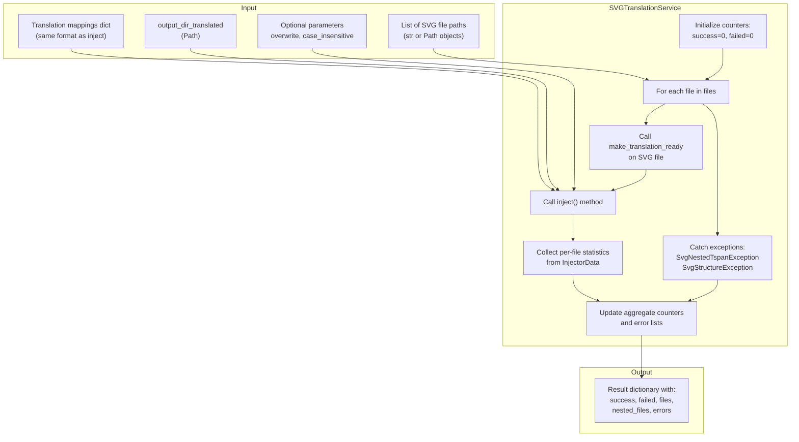
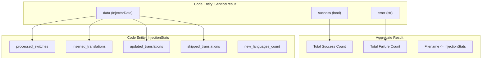
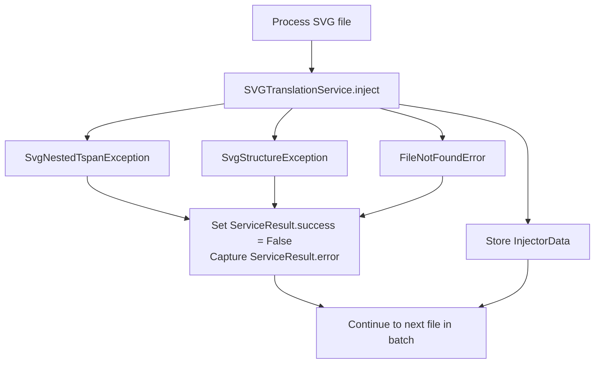
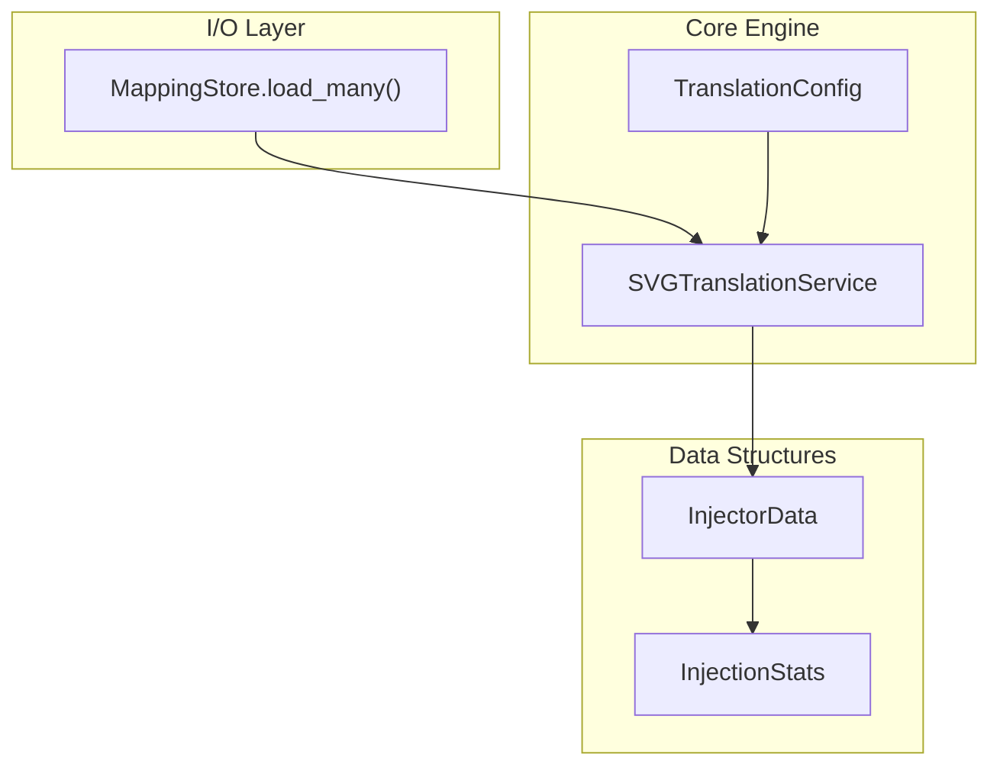

# Batch Processing

> **Relevant source files**
> * [tests/e2e/injection/test_inject_extended.py](https://github.com/MrIbrahem/CopySVGTranslation/blob/d984a401/tests/e2e/injection/test_inject_extended.py)
> * [tests/e2e/svg_translate/test_svgtranslate.py](https://github.com/MrIbrahem/CopySVGTranslation/blob/d984a401/tests/e2e/svg_translate/test_svgtranslate.py)
> * [tests/e2e/svg_translate/test_svgtranslate_extended.py](https://github.com/MrIbrahem/CopySVGTranslation/blob/d984a401/tests/e2e/svg_translate/test_svgtranslate_extended.py)
> * [tests/e2e/test_additional.py](https://github.com/MrIbrahem/CopySVGTranslation/blob/d984a401/tests/e2e/test_additional.py)
> * [tests/e2e/test_full.py](https://github.com/MrIbrahem/CopySVGTranslation/blob/d984a401/tests/e2e/test_full.py)

This page documents the batch processing capabilities provided by the `start_injects` function, which enables efficient translation injection across multiple SVG files in a single operation. For information about injecting translations into a single SVG file, see [Injection](/MrIbrahem/CopySVGTranslation/4.2-injection). For the combined extraction and injection workflow, see [Combined Workflow](/MrIbrahem/CopySVGTranslation/4.3-combined-workflow).

## Overview

The batch processing system allows translation mappings to be applied to multiple SVG files simultaneously. This is particularly useful when translating large sets of related SVG files, such as chart series or diagram collections. The system processes each file independently, tracks per-file statistics, handles errors gracefully, and provides detailed aggregate metrics.

**Sources:** [tests/e2e/svg_translate/test_svgtranslate_extended.py L111-L152](https://github.com/MrIbrahem/CopySVGTranslation/blob/d984a401/tests/e2e/svg_translate/test_svgtranslate_extended.py#L111-L152)

 [tests/e2e/svg_translate/test_svgtranslate.py L121-L173](https://github.com/MrIbrahem/CopySVGTranslation/blob/d984a401/tests/e2e/svg_translate/test_svgtranslate.py#L121-L173)

## The start_injects Function

The `start_injects` function is the primary entry point for batch processing operations. It leverages the `SVGTranslationService` to iterate through file lists and apply mappings.



**Function Signature:**

```markdown
# Typically invoked via the service or helper wrappersservice.inject(    svg_path: Union[str, Path],    mapping: Union[dict, TranslationMapping],    output: Optional[Union[str, Path]] = None,    save: bool = False) -> ServiceResult
```

While `start_injects` acts as a high-level wrapper, the core logic resides in `SVGTranslationService.inject`, which returns a `ServiceResult` containing `InjectorData`.

**Sources:** [tests/e2e/svg_translate/test_svgtranslate.py L142-L147](https://github.com/MrIbrahem/CopySVGTranslation/blob/d984a401/tests/e2e/svg_translate/test_svgtranslate.py#L142-L147)

 [tests/e2e/test_full.py L31-L36](https://github.com/MrIbrahem/CopySVGTranslation/blob/d984a401/tests/e2e/test_full.py#L31-L36)

## Batch Statistics and Tracking

The batch processing logic aggregates data from the `InjectorData` class, which holds an `InjectionStats` object for every file processed.



**Key Statistics Fields:**

| Key | Description |
| --- | --- |
| `processed_switches` | Number of `<switch>` blocks examined in the file |
| `inserted_translations` | New language variants added to the SVG |
| `updated_translations` | Existing translations modified (requires `overwrite` parameter) |
| `skipped_translations` | Translations not applied because they already existed |
| `all_languages_count` | Total count of languages in the file after injection |

**Sources:** [tests/e2e/svg_translate/test_svgtranslate.py L153-L161](https://github.com/MrIbrahem/CopySVGTranslation/blob/d984a401/tests/e2e/svg_translate/test_svgtranslate.py#L153-L161)

 [tests/e2e/test_full.py L85-L92](https://github.com/MrIbrahem/CopySVGTranslation/blob/d984a401/tests/e2e/test_full.py#L85-L92)

## Error Handling in Batch Mode

The system is designed to handle structural anomalies in SVG files without crashing the entire batch. If a file fails validation or injection, the `ServiceResult.success` flag is set to `False`, and the error is captured.



**Handled Exceptions:**

1. **`SvgNestedTspanException`**: Triggered when the preparation pipeline detects tspans inside other tspans, which breaks the standard translation model.
2. **`SvgStructureException`**: Triggered when the SVG lacks the expected `switch/text/tspan` hierarchy required for injection.
3. **Path Validation**: The service checks if the provided path is a directory instead of a file.

**Sources:** [tests/e2e/svg_translate/test_svgtranslate_extended.py L104-L110](https://github.com/MrIbrahem/CopySVGTranslation/blob/d984a401/tests/e2e/svg_translate/test_svgtranslate_extended.py#L104-L110)

 [tests/e2e/injection/test_inject_extended.py L32-L46](https://github.com/MrIbrahem/CopySVGTranslation/blob/d984a401/tests/e2e/injection/test_inject_extended.py#L32-L46)

## Usage Patterns

### Basic Batch Workflow

The standard way to process multiple files is to iterate through a list and use the `SVGTranslationService`.

```javascript
from CopySVGTranslation import SVGTranslationServicefrom CopySVGTranslation.io.mapping_store import MappingStore service = SVGTranslationService()store = MappingStore() # Load multiple mapping files into one combined mappingmapping = store.load_many(["map1.json", "map2.json"]) files = ["file1.svg", "file2.svg"]results = {} for f in files:    res = service.inject(svg_path=f, mapping=mapping, output=f"out_{f}", save=True)    results[f] = res
```

**Sources:** [tests/e2e/svg_translate/test_svgtranslate_extended.py L141-L145](https://github.com/MrIbrahem/CopySVGTranslation/blob/d984a401/tests/e2e/svg_translate/test_svgtranslate_extended.py#L141-L145)

 [tests/e2e/test_full.py L23-L36](https://github.com/MrIbrahem/CopySVGTranslation/blob/d984a401/tests/e2e/test_full.py#L23-L36)

### Dry-Run Batching

To validate translations against a batch of files without writing to disk, set `save=False`. This allows inspecting the `InjectionStats` before committing changes.

```markdown
result = service.inject(    svg_path="target.svg",    mapping=my_mapping,    save=False)# result.data.tree contains the modified XML in memory# result.data.inject_stats contains the metrics
```

**Sources:** [tests/e2e/test_full.py L58-L62](https://github.com/MrIbrahem/CopySVGTranslation/blob/d984a401/tests/e2e/test_full.py#L58-L62)

 [tests/e2e/svg_translate/test_svgtranslate.py L174-L183](https://github.com/MrIbrahem/CopySVGTranslation/blob/d984a401/tests/e2e/svg_translate/test_svgtranslate.py#L174-L183)

## Integration with Other Components

The batch processing logic sits at the intersection of the I/O layer and the core injection engine.



**Component Roles:**

* **`MappingStore`**: Responsible for aggregating multiple JSON mapping files into a single dictionary structure compatible with the injector.
* **`TranslationConfig`**: Controls the behavior of the batch (e.g., `case_insensitive` matching).
* **`ServiceResult`**: The standardized container for both successful data and error messages.

**Sources:** [tests/e2e/svg_translate/test_svgtranslate_extended.py L141-L148](https://github.com/MrIbrahem/CopySVGTranslation/blob/d984a401/tests/e2e/svg_translate/test_svgtranslate_extended.py#L141-L148)

 [tests/e2e/test_full.py L9-L13](https://github.com/MrIbrahem/CopySVGTranslation/blob/d984a401/tests/e2e/test_full.py#L9-L13)