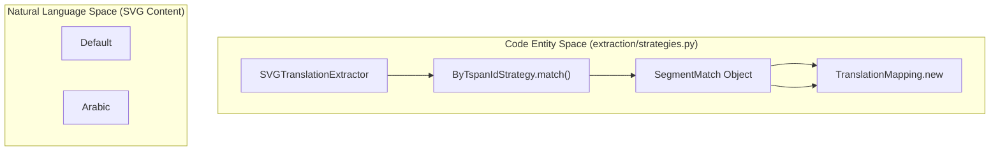
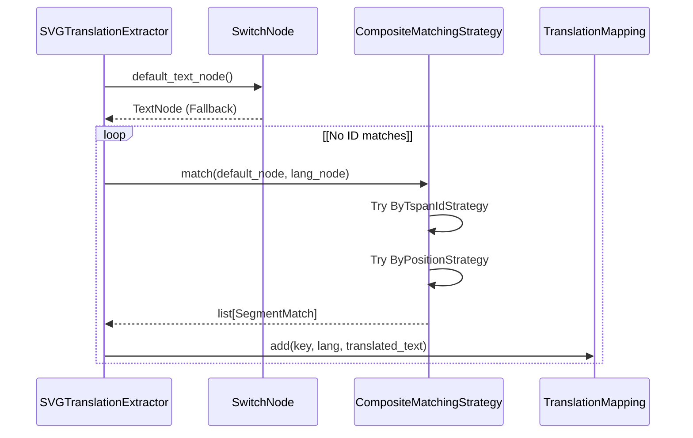

# Matching Strategies

> **Relevant source files**
> * [CopySVGTranslation/core/__init__.py](https://github.com/MrIbrahem/CopySVGTranslation/blob/d984a401/CopySVGTranslation/core/__init__.py)
> * [CopySVGTranslation/core/models.py](https://github.com/MrIbrahem/CopySVGTranslation/blob/d984a401/CopySVGTranslation/core/models.py)
> * [CopySVGTranslation/core/switch_node.py](https://github.com/MrIbrahem/CopySVGTranslation/blob/d984a401/CopySVGTranslation/core/switch_node.py)
> * [CopySVGTranslation/extraction/extractor.py](https://github.com/MrIbrahem/CopySVGTranslation/blob/d984a401/CopySVGTranslation/extraction/extractor.py)
> * [CopySVGTranslation/extraction/strategies.py](https://github.com/MrIbrahem/CopySVGTranslation/blob/d984a401/CopySVGTranslation/extraction/strategies.py)
> * [tests/unit/extraction/test_extractor_header.py](https://github.com/MrIbrahem/CopySVGTranslation/blob/d984a401/tests/unit/extraction/test_extractor_header.py)
> * [tests/unit/extraction/test_svg_extractor_class.py](https://github.com/MrIbrahem/CopySVGTranslation/blob/d984a401/tests/unit/extraction/test_svg_extractor_class.py)

Matching strategies define how the system correlates translated text segments with their corresponding default (fallback) text within an SVG `<switch>` element during the extraction phase. These strategies ensure that when a translation is found for a specific language, it is correctly mapped to the original English (or default) key in the `TranslationMapping` [CopySVGTranslation/extraction/extractor.py L41-L90](https://github.com/MrIbrahem/CopySVGTranslation/blob/d984a401/CopySVGTranslation/extraction/extractor.py#L41-L90)

## SegmentMatch Data Structure

The `SegmentMatch` class is the primary data structure used to represent a successful correlation between a source text and its translation [CopySVGTranslation/extraction/strategies.py L14-L20](https://github.com/MrIbrahem/CopySVGTranslation/blob/d984a401/CopySVGTranslation/extraction/strategies.py#L14-L20)

| Attribute | Type | Description |
| --- | --- | --- |
| `default_text` | `str` | The normalized text from the fallback `<text>` element. |
| `translated_text` | `str` | The normalized text from the language-specific `<text>` element. |
| `default_id` | `str \| None` | The base ID extracted from the default `tspan`. |
| `translated_id` | `str \| None` | The full ID of the translated `tspan`. |

**Sources:** [CopySVGTranslation/extraction/strategies.py L14-L20](https://github.com/MrIbrahem/CopySVGTranslation/blob/d984a401/CopySVGTranslation/extraction/strategies.py#L14-L20)

## Matching Strategy Implementation

All strategies implement the `MatchingStrategy` abstract base class [CopySVGTranslation/extraction/strategies.py L23-L41](https://github.com/MrIbrahem/CopySVGTranslation/blob/d984a401/CopySVGTranslation/extraction/strategies.py#L23-L41)

 The `SVGTranslationExtractor` uses these strategies inside its `_process_switch` loop to populate the `TranslationMapping` [CopySVGTranslation/extraction/extractor.py L78-L90](https://github.com/MrIbrahem/CopySVGTranslation/blob/d984a401/CopySVGTranslation/extraction/extractor.py#L78-L90)

### ByTspanIdStrategy

This is the **preferred strategy** [CopySVGTranslation/extraction/strategies.py L44-L46](https://github.com/MrIbrahem/CopySVGTranslation/blob/d984a401/CopySVGTranslation/extraction/strategies.py#L44-L46)

 It assumes that translated `tspan` elements follow a naming convention where the ID includes the base ID of the default element plus a language suffix (e.g., `trsvg12` $\rightarrow$ `trsvg12-ar`) [CopySVGTranslation/extraction/strategies.py L48-L49](https://github.com/MrIbrahem/CopySVGTranslation/blob/d984a401/CopySVGTranslation/extraction/strategies.py#L48-L49)

* **Logic**: It splits IDs by hyphens (`-`) or underscores (`_`) to find a "base" ID [CopySVGTranslation/extraction/strategies.py L70-L73](https://github.com/MrIbrahem/CopySVGTranslation/blob/d984a401/CopySVGTranslation/extraction/strategies.py#L70-L73)
* **Matching**: It builds a map of `base_id` $\rightarrow$ `default_text` and then looks up that base ID for every translated `tspan` found [CopySVGTranslation/extraction/strategies.py L76-L93](https://github.com/MrIbrahem/CopySVGTranslation/blob/d984a401/CopySVGTranslation/extraction/strategies.py#L76-L93)

### ByPositionStrategy

This serves as a **fallback strategy** when IDs are missing, inconsistent, or do not follow the expected naming convention [CopySVGTranslation/extraction/strategies.py L96-L98](https://github.com/MrIbrahem/CopySVGTranslation/blob/d984a401/CopySVGTranslation/extraction/strategies.py#L96-L98)

* **Logic**: It matches segments strictly by their index order within the `<text>` element [CopySVGTranslation/extraction/strategies.py L100-L101](https://github.com/MrIbrahem/CopySVGTranslation/blob/d984a401/CopySVGTranslation/extraction/strategies.py#L100-L101)
* **Matching**: `default_tspans[i]` is matched with `translated_tspans[i]` [CopySVGTranslation/extraction/strategies.py L118-L127](https://github.com/MrIbrahem/CopySVGTranslation/blob/d984a401/CopySVGTranslation/extraction/strategies.py#L118-L127)

### CompositeMatchingStrategy

The `CompositeMatchingStrategy` acts as a coordinator. It holds a list of strategies (by default: `ByTspanIdStrategy` followed by `ByPositionStrategy`) and executes them in order [CopySVGTranslation/extraction/strategies.py L130-L140](https://github.com/MrIbrahem/CopySVGTranslation/blob/d984a401/CopySVGTranslation/extraction/strategies.py#L130-L140)

 It returns the results from the first strategy that successfully finds matches [CopySVGTranslation/extraction/strategies.py L149-L157](https://github.com/MrIbrahem/CopySVGTranslation/blob/d984a401/CopySVGTranslation/extraction/strategies.py#L149-L157)

**Sources:** [CopySVGTranslation/extraction/strategies.py L44-L166](https://github.com/MrIbrahem/CopySVGTranslation/blob/d984a401/CopySVGTranslation/extraction/strategies.py#L44-L166)

 [CopySVGTranslation/extraction/extractor.py L36-L37](https://github.com/MrIbrahem/CopySVGTranslation/blob/d984a401/CopySVGTranslation/extraction/extractor.py#L36-L37)

## Data Flow: From SVG to SegmentMatch

The following diagram illustrates how the `SVGTranslationExtractor` uses `MatchingStrategy` to bridge the gap between XML elements and the internal `SegmentMatch` representation.

**Matching Logic Flow**

**Sources:** [CopySVGTranslation/extraction/extractor.py L78-L90](https://github.com/MrIbrahem/CopySVGTranslation/blob/d984a401/CopySVGTranslation/extraction/extractor.py#L78-L90)

 [CopySVGTranslation/extraction/strategies.py L57-L93](https://github.com/MrIbrahem/CopySVGTranslation/blob/d984a401/CopySVGTranslation/extraction/strategies.py#L57-L93)

## Extraction Sequence

This diagram shows the interaction between the `SVGTranslationExtractor`, the `SwitchNode` domain model, and the `MatchingStrategy`.

**Extraction Sequence Diagram**

**Sources:** [CopySVGTranslation/extraction/extractor.py L41-L90](https://github.com/MrIbrahem/CopySVGTranslation/blob/d984a401/CopySVGTranslation/extraction/extractor.py#L41-L90)

 [CopySVGTranslation/extraction/strategies.py L149-L157](https://github.com/MrIbrahem/CopySVGTranslation/blob/d984a401/CopySVGTranslation/extraction/strategies.py#L149-L157)

 [CopySVGTranslation/core/switch_node.py L34-L36](https://github.com/MrIbrahem/CopySVGTranslation/blob/d984a401/CopySVGTranslation/core/switch_node.py#L34-L36)

## Known Edge Cases

| Scenario | Behavior | Source |
| --- | --- | --- |
| **Empty Tspans** | Tspans with no text or only whitespace are ignored during matching. | [strategies.py L68-L69](https://github.com/MrIbrahem/CopySVGTranslation/blob/d984a401/strategies.py#L68-L69) |
| **Mismatched Tspan Counts** | `ByPositionStrategy` stops matching once the shorter list of tspans (default vs translated) is exhausted. | [strategies.py L119-L120](https://github.com/MrIbrahem/CopySVGTranslation/blob/d984a401/strategies.py#L119-L120) |
| **Case Sensitivity** | Keys are normalized (lowercased by default) based on `TranslationConfig.case_insensitive`. | [extractor.py L66-L68](https://github.com/MrIbrahem/CopySVGTranslation/blob/d984a401/extractor.py#L66-L68) |
| **Missing IDs** | If IDs are missing, `ByTspanIdStrategy` returns no matches, triggering the `ByPositionStrategy` fallback in the composite pipeline. | [strategies.py L149-L157](https://github.com/MrIbrahem/CopySVGTranslation/blob/d984a401/strategies.py#L149-L157) |

**Sources:** [CopySVGTranslation/extraction/strategies.py L68-L157](https://github.com/MrIbrahem/CopySVGTranslation/blob/d984a401/CopySVGTranslation/extraction/strategies.py#L68-L157)

 [CopySVGTranslation/extraction/extractor.py L66-L68](https://github.com/MrIbrahem/CopySVGTranslation/blob/d984a401/CopySVGTranslation/extraction/extractor.py#L66-L68)