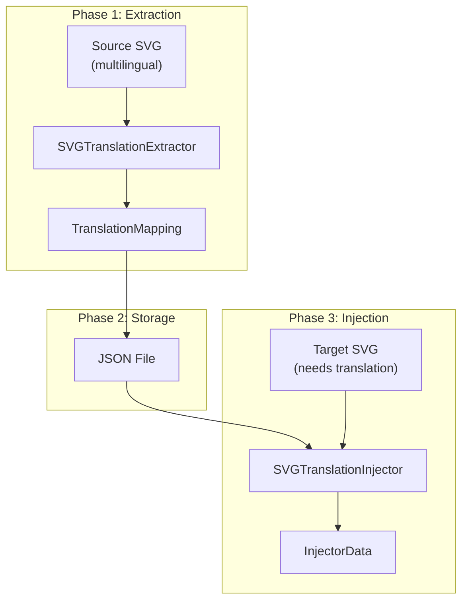
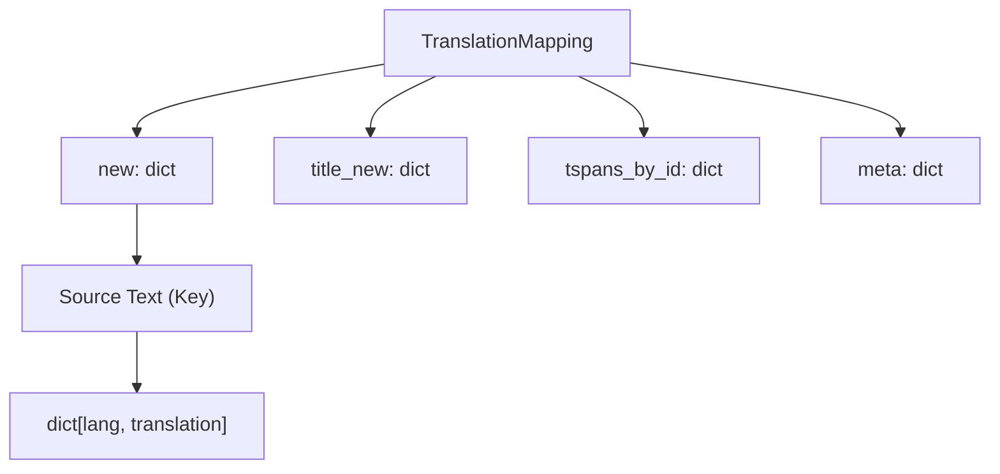
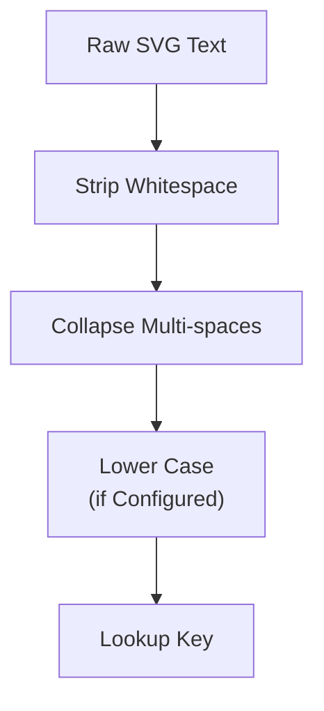

# Core Concepts

> **Relevant source files**
> * [CLAUDE.md](https://github.com/MrIbrahem/CopySVGTranslation/blob/d984a401/CLAUDE.md?plain=1)
> * [CopySVGTranslation/core/mapping.py](https://github.com/MrIbrahem/CopySVGTranslation/blob/d984a401/CopySVGTranslation/core/mapping.py)
> * [CopySVGTranslation/result.py](https://github.com/MrIbrahem/CopySVGTranslation/blob/d984a401/CopySVGTranslation/result.py)
> * [README.md](https://github.com/MrIbrahem/CopySVGTranslation/blob/d984a401/README.md?plain=1)
> * [requirements.txt](https://github.com/MrIbrahem/CopySVGTranslation/blob/d984a401/requirements.txt)

This page explains the fundamental concepts underlying the CopySVGTranslation system. It covers the three-phase translation workflow, the JSON data structure used for translation mappings, the language tracking system that identifies newly added translations, and the text normalization process that ensures reliable matching between source and target text.

For practical usage examples, see [Quick Start Tutorial](/MrIbrahem/CopySVGTranslation/2.2-quick-start-tutorial). For detailed API documentation of the functions discussed here, see [API Reference](/MrIbrahem/CopySVGTranslation/6-api-reference).

## SVG Translation Workflow

The CopySVGTranslation system operates through a pipeline that separates concerns between extraction, storage, and injection of translations. The high-level orchestration is handled by the `SVGTranslationService` facade [CopySVGTranslation/service.py L45-L51](https://github.com/MrIbrahem/CopySVGTranslation/blob/d984a401/CopySVGTranslation/service.py#L45-L51)

### Three-Phase Pipeline

**Sources:** [README.md L8-L20](https://github.com/MrIbrahem/CopySVGTranslation/blob/d984a401/README.md?plain=1#L8-L20)

 [CopySVGTranslation/service.py L31-L55](https://github.com/MrIbrahem/CopySVGTranslation/blob/d984a401/CopySVGTranslation/service.py#L31-L55)

### Phase 1: Extraction

The `SVGTranslationExtractor` parses a source SVG and locates `<switch>` elements. It correlates "default" text (no `systemLanguage`) with translated variants.

1. **Parsing**: Uses `lxml` to load the SVG [CopySVGTranslation/extraction/extractor.py L46-L47](https://github.com/MrIbrahem/CopySVGTranslation/blob/d984a401/CopySVGTranslation/extraction/extractor.py#L46-L47)
2. **Matching**: Correlates text segments using strategies like `ByPositionStrategy` or `ByTspanIdStrategy` [CLAUDE.md L54](https://github.com/MrIbrahem/CopySVGTranslation/blob/d984a401/CLAUDE.md?plain=1#L54-L54)
3. **Mapping**: Produces a `TranslationMapping` object [CopySVGTranslation/core/mapping.py L26-L44](https://github.com/MrIbrahem/CopySVGTranslation/blob/d984a401/CopySVGTranslation/core/mapping.py#L26-L44)

**Sources:** [CopySVGTranslation/extraction/extractor.py L1-L20](https://github.com/MrIbrahem/CopySVGTranslation/blob/d984a401/CopySVGTranslation/extraction/extractor.py#L1-L20)

 [CLAUDE.md L46](https://github.com/MrIbrahem/CopySVGTranslation/blob/d984a401/CLAUDE.md?plain=1#L46-L46)

### Phase 2: Storage

Translations are persisted as JSON. The `TranslationMapping` class provides `to_json()` and `from_any()` methods to handle serialization [CopySVGTranslation/core/mapping.py L49-L65](https://github.com/MrIbrahem/CopySVGTranslation/blob/d984a401/CopySVGTranslation/core/mapping.py#L49-L65)

 [CopySVGTranslation/core/mapping.py L149-L157](https://github.com/MrIbrahem/CopySVGTranslation/blob/d984a401/CopySVGTranslation/core/mapping.py#L149-L157)

**Sources:** [CopySVGTranslation/core/mapping.py L107-L118](https://github.com/MrIbrahem/CopySVGTranslation/blob/d984a401/CopySVGTranslation/core/mapping.py#L107-L118)

### Phase 3: Injection

The `SVGTranslationInjector` applies mappings to a target SVG.

1. **Preparation**: Runs `SvgPreparationPipeline` to normalize language tags and wrap naked `<text>` nodes in `<switch>` elements [CLAUDE.md L51](https://github.com/MrIbrahem/CopySVGTranslation/blob/d984a401/CLAUDE.md?plain=1#L51-L51)
2. **Processing**: The `SwitchProcessor` iterates through elements, matching source text and delegating to `TranslationApplier` [CLAUDE.md L48-L49](https://github.com/MrIbrahem/CopySVGTranslation/blob/d984a401/CLAUDE.md?plain=1#L48-L49)
3. **ID Management**: The `IdManager` ensures newly inserted nodes have unique XML IDs [CLAUDE.md L50](https://github.com/MrIbrahem/CopySVGTranslation/blob/d984a401/CLAUDE.md?plain=1#L50-L50)

**Sources:** [CopySVGTranslation/injection/injector.py L1-L40](https://github.com/MrIbrahem/CopySVGTranslation/blob/d984a401/CopySVGTranslation/injection/injector.py#L1-L40)

 [CLAUDE.md L47-L50](https://github.com/MrIbrahem/CopySVGTranslation/blob/d984a401/CLAUDE.md?plain=1#L47-L50)

## Translation Data Format

The system uses the `TranslationMapping` dataclass to represent the relationship between source strings and their translations.

### Data Structure Schema

**Sources:** [CopySVGTranslation/core/mapping.py L26-L44](https://github.com/MrIbrahem/CopySVGTranslation/blob/d984a401/CopySVGTranslation/core/mapping.py#L26-L44)

| Attribute | Type | Purpose |
| --- | --- | --- |
| `new` | `dict[str, dict[str, str]]` | Primary mapping: Source text -> {Lang: Translation} [CopySVGTranslation/core/mapping.py L40](https://github.com/MrIbrahem/CopySVGTranslation/blob/d984a401/CopySVGTranslation/core/mapping.py#L40-L40) |
| `title_new` | `dict[str, dict[str, str]]` | Specialized mappings for titles containing years [CopySVGTranslation/core/mapping.py L41](https://github.com/MrIbrahem/CopySVGTranslation/blob/d984a401/CopySVGTranslation/core/mapping.py#L41-L41) |
| `tspans_by_id` | `dict[str, str]` | Diagnostic map linking XML IDs to their default text [CopySVGTranslation/core/mapping.py L42](https://github.com/MrIbrahem/CopySVGTranslation/blob/d984a401/CopySVGTranslation/core/mapping.py#L42-L42) |
| `meta` | `dict[str, Any]` | Stores processing metadata and non-fatal errors [CopySVGTranslation/core/mapping.py L43](https://github.com/MrIbrahem/CopySVGTranslation/blob/d984a401/CopySVGTranslation/core/mapping.py#L43-L43) |

### Merge Logic

The `TranslationMapping.merge()` method allows combining multiple mappings, preventing duplicate translations while aggregating data across different source files [CopySVGTranslation/core/mapping.py L107-L145](https://github.com/MrIbrahem/CopySVGTranslation/blob/d984a401/CopySVGTranslation/core/mapping.py#L107-L145)

## Language Tracking

The system monitors language presence to provide detailed reporting via `InjectorStats` [CopySVGTranslation/core/mapping.py L161-L171](https://github.com/MrIbrahem/CopySVGTranslation/blob/d984a401/CopySVGTranslation/core/mapping.py#L161-L171)

### Metrics and Identification

The system tracks several key metrics during the injection process:

* **`languages_before` / `languages_after`**: List of ISO codes present in the file before and after the operation [CopySVGTranslation/core/mapping.py L170-L171](https://github.com/MrIbrahem/CopySVGTranslation/blob/d984a401/CopySVGTranslation/core/mapping.py#L170-L171)
* **`new_languages_count`**: Number of languages added that were not previously in the SVG [CopySVGTranslation/core/mapping.py L163](https://github.com/MrIbrahem/CopySVGTranslation/blob/d984a401/CopySVGTranslation/core/mapping.py#L163-L163)
* **`inserted_translations` vs `updated_translations`**: Distinguishes between creating a new `systemLanguage` node and modifying an existing one [CopySVGTranslation/core/mapping.py L166-L168](https://github.com/MrIbrahem/CopySVGTranslation/blob/d984a401/CopySVGTranslation/core/mapping.py#L166-L168)

**Sources:** [CopySVGTranslation/core/mapping.py L161-L191](https://github.com/MrIbrahem/CopySVGTranslation/blob/d984a401/CopySVGTranslation/core/mapping.py#L161-L191)

## Text Normalization

Reliable matching depends on `normalize_text()`, which ensures that minor formatting differences in SVG source code do not break the translation lookup [CLAUDE.md L54](https://github.com/MrIbrahem/CopySVGTranslation/blob/d984a401/CLAUDE.md?plain=1#L54-L54)

### Normalization Workflow

**Sources:** [CopySVGTranslation/core/mapping.py L84-L94](https://github.com/MrIbrahem/CopySVGTranslation/blob/d984a401/CopySVGTranslation/core/mapping.py#L84-L94)

1. **Whitespace Handling**: Leading/trailing spaces are removed; internal tabs and newlines are collapsed.
2. **Case Sensitivity**: Controlled by `TranslationConfig.case_insensitive`. If enabled, the `TranslationMapping.lookup()` method converts both the query and the keys to lowercase for comparison [CopySVGTranslation/core/mapping.py L84-L94](https://github.com/MrIbrahem/CopySVGTranslation/blob/d984a401/CopySVGTranslation/core/mapping.py#L84-L94)

**Sources:** [CopySVGTranslation/core/mapping.py L103-L105](https://github.com/MrIbrahem/CopySVGTranslation/blob/d984a401/CopySVGTranslation/core/mapping.py#L103-L105)

 [README.md L43-L50](https://github.com/MrIbrahem/CopySVGTranslation/blob/d984a401/README.md?plain=1#L43-L50)