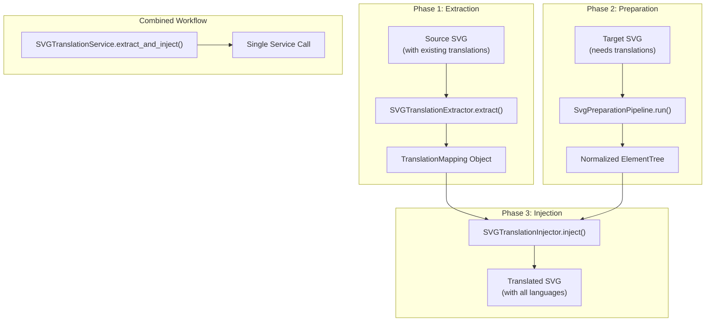
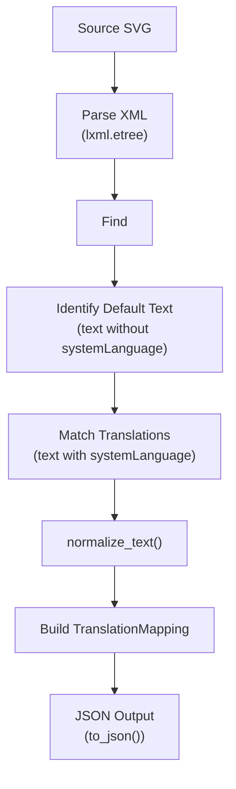
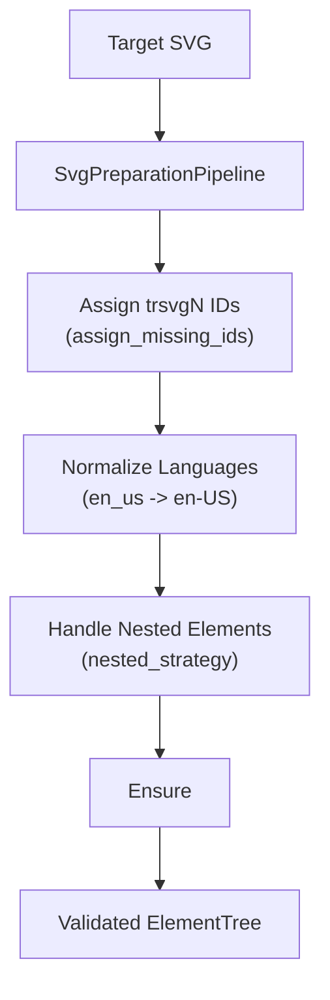
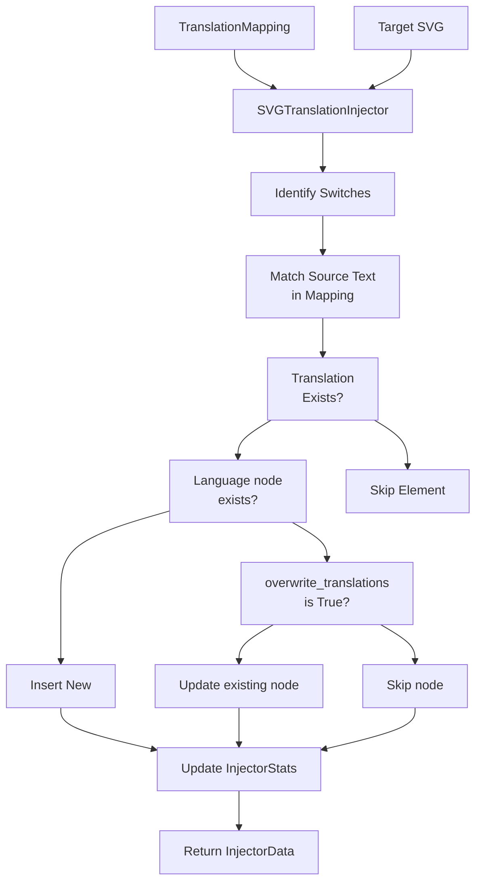

# SVG Translation Workflow

> **Relevant source files**
> * [CLAUDE.md](https://github.com/MrIbrahem/CopySVGTranslation/blob/d984a401/CLAUDE.md?plain=1)
> * [CopySVGTranslation/config.py](https://github.com/MrIbrahem/CopySVGTranslation/blob/d984a401/CopySVGTranslation/config.py)
> * [README.md](https://github.com/MrIbrahem/CopySVGTranslation/blob/d984a401/README.md?plain=1)
> * [requirements.txt](https://github.com/MrIbrahem/CopySVGTranslation/blob/d984a401/requirements.txt)
> * [tests/e2e/injection/test_inject2.py](https://github.com/MrIbrahem/CopySVGTranslation/blob/d984a401/tests/e2e/injection/test_inject2.py)
> * [tests/e2e/preparation/test_make_translation_ready.py](https://github.com/MrIbrahem/CopySVGTranslation/blob/d984a401/tests/e2e/preparation/test_make_translation_ready.py)
> * [tests/e2e/test_manual_workflows.py](https://github.com/MrIbrahem/CopySVGTranslation/blob/d984a401/tests/e2e/test_manual_workflows.py)

## Purpose and Scope

This document describes the **three-phase workflow** that CopySVGTranslation uses to transfer multilingual translations between SVG files. The workflow consists of: (1) **extraction** of translations from source SVGs into structured JSON, (2) **preparation** of target SVGs to ensure proper structure, and (3) **injection** of translations into target SVGs.

The high-level orchestration is handled by the `SVGTranslationService` facade [CopySVGTranslation/service.py L31-L35](https://github.com/MrIbrahem/CopySVGTranslation/blob/d984a401/CopySVGTranslation/service.py#L31-L35)

 which provides a unified interface for these operations.

---

## Workflow Overview

The translation process is divided into three distinct phases that can be executed independently or combined into a single operation. Each phase has a well-defined input and output, allowing for intermediate inspection, modification, or storage of translation data.



**Sources:** [README.md L8-L20](https://github.com/MrIbrahem/CopySVGTranslation/blob/d984a401/README.md?plain=1#L8-L20)

 [CLAUDE.md L31-L32](https://github.com/MrIbrahem/CopySVGTranslation/blob/d984a401/CLAUDE.md?plain=1#L31-L32)

 [CLAUDE.md L57-L61](https://github.com/MrIbrahem/CopySVGTranslation/blob/d984a401/CLAUDE.md?plain=1#L57-L61)

---

## Phase 1: Extraction

The **extraction phase** reads a source SVG file that contains existing translations and converts them into a structured `TranslationMapping` object [CLAUDE.md L68-L73](https://github.com/MrIbrahem/CopySVGTranslation/blob/d984a401/CLAUDE.md?plain=1#L68-L73)

 This phase is implemented by the `SVGTranslationExtractor` class [CLAUDE.md L46](https://github.com/MrIbrahem/CopySVGTranslation/blob/d984a401/CLAUDE.md?plain=1#L46-L46)

### Extraction Process



**Sources:** [CLAUDE.md L46](https://github.com/MrIbrahem/CopySVGTranslation/blob/d984a401/CLAUDE.md?plain=1#L46-L46)

 [CopySVGTranslation/config.py L17-L18](https://github.com/MrIbrahem/CopySVGTranslation/blob/d984a401/CopySVGTranslation/config.py#L17-L18)

 [tests/e2e/test_manual_workflows.py L123-L151](https://github.com/MrIbrahem/CopySVGTranslation/blob/d984a401/tests/e2e/test_manual_workflows.py#L123-L151)

### Key Characteristics

* **Input:** SVG file containing `<switch>` elements with `systemLanguage` attributes [README.md L8](https://github.com/MrIbrahem/CopySVGTranslation/blob/d984a401/README.md?plain=1#L8-L8)
* **Output:** `TranslationMapping` object, which can be serialized to JSON via `to_json()` [CLAUDE.md L68-L73](https://github.com/MrIbrahem/CopySVGTranslation/blob/d984a401/CLAUDE.md?plain=1#L68-L73)
* **Normalization:** By default, text is normalized (whitespace collapsed) and treated as case-insensitive based on `TranslationConfig.case_insensitive` [CopySVGTranslation/config.py L17-L18](https://github.com/MrIbrahem/CopySVGTranslation/blob/d984a401/CopySVGTranslation/config.py#L17-L18)
* **Structure:** The resulting mapping stores data in the `new` dictionary, where the key is the normalized source text [CLAUDE.md L69](https://github.com/MrIbrahem/CopySVGTranslation/blob/d984a401/CLAUDE.md?plain=1#L69-L69)

---

## Phase 2: Preparation

The **preparation phase** validates and normalizes the structure of target SVG files before injection. This is handled by the `SvgPreparationPipeline` [CopySVGTranslation/preparation/preparer.py](https://github.com/MrIbrahem/CopySVGTranslation/blob/d984a401/CopySVGTranslation/preparation/preparer.py)

### Preparation Activities



**Sources:** [CopySVGTranslation/config.py L63-L70](https://github.com/MrIbrahem/CopySVGTranslation/blob/d984a401/CopySVGTranslation/config.py#L63-L70)

 [tests/e2e/preparation/test_make_translation_ready.py L16-L25](https://github.com/MrIbrahem/CopySVGTranslation/blob/d984a401/tests/e2e/preparation/test_make_translation_ready.py#L16-L25)

 [CLAUDE.md L51](https://github.com/MrIbrahem/CopySVGTranslation/blob/d984a401/CLAUDE.md?plain=1#L51-L51)

### Critical Structural Checks

1. **Nested Elements:** The pipeline checks for nested `<tspan>` or `<a>` elements. Behavior is governed by `TranslationConfig.nested_strategy`, which can `flatten`, `split_nested_tspans`, or `raise` an error [CopySVGTranslation/config.py L28-L34](https://github.com/MrIbrahem/CopySVGTranslation/blob/d984a401/CopySVGTranslation/config.py#L28-L34)
2. **Duplicate Languages:** The pipeline raises `SvgStructureError` if multiple `<text>` elements within the same `<switch>` share a `systemLanguage` [tests/e2e/injection/test_inject2.py L104-L123](https://github.com/MrIbrahem/CopySVGTranslation/blob/d984a401/tests/e2e/injection/test_inject2.py#L104-L123)
3. **Unique IDs:** Automatically assigns `trsvgN` IDs to translatable nodes if `assign_missing_ids` is enabled [CopySVGTranslation/config.py L66-L67](https://github.com/MrIbrahem/CopySVGTranslation/blob/d984a401/CopySVGTranslation/config.py#L66-L67)

---

## Phase 3: Injection

The **injection phase** applies translations from a `TranslationMapping` into a target SVG. This is coordinated by `SVGTranslationInjector` [CLAUDE.md L47](https://github.com/MrIbrahem/CopySVGTranslation/blob/d984a401/CLAUDE.md?plain=1#L47-L47)

### Injection Process Flow



**Sources:** [CLAUDE.md L47-L50](https://github.com/MrIbrahem/CopySVGTranslation/blob/d984a401/CLAUDE.md?plain=1#L47-L50)

 [CopySVGTranslation/config.py L21-L22](https://github.com/MrIbrahem/CopySVGTranslation/blob/d984a401/CopySVGTranslation/config.py#L21-L22)

 [tests/e2e/injection/test_inject2.py L45-L81](https://github.com/MrIbrahem/CopySVGTranslation/blob/d984a401/tests/e2e/injection/test_inject2.py#L45-L81)

### Code Entity Mapping

| Component | Class/Function | Responsibility |
| --- | --- | --- |
| **Orchestrator** | `SVGTranslationInjector` | Coordinates preparation and switch processing [CLAUDE.md L47](https://github.com/MrIbrahem/CopySVGTranslation/blob/d984a401/CLAUDE.md?plain=1#L47-L47) |
| **Switch Processor** | `switch_processor.py` | Matches source text within `<switch>` blocks [CLAUDE.md L48](https://github.com/MrIbrahem/CopySVGTranslation/blob/d984a401/CLAUDE.md?plain=1#L48-L48) |
| **Applier** | `translation_applier.py` | Performs the actual XML insertion/modification [CLAUDE.md L49](https://github.com/MrIbrahem/CopySVGTranslation/blob/d984a401/CLAUDE.md?plain=1#L49-L49) |
| **ID Manager** | `id_manager.py` | Prevents ID collisions during new node creation [CLAUDE.md L50](https://github.com/MrIbrahem/CopySVGTranslation/blob/d984a401/CLAUDE.md?plain=1#L50-L50) |

**Sources:** [CLAUDE.md L47-L50](https://github.com/MrIbrahem/CopySVGTranslation/blob/d984a401/CLAUDE.md?plain=1#L47-L50)

---

## End-to-End Workflow Execution

The `SVGTranslationService` allows executing the entire flow with a single method call.

### Usage Pattern

```javascript
from CopySVGTranslation import SVGTranslationService, TranslationConfig service = SVGTranslationService(TranslationConfig(overwrite_translations=True)) # Combined Extraction and Injectionresult = service.extract_and_inject(    source="source.svg",    output="target.svg",    save=True)
```

**Sources:** [README.md L41-L66](https://github.com/MrIbrahem/CopySVGTranslation/blob/d984a401/README.md?plain=1#L41-L66)

 [CopySVGTranslation/service.py L31-L35](https://github.com/MrIbrahem/CopySVGTranslation/blob/d984a401/CopySVGTranslation/service.py#L31-L35)

### Result Tracking

Every operation returns an `OperationResult` [README.md L97-L110](https://github.com/MrIbrahem/CopySVGTranslation/blob/d984a401/README.md?plain=1#L97-L110)

 For injection workflows, this includes `InjectorStats`:

* `inserted_translations`: Count of new language nodes added [README.md L63](https://github.com/MrIbrahem/CopySVGTranslation/blob/d984a401/README.md?plain=1#L63-L63)
* `updated_translations`: Count of existing nodes modified [README.md L64](https://github.com/MrIbrahem/CopySVGTranslation/blob/d984a401/README.md?plain=1#L64-L64)
* `skipped_translations`: Count of translations found but not applied due to config [README.md L65](https://github.com/MrIbrahem/CopySVGTranslation/blob/d984a401/README.md?plain=1#L65-L65)

**Sources:** [README.md L63-L65](https://github.com/MrIbrahem/CopySVGTranslation/blob/d984a401/README.md?plain=1#L63-L65)

 [README.md L116](https://github.com/MrIbrahem/CopySVGTranslation/blob/d984a401/README.md?plain=1#L116-L116)