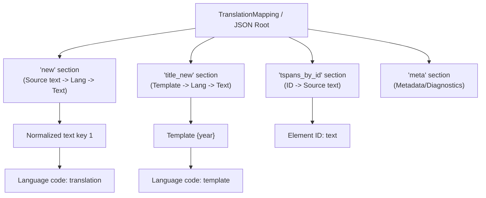
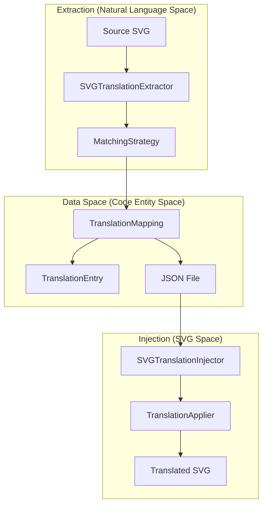
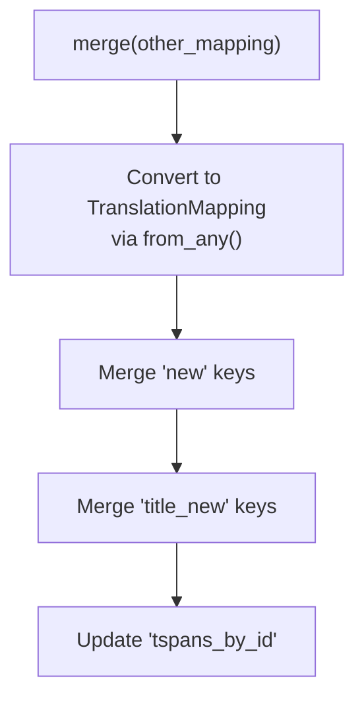

# Translation Data Format

> **Relevant source files**
> * [CopySVGTranslation/core/mapping.py](https://github.com/MrIbrahem/CopySVGTranslation/blob/d984a401/CopySVGTranslation/core/mapping.py)
> * [CopySVGTranslation/result.py](https://github.com/MrIbrahem/CopySVGTranslation/blob/d984a401/CopySVGTranslation/result.py)
> * [docs/refactor/README.md](https://github.com/MrIbrahem/CopySVGTranslation/blob/d984a401/docs/refactor/README.md?plain=1)
> * [docs/refactor/core.md](https://github.com/MrIbrahem/CopySVGTranslation/blob/d984a401/docs/refactor/core.md?plain=1)
> * [docs/refactor/injection.md](https://github.com/MrIbrahem/CopySVGTranslation/blob/d984a401/docs/refactor/injection.md?plain=1)
> * [tests/e2e/injection/test_language_tracking.py](https://github.com/MrIbrahem/CopySVGTranslation/blob/d984a401/tests/e2e/injection/test_language_tracking.py)
> * [tests/unit/core/test_mapping.py](https://github.com/MrIbrahem/CopySVGTranslation/blob/d984a401/tests/unit/core/test_mapping.py)

This document describes the JSON data structure used by CopySVGTranslation to store translation mappings between source text and translated variants. This format serves as an intermediate representation between the extraction and injection phases of the translation workflow.

For information about the extraction process that generates this format, see [Extraction](/MrIbrahem/CopySVGTranslation/4.1-extraction). For details on how this data is consumed during injection, see [Injection](/MrIbrahem/CopySVGTranslation/4.2-injection). For the overall workflow, see [SVG Translation Workflow](/MrIbrahem/CopySVGTranslation/3.1-svg-translation-workflow).

## Overview of the JSON Structure

The translation data is encapsulated in the `TranslationMapping` class [CopySVGTranslation/core/mapping.py L26-L44](https://github.com/MrIbrahem/CopySVGTranslation/blob/d984a401/CopySVGTranslation/core/mapping.py#L26-L44)

 The modern format organizes translations under specific keys to allow for future extensibility and metadata tracking.



**Sources:** [CopySVGTranslation/core/mapping.py L26-L44](https://github.com/MrIbrahem/CopySVGTranslation/blob/d984a401/CopySVGTranslation/core/mapping.py#L26-L44)

 [CopySVGTranslation/core/mapping.py L149-L157](https://github.com/MrIbrahem/CopySVGTranslation/blob/d984a401/CopySVGTranslation/core/mapping.py#L149-L157)

## The "new" Section: Primary Translation Mappings

The `new` attribute of `TranslationMapping` contains the core translation data [CopySVGTranslation/core/mapping.py L40](https://github.com/MrIbrahem/CopySVGTranslation/blob/d984a401/CopySVGTranslation/core/mapping.py#L40-L40)

 It is a nested dictionary where:

1. **First level keys** are normalized source text strings.
2. **Second level keys** are language codes (e.g., `"ar"`, `"fr"`).
3. **Values** are the translated strings.

### Normalization and Lookup

Source text keys are typically normalized to ensure consistent matching. By default, the `lookup` method and `add` method support case-insensitive matching by converting keys to lowercase [CopySVGTranslation/core/mapping.py L84-L94](https://github.com/MrIbrahem/CopySVGTranslation/blob/d984a401/CopySVGTranslation/core/mapping.py#L84-L94)

 [CopySVGTranslation/core/mapping.py L103-L105](https://github.com/MrIbrahem/CopySVGTranslation/blob/d984a401/CopySVGTranslation/core/mapping.py#L103-L105)

### Example: Basic Translation Mapping

```json
{  "new": {    "hello": {      "ar": "مرحبا",      "fr": "Bonjour"    },    "population in 2020": {      "ar": "السكان في عام 2020"    }  }}
```

**Sources:** [CopySVGTranslation/core/mapping.py L40](https://github.com/MrIbrahem/CopySVGTranslation/blob/d984a401/CopySVGTranslation/core/mapping.py#L40-L40)

 [CopySVGTranslation/core/mapping.py L84-L105](https://github.com/MrIbrahem/CopySVGTranslation/blob/d984a401/CopySVGTranslation/core/mapping.py#L84-L105)

## Data Flow: Extraction to Injection

The following diagram illustrates how the `TranslationMapping` object bridges the extraction and injection phases.



**Sources:** [docs/refactor/README.md L64-L84](https://github.com/MrIbrahem/CopySVGTranslation/blob/d984a401/docs/refactor/README.md?plain=1#L64-L84)

 [docs/refactor/core.md L42-L60](https://github.com/MrIbrahem/CopySVGTranslation/blob/d984a401/docs/refactor/core.md?plain=1#L42-L60)

 [CopySVGTranslation/core/mapping.py L96-L98](https://github.com/MrIbrahem/CopySVGTranslation/blob/d984a401/CopySVGTranslation/core/mapping.py#L96-L98)

## Backward Compatibility and Factory Methods

The system uses `TranslationMapping.from_any()` to handle various input formats, including raw dictionaries [CopySVGTranslation/core/mapping.py L49-L65](https://github.com/MrIbrahem/CopySVGTranslation/blob/d984a401/CopySVGTranslation/core/mapping.py#L49-L65)

### Legacy Format Handling

While the modern format prefers the `"new"` key, the system is designed to be resilient. If a dictionary is passed without the expected top-level keys, the factory method initializes an empty mapping [CopySVGTranslation/core/mapping.py L59-L64](https://github.com/MrIbrahem/CopySVGTranslation/blob/d984a401/CopySVGTranslation/core/mapping.py#L59-L64)

| Format Type | Logic | Data Access |
| --- | --- | --- |
| **Modern** | `new` key present | `mapping.new` |
| **Legacy** | Flat dict | Handled via `from_any` |

**Sources:** [CopySVGTranslation/core/mapping.py L49-L65](https://github.com/MrIbrahem/CopySVGTranslation/blob/d984a401/CopySVGTranslation/core/mapping.py#L49-L65)

 [tests/unit/core/test_mapping.py L94-L99](https://github.com/MrIbrahem/CopySVGTranslation/blob/d984a401/tests/unit/core/test_mapping.py#L94-L99)

## The "title_new" Section: Year-Suffix Templates

The `title_new` section stores templates for text containing year suffixes (e.g., "Population {year}") [CopySVGTranslation/core/mapping.py L41](https://github.com/MrIbrahem/CopySVGTranslation/blob/d984a401/CopySVGTranslation/core/mapping.py#L41-L41)

 This allows the system to apply translations to different years using a single template.

### Structure

```json
{  "title_new": {    "population {year}": {      "ar": "السكان {year}",      "fr": "Population {year}"    }  }}
```

**Sources:** [CopySVGTranslation/core/mapping.py L41](https://github.com/MrIbrahem/CopySVGTranslation/blob/d984a401/CopySVGTranslation/core/mapping.py#L41-L41)

 [CopySVGTranslation/core/mapping.py L113](https://github.com/MrIbrahem/CopySVGTranslation/blob/d984a401/CopySVGTranslation/core/mapping.py#L113-L113)

 [CopySVGTranslation/core/mapping.py L139-L141](https://github.com/MrIbrahem/CopySVGTranslation/blob/d984a401/CopySVGTranslation/core/mapping.py#L139-L141)

## The "tspans_by_id" Section: Element ID Tracking

The `tspans_by_id` section maps specific SVG element IDs to their source text [CopySVGTranslation/core/mapping.py L42](https://github.com/MrIbrahem/CopySVGTranslation/blob/d984a401/CopySVGTranslation/core/mapping.py#L42-L42)

 This is primarily used for diagnostic purposes to track which element provided which source string during extraction.

### Structure

```json
{  "tspans_by_id": {    "trsvg1": "Text content",    "tspan45": "Another string"  }}
```

**Sources:** [CopySVGTranslation/core/mapping.py L42](https://github.com/MrIbrahem/CopySVGTranslation/blob/d984a401/CopySVGTranslation/core/mapping.py#L42-L42)

 [CopySVGTranslation/core/mapping.py L112](https://github.com/MrIbrahem/CopySVGTranslation/blob/d984a401/CopySVGTranslation/core/mapping.py#L112-L112)

 [CopySVGTranslation/core/mapping.py L144-L145](https://github.com/MrIbrahem/CopySVGTranslation/blob/d984a401/CopySVGTranslation/core/mapping.py#L144-L145)

## Merging Mappings

The `TranslationMapping.merge()` method allows combining multiple translation sources [CopySVGTranslation/core/mapping.py L107-L147](https://github.com/MrIbrahem/CopySVGTranslation/blob/d984a401/CopySVGTranslation/core/mapping.py#L107-L147)

 It performs a deep merge on the `new` and `title_new` dictionaries, ensuring that existing translations are not overwritten unless specified by the merge logic.

### Merge Logic Flow



**Sources:** [CopySVGTranslation/core/mapping.py L107-L147](https://github.com/MrIbrahem/CopySVGTranslation/blob/d984a401/CopySVGTranslation/core/mapping.py#L107-L147)

 [tests/unit/core/test_mapping.py L204-L225](https://github.com/MrIbrahem/CopySVGTranslation/blob/d984a401/tests/unit/core/test_mapping.py#L204-L225)

## Language Tracking and Statistics

When translations are injected, the system tracks changes using the `InjectorStats` class [CopySVGTranslation/core/mapping.py L161-L192](https://github.com/MrIbrahem/CopySVGTranslation/blob/d984a401/CopySVGTranslation/core/mapping.py#L161-L192)

### Tracked Metrics

* `all_languages_count`: Total languages in the SVG after injection.
* `new_languages_count`: Number of languages added during the current operation.
* `inserted_translations`: Count of new `<text>` elements created.
* `updated_translations`: Count of existing translations modified.
* `languages_before` / `languages_after`: Lists of language codes present before and after the operation.

**Sources:** [CopySVGTranslation/core/mapping.py L161-L171](https://github.com/MrIbrahem/CopySVGTranslation/blob/d984a401/CopySVGTranslation/core/mapping.py#L161-L171)

 [tests/e2e/injection/test_language_tracking.py L41-L44](https://github.com/MrIbrahem/CopySVGTranslation/blob/d984a401/tests/e2e/injection/test_language_tracking.py#L41-L44)