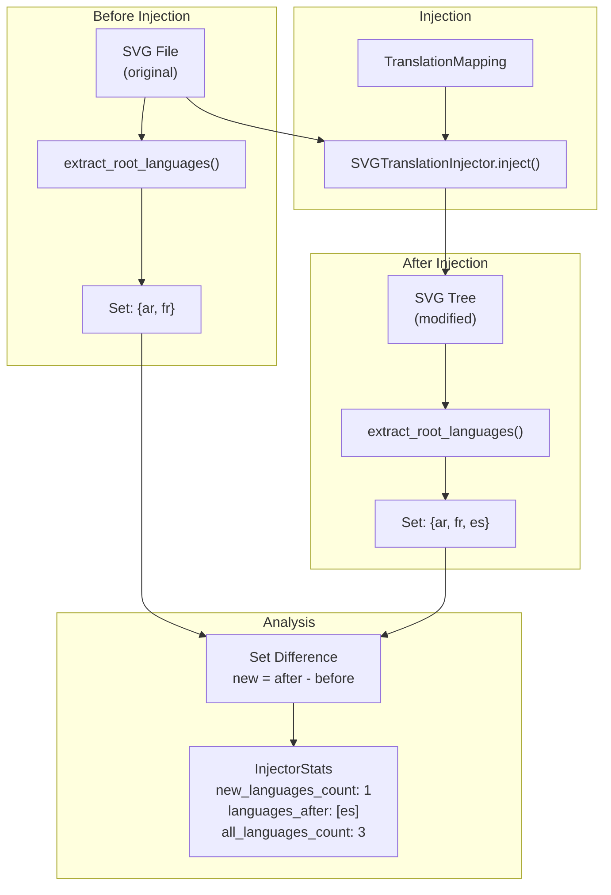
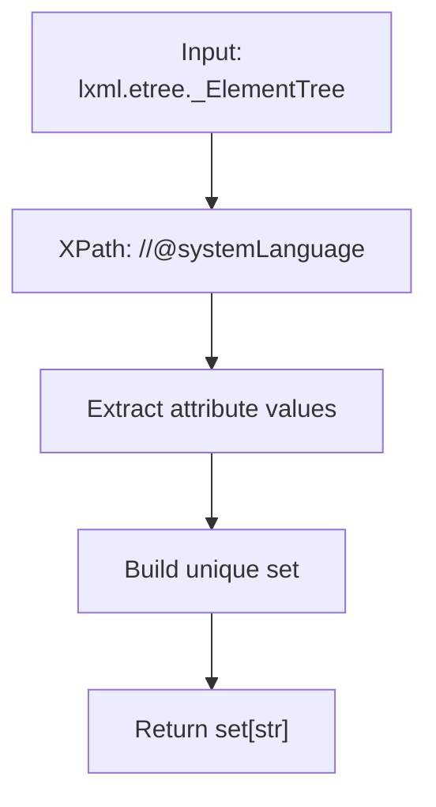
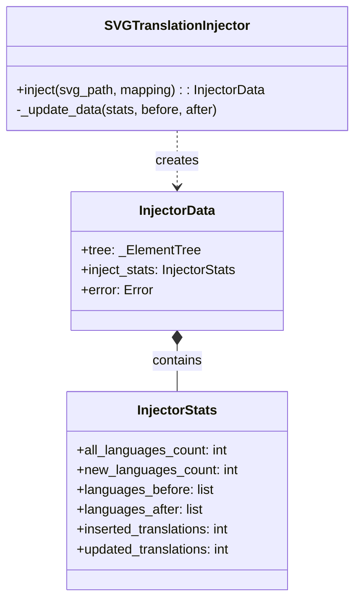

# Language Tracking

> **Relevant source files**
>
> -   [CopySVGTranslation/core/mapping.py](https://github.com/MrIbrahem/CopySVGTranslation/blob/d984a401/CopySVGTranslation/core/mapping.py)
> -   [CopySVGTranslation/injection/injector.py](https://github.com/MrIbrahem/CopySVGTranslation/blob/d984a401/CopySVGTranslation/injection/injector.py)
> -   [CopySVGTranslation/result.py](https://github.com/MrIbrahem/CopySVGTranslation/blob/d984a401/CopySVGTranslation/result.py)
> -   [tests/unit/injection/test_svg_injector_class.py](https://github.com/MrIbrahem/CopySVGTranslation/blob/d984a401/tests/unit/injection/test_svg_injector_class.py)

## Purpose and Scope

This document explains how CopySVGTranslation tracks which languages are present in SVG files and identifies newly added translations versus updates to existing translations. The language tracking system provides detailed metrics about translation coverage and changes, enabling users to monitor and validate their translation workflows through the `InjectorStats` class.

For information about the injection process itself and how translations are applied, see [Injection](/MrIbrahem/CopySVGTranslation/4.2-injection). For details on the translation data format, see [Translation Data Format](/MrIbrahem/CopySVGTranslation/3.2-translation-data-format).

---

## Overview

The language tracking system serves two primary purposes:

1. **Language Discovery**: Identify which language codes are present in an SVG file by scanning `systemLanguage` attributes.
2. **Change Detection**: Compare language sets before and after injection to distinguish between newly added languages and updates to existing translations.

This distinction is critical because updating an existing Arabic translation is fundamentally different from adding support for a new language. The system provides accurate metrics for both scenarios via the `SVGTranslationInjector`.

### System Logic Flow



**Sources**: [CopySVGTranslation/injection/injector.py L114-L115](https://github.com/MrIbrahem/CopySVGTranslation/blob/d984a401/CopySVGTranslation/injection/injector.py#L114-L115)

[CopySVGTranslation/injection/injector.py L133-L134](https://github.com/MrIbrahem/CopySVGTranslation/blob/d984a401/CopySVGTranslation/injection/injector.py#L133-L134)

[CopySVGTranslation/injection/injector.py L184-L203](https://github.com/MrIbrahem/CopySVGTranslation/blob/d984a401/CopySVGTranslation/injection/injector.py#L184-L203)

---

## The extract_root_languages Function

The `extract_root_languages` utility (found in `utils.xml`) is the core function for extracting language information from SVG roots. It scans the SVG XML structure for all elements with `systemLanguage` attributes and returns the set of unique language codes.

### Function Implementation

The function identifies languages by executing an XPath query for the `systemLanguage` attribute across the entire document tree.



**Sources**: [CopySVGTranslation/injection/injector.py L21](https://github.com/MrIbrahem/CopySVGTranslation/blob/d984a401/CopySVGTranslation/injection/injector.py#L21-L21)

[CopySVGTranslation/injection/injector.py L114](https://github.com/MrIbrahem/CopySVGTranslation/blob/d984a401/CopySVGTranslation/injection/injector.py#L114-L114)

[CopySVGTranslation/injection/injector.py L133](https://github.com/MrIbrahem/CopySVGTranslation/blob/d984a401/CopySVGTranslation/injection/injector.py#L133-L133)

---

## Language Statistics in Injection

When the `inject()` method of `SVGTranslationInjector` is called, it populates an `InjectorStats` object which is returned as part of the `InjectorData` result [CopySVGTranslation/injection/injector.py L66-L70](https://github.com/MrIbrahem/CopySVGTranslation/blob/d984a401/CopySVGTranslation/injection/injector.py#L66-L70)

### InjectorStats Structure

The `InjectorStats` class tracks the following language-related fields:

| Attribute             | Type        | Description                                                                                                                                                                                                      |
| --------------------- | ----------- | ---------------------------------------------------------------------------------------------------------------------------------------------------------------------------------------------------------------- |
| `all_languages_count` | `int`       | Total unique languages in the SVG after injection [CopySVGTranslation/core/mapping.py L162](https://github.com/MrIbrahem/CopySVGTranslation/blob/d984a401/CopySVGTranslation/core/mapping.py#L162-L162)          |
| `new_languages_count` | `int`       | Number of languages that were NOT present before injection [CopySVGTranslation/core/mapping.py L163](https://github.com/MrIbrahem/CopySVGTranslation/blob/d984a401/CopySVGTranslation/core/mapping.py#L163-L163) |
| `languages_before`    | `list[str]` | Sorted list of language codes present initially [CopySVGTranslation/core/mapping.py L170](https://github.com/MrIbrahem/CopySVGTranslation/blob/d984a401/CopySVGTranslation/core/mapping.py#L170-L170)            |
| `languages_after`     | `list[str]` | Sorted list of language codes added during this operation [CopySVGTranslation/core/mapping.py L171](https://github.com/MrIbrahem/CopySVGTranslation/blob/d984a401/CopySVGTranslation/core/mapping.py#L171-L171)  |

### Code Entity Relationship

The following diagram bridges the high-level statistics to the specific code entities involved in the calculation.



**Sources**: [CopySVGTranslation/injection/injector.py L30-L32](https://github.com/MrIbrahem/CopySVGTranslation/blob/d984a401/CopySVGTranslation/injection/injector.py#L30-L32)

[CopySVGTranslation/core/mapping.py L161-L172](https://github.com/MrIbrahem/CopySVGTranslation/blob/d984a401/CopySVGTranslation/core/mapping.py#L161-L172)

[CopySVGTranslation/injection/injector.py L184-L189](https://github.com/MrIbrahem/CopySVGTranslation/blob/d984a401/CopySVGTranslation/injection/injector.py#L184-L189)

---

## Before/After Comparison Mechanism

The system accurately identifies truly new languages by taking a snapshot of the tree's languages at the start of the `inject` method and comparing it to the state after `SwitchProcessor` has finished its work.

### Comparison Algorithm

The `_update_data` private method performs the set arithmetic to determine what has changed [CopySVGTranslation/injection/injector.py L184-L195](https://github.com/MrIbrahem/CopySVGTranslation/blob/d984a401/CopySVGTranslation/injection/injector.py#L184-L195)

```mermaid
sequenceDiagram
  participant SVGTranslationInjector
  participant extract_root_languages()
  participant InjectorStats

  SVGTranslationInjector->>extract_root_languages(root)
  extract_root_languages()-->>SVGTranslationInjector: before_langs = {"en"}
  SVGTranslationInjector->>SVGTranslationInjector: work_on_switches()
  note over SVGTranslationInjector: (Adds "ar" and "fr" translations)
  SVGTranslationInjector->>extract_root_languages(root)
  extract_root_languages()-->>SVGTranslationInjector: after_langs = {"en", "ar", "fr"}
  SVGTranslationInjector->>SVGTranslationInjector: _update_data(stats, before_langs, after_langs)
  note over SVGTranslationInjector: new_langs = after_langs - before_langs
  SVGTranslationInjector->>InjectorStats: Update counts and lists
  InjectorStats-->>SVGTranslationInjector: stats updated
```

### Example: New Language vs Update

**Scenario: Adding New and Updating Existing**

If an SVG initially contains English (`en`) and Arabic (`ar`), and the `TranslationMapping` contains an updated Arabic string and a new French (`fr`) string:

1. **Before Injection**: `languages_before` = `["ar", "en"]` [CopySVGTranslation/injection/injector.py L115](https://github.com/MrIbrahem/CopySVGTranslation/blob/d984a401/CopySVGTranslation/injection/injector.py#L115-L115)
2. **During Injection**: `updated_translations` increments for the Arabic change; `inserted_translations` increments for French [CopySVGTranslation/core/mapping.py L166-L168](https://github.com/MrIbrahem/CopySVGTranslation/blob/d984a401/CopySVGTranslation/core/mapping.py#L166-L168)
3. **After Injection**: _ `all_languages_count` = 3 [CopySVGTranslation/injection/injector.py L192](https://github.com/MrIbrahem/CopySVGTranslation/blob/d984a401/CopySVGTranslation/injection/injector.py#L192-L192) _ `new_languages_count` = 1 (French) [CopySVGTranslation/injection/injector.py L193](https://github.com/MrIbrahem/CopySVGTranslation/blob/d984a401/CopySVGTranslation/injection/injector.py#L193-L193) \* `languages_after` = `["fr"]` [CopySVGTranslation/injection/injector.py L194](https://github.com/MrIbrahem/CopySVGTranslation/blob/d984a401/CopySVGTranslation/injection/injector.py#L194-L194)

**Sources**: [CopySVGTranslation/injection/injector.py L184-L203](https://github.com/MrIbrahem/CopySVGTranslation/blob/d984a401/CopySVGTranslation/injection/injector.py#L184-L203)

[tests/unit/injection/test_svg_injector_class.py L95-L106](https://github.com/MrIbrahem/CopySVGTranslation/blob/d984a401/tests/unit/injection/test_svg_injector_class.py#L95-L106)

---

## Implementation Details

### Language Code Extraction

The system relies on the `systemLanguage` attribute, which is standard in SVG `<switch>` elements. During injection, the `TranslationApplier` ensures that new `<text>` elements are created with the correct `systemLanguage` attribute mapped from the `TranslationMapping` keys [CopySVGTranslation/core/mapping.py L103-L105](https://github.com/MrIbrahem/CopySVGTranslation/blob/d984a401/CopySVGTranslation/core/mapping.py#L103-L105)

### Data Integrity

The `InjectorStats` class includes a `has_changes()` helper method. This method returns `True` if any new languages were added, or if any existing translations were updated or inserted, allowing calling code to decide whether to save the resulting SVG tree [CopySVGTranslation/core/mapping.py L184-L191](https://github.com/MrIbrahem/CopySVGTranslation/blob/d984a401/CopySVGTranslation/core/mapping.py#L184-L191)

### Efficiency

The tracking is memory-efficient because it operates on the `lxml` tree already loaded in memory for the injection process. It avoids redundant I/O by passing `tree.getroot()` object to `extract_root_languages` before and after processing [CopySVGTranslation/injection/injector.py L114-L133](https://github.com/MrIbrahem/CopySVGTranslation/blob/d984a401/CopySVGTranslation/injection/injector.py#L114-L133)

**Sources**: [CopySVGTranslation/injection/injector.py L114-L134](https://github.com/MrIbrahem/CopySVGTranslation/blob/d984a401/CopySVGTranslation/injection/injector.py#L114-L134)

[CopySVGTranslation/core/mapping.py L184-L191](https://github.com/MrIbrahem/CopySVGTranslation/blob/d984a401/CopySVGTranslation/core/mapping.py#L184-L191)
