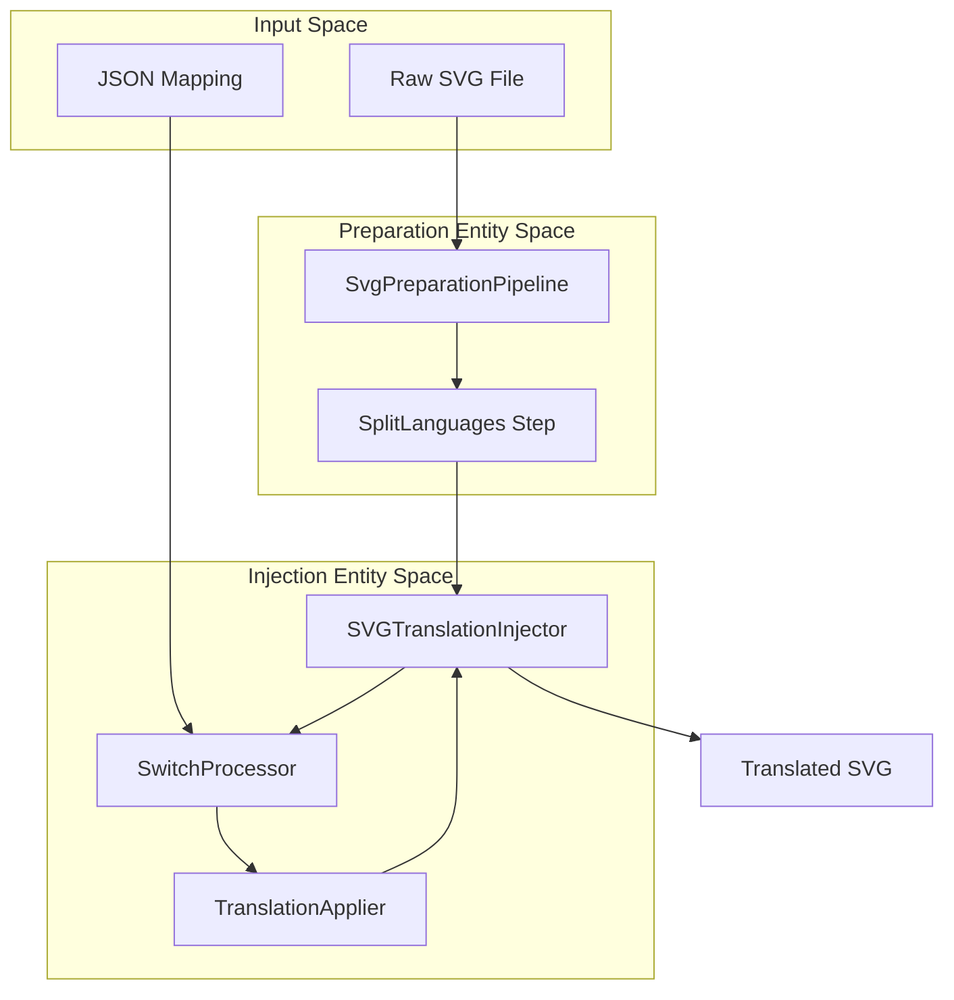
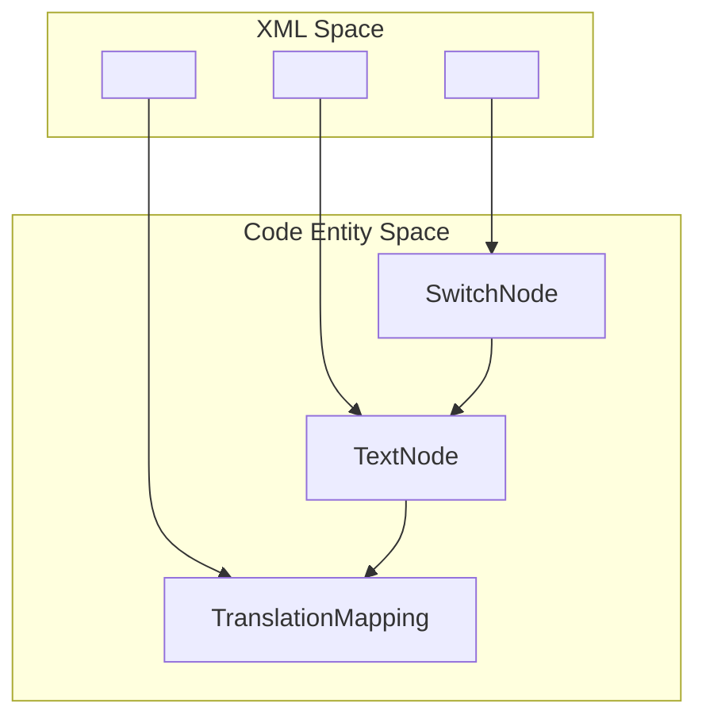

# Glossary

> **Relevant source files**
> * [CLAUDE.md](https://github.com/MrIbrahem/CopySVGTranslation/blob/d984a401/CLAUDE.md?plain=1)
> * [CopySVGTranslation/__init__.py](https://github.com/MrIbrahem/CopySVGTranslation/blob/d984a401/CopySVGTranslation/__init__.py)
> * [CopySVGTranslation/core/mapping.py](https://github.com/MrIbrahem/CopySVGTranslation/blob/d984a401/CopySVGTranslation/core/mapping.py)
> * [CopySVGTranslation/core/text_node.py](https://github.com/MrIbrahem/CopySVGTranslation/blob/d984a401/CopySVGTranslation/core/text_node.py)
> * [CopySVGTranslation/injection/switch_processor.py](https://github.com/MrIbrahem/CopySVGTranslation/blob/d984a401/CopySVGTranslation/injection/switch_processor.py)
> * [CopySVGTranslation/injection/translation_applier.py](https://github.com/MrIbrahem/CopySVGTranslation/blob/d984a401/CopySVGTranslation/injection/translation_applier.py)
> * [CopySVGTranslation/nested/__init__.py](https://github.com/MrIbrahem/CopySVGTranslation/blob/d984a401/CopySVGTranslation/nested/__init__.py)
> * [CopySVGTranslation/preparation/preparer.py](https://github.com/MrIbrahem/CopySVGTranslation/blob/d984a401/CopySVGTranslation/preparation/preparer.py)
> * [CopySVGTranslation/preparation/steps/__init__.py](https://github.com/MrIbrahem/CopySVGTranslation/blob/d984a401/CopySVGTranslation/preparation/steps/__init__.py)
> * [CopySVGTranslation/preparation/steps/assign_ids.py](https://github.com/MrIbrahem/CopySVGTranslation/blob/d984a401/CopySVGTranslation/preparation/steps/assign_ids.py)
> * [CopySVGTranslation/preparation/steps/normalize_tspans.py](https://github.com/MrIbrahem/CopySVGTranslation/blob/d984a401/CopySVGTranslation/preparation/steps/normalize_tspans.py)
> * [CopySVGTranslation/preparation/steps/split_languages.py](https://github.com/MrIbrahem/CopySVGTranslation/blob/d984a401/CopySVGTranslation/preparation/steps/split_languages.py)
> * [CopySVGTranslation/result.py](https://github.com/MrIbrahem/CopySVGTranslation/blob/d984a401/CopySVGTranslation/result.py)
> * [README.md](https://github.com/MrIbrahem/CopySVGTranslation/blob/d984a401/README.md?plain=1)
> * [requirements.txt](https://github.com/MrIbrahem/CopySVGTranslation/blob/d984a401/requirements.txt)
> * [tests/unit/injection/test_switch_processor.py](https://github.com/MrIbrahem/CopySVGTranslation/blob/d984a401/tests/unit/injection/test_switch_processor.py)

This glossary defines technical terms, internal concepts, and architectural components specific to the `CopySVGTranslation` codebase. It serves as a reference for understanding the domain-specific language used throughout the system.

## Core Concepts & Terminology

### Default Text Node (Fallback Node)

In the context of an SVG `<switch>` element, the "Default Text Node" is the `<text>` element that does not possess a `systemLanguage` attribute. It acts as the source of truth for the original text and the structural template for all other translations.

* **Implementation:** Identified by `SwitchNode.default_text_node()` [CopySVGTranslation/core/switch_node.py:53-53].
* **Role:** Used as the source for `default_texts` which are then looked up in a `TranslationMapping` [CopySVGTranslation/injection/switch_processor.py:58-61].

### System Language

A standard SVG attribute (`systemLanguage`) used within `<switch>` elements to specify which language a particular `<text>` node belongs to. The library uses these tags to identify existing translations and inject new ones.

* **Normalization:** The system uses `split_lang_list` to handle comma-separated language tags [CopySVGTranslation/preparation/steps/split_languages.py:10-10].

### Translation Mapping

The primary data structure for storing extracted translations. It maps source text to a dictionary of language codes and their corresponding translated strings.

* **Implementation:** Defined in `TranslationMapping` [CopySVGTranslation/core/mapping.py:26-44].
* **Structure:** * `new`: The primary map of `source_text -> {lang: translation}`. * `title_new`: Specialized map for titles containing year variables. * `tspans_by_id`: Diagnostic map linking `tspan` IDs to text content.

### ID Management

A mechanism to ensure that every translatable element has a unique ID, especially after cloning nodes for new languages. The system uses a `trsvg` prefix for auto-generated IDs.

* **Implementation:** Managed by `IdManager` [CopySVGTranslation/injection/id_manager.py:1-52].
* **Allocation:** `IdManager.allocate_clone(base_id, lang)` creates a deterministic ID like `base-id-lang` [tests/unit/injection/test_switch_processor.py:25-27].

---

## Code Entity Space Mapping

The following diagrams bridge the gap between natural language concepts and the specific classes or functions that implement them.

### Data Transformation Flow

This diagram shows how data moves from a raw SVG file through the system's core entities to produce a translated result.

**Sources:** [CopySVGTranslation/preparation/preparer.py:28-39], [CopySVGTranslation/injection/switch_processor.py:34-50], [CopySVGTranslation/injection/translation_applier.py:89-101]

### Internal Node Representations

This diagram associates SVG XML elements with their corresponding Python wrapper classes used during the translation process.

**Sources:** [CopySVGTranslation/core/switch_node.py:52-52], [CopySVGTranslation/core/text_node.py:11-11], [CopySVGTranslation/core/mapping.py:26-26]

---

## Technical Jargon & Abbreviations

| Term | Definition | Code Pointer |
| --- | --- | --- |
| **Enrichment** | The process of expanding template-based translations (like year titles) into concrete text strings for specific switches. | [CopySVGTranslation/injection/switch_processor.py:67-68] |
| **Flattening** | The act of removing nested `<tspan>` or `<a>` tags within a `<text>` element to create a flat list of translatable segments. | [CopySVGTranslation/nested/flattener.py:9-9] |
| **Loose Text** | Text content found directly inside a `<text>` element rather than being wrapped in a `<tspan>`. | [CopySVGTranslation/preparation/steps/normalize_tspans.py:25-27] |
| **OperationResult** | A uniform response object returned by the `SVGTranslationService` facade containing success status, data, and errors. | [CopySVGTranslation/result.py:97-120] |
| **Switch Splitting** | The preparation step that takes a `<text>` node with multiple languages (e.g., `systemLanguage="en,fr"`) and splits it into individual nodes. | [CopySVGTranslation/preparation/steps/split_languages.py:32-33] |
| **TRSVG ID** | An auto-generated ID following the pattern `trsvg[0-9]+`, used to track elements that lacked unique IDs in the source file. | [CopySVGTranslation/preparation/steps/split_languages.py:147-147] |

**Sources:**

* `SwitchProcessor.enrich_all_mappings`: [CopySVGTranslation/injection/switch_processor.py:123-128]
* `NormalizeTspans._wrap_loose_text`: [CopySVGTranslation/preparation/steps/normalize_tspans.py:29-38]
* `SplitLanguages._split_switch_languages`: [CopySVGTranslation/preparation/steps/split_languages.py:32-40]
* `TranslationMapping` fields: [CopySVGTranslation/core/mapping.py:40-44]