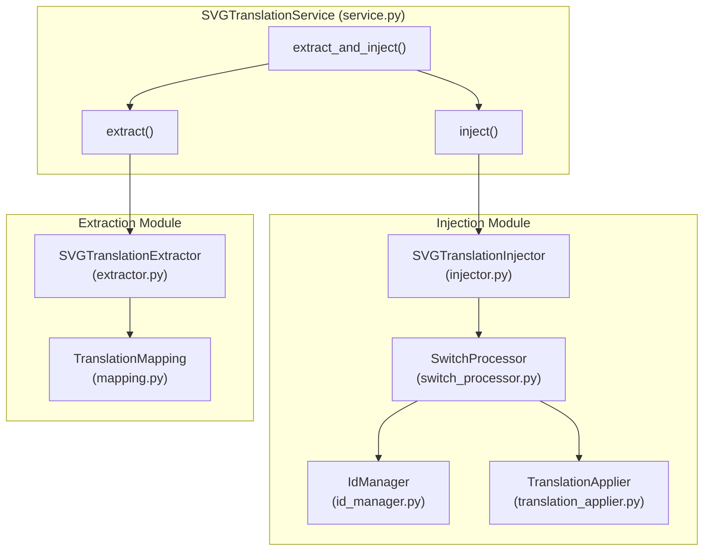
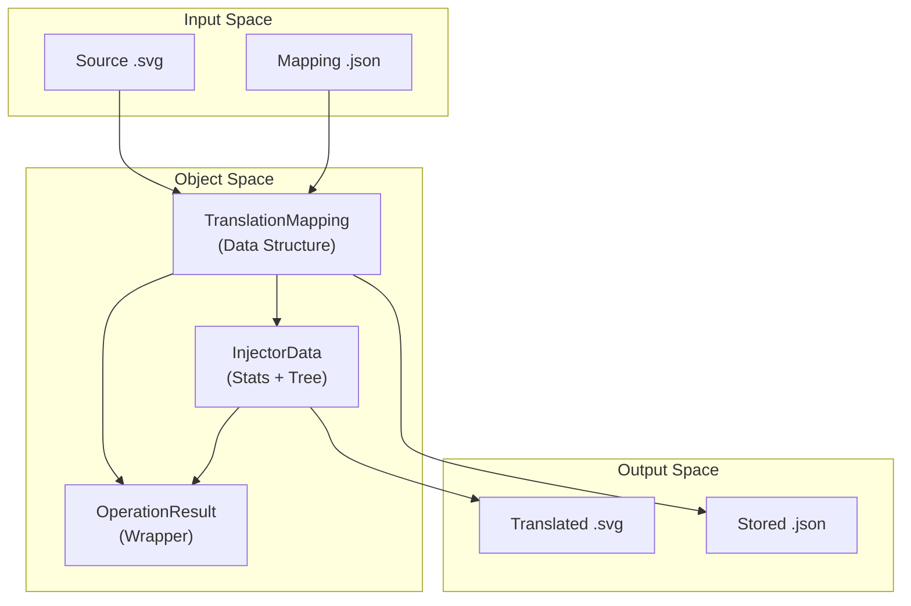

# Main Features

> **Relevant source files**
> * [CLAUDE.md](https://github.com/MrIbrahem/CopySVGTranslation/blob/d984a401/CLAUDE.md?plain=1)
> * [CopySVGTranslation/service.py](https://github.com/MrIbrahem/CopySVGTranslation/blob/d984a401/CopySVGTranslation/service.py)
> * [README.md](https://github.com/MrIbrahem/CopySVGTranslation/blob/d984a401/README.md?plain=1)
> * [requirements.txt](https://github.com/MrIbrahem/CopySVGTranslation/blob/d984a401/requirements.txt)
> * [tests/unit/test_service.py](https://github.com/MrIbrahem/CopySVGTranslation/blob/d984a401/tests/unit/test_service.py)

This document provides a high-level overview of the primary functions in `CopySVGTranslation`: extraction, injection, combined workflows, and batch processing. These features are accessible via the `SVGTranslationService` facade, which coordinates the core API for managing translation mappings and applying them to SVG files.

For detailed technical implementation and parameter references, see the child pages:

* **Extraction implementation details**: [Extraction](/MrIbrahem/CopySVGTranslation/4.1-extraction) — Details on `extract()`, `<switch>` element parsing, and mapping generation.
* **Injection implementation details**: [Injection](/MrIbrahem/CopySVGTranslation/4.2-injection) — Details on `inject()`, language tracking, and ID management.
* **Combined workflow usage**: [Combined Workflow](/MrIbrahem/CopySVGTranslation/4.3-combined-workflow) — Details on `extract_and_inject()` for end-to-end operations.
* **Batch processing**: [Batch Processing](/MrIbrahem/CopySVGTranslation/4.4-batch-processing) — Details on processing multiple files with aggregated statistics.

## Overview

The `SVGTranslationService` provides unified entry points for working with multilingual SVG files. It uses a `TranslationConfig` to manage behavior across all operations [CopySVGTranslation/service.py L33-L42](https://github.com/MrIbrahem/CopySVGTranslation/blob/d984a401/CopySVGTranslation/service.py#L33-L42)

| Feature | Service Method | Core Component | Purpose |
| --- | --- | --- | --- |
| **Extraction** | `extract()` | `SVGTranslationExtractor` | Parse SVGs containing `<switch>` elements to generate `TranslationMapping` [CopySVGTranslation/service.py L105-L153](https://github.com/MrIbrahem/CopySVGTranslation/blob/d984a401/CopySVGTranslation/service.py#L105-L153) |
| **Injection** | `inject()` | `SVGTranslationInjector` | Apply mappings to SVGs by inserting or updating `<text systemLanguage="XX">` nodes [CopySVGTranslation/service.py L155-L214](https://github.com/MrIbrahem/CopySVGTranslation/blob/d984a401/CopySVGTranslation/service.py#L155-L214) |
| **Combined** | `extract_and_inject()` | Facade Logic | Extract from a source and inject into a target in one call [CopySVGTranslation/service.py L216-L258](https://github.com/MrIbrahem/CopySVGTranslation/blob/d984a401/CopySVGTranslation/service.py#L216-L258) |
| **Preparation** | `prepare_only()` | `SvgPreparationPipeline` | Normalize SVG structure (e.g., wrapping text in `<switch>`) without translating [CopySVGTranslation/service.py L260-L290](https://github.com/MrIbrahem/CopySVGTranslation/blob/d984a401/CopySVGTranslation/service.py#L260-L290) |

Sources: [CopySVGTranslation/service.py L24-L290](https://github.com/MrIbrahem/CopySVGTranslation/blob/d984a401/CopySVGTranslation/service.py#L24-L290)

 [README.md L72-L92](https://github.com/MrIbrahem/CopySVGTranslation/blob/d984a401/README.md?plain=1#L72-L92)

## System Architecture

The following diagram bridges the high-level service methods to the internal code entities responsible for the logic.

### Logic Flow: From Service to Core Entities

Sources: [CopySVGTranslation/service.py L33-L42](https://github.com/MrIbrahem/CopySVGTranslation/blob/d984a401/CopySVGTranslation/service.py#L33-L42)

 [CLAUDE.md L43-L56](https://github.com/MrIbrahem/CopySVGTranslation/blob/d984a401/CLAUDE.md?plain=1#L43-L56)

## Data Transformation Workflow

The system transforms raw SVG XML into structured `TranslationMapping` objects and back into modified SVG documents.

### Entity Relationship Diagram

Sources: [CopySVGTranslation/service.py L105-L214](https://github.com/MrIbrahem/CopySVGTranslation/blob/d984a401/CopySVGTranslation/service.py#L105-L214)

 [CopySVGTranslation/core/mapping.py L12-L15](https://github.com/MrIbrahem/CopySVGTranslation/blob/d984a401/CopySVGTranslation/core/mapping.py#L12-L15)

 [CLAUDE.md L57-L83](https://github.com/MrIbrahem/CopySVGTranslation/blob/d984a401/CLAUDE.md?plain=1#L57-L83)

## Key Features

### 1. Extraction Workflow

The `extract()` method parses SVG files to find `<switch>` elements. It identifies "default" text (usually English) and correlates it with translated variants identified by the `systemLanguage` attribute [CopySVGTranslation/extraction/extractor.py L13-L20](https://github.com/MrIbrahem/CopySVGTranslation/blob/d984a401/CopySVGTranslation/extraction/extractor.py#L13-L20)

* **Normalization**: Text is normalized to ensure reliable matching despite whitespace differences.
* **Result**: Returns a `TranslationMapping` containing a `new` dictionary (source text -> lang -> translation) [CopySVGTranslation/core/mapping.py L68-L73](https://github.com/MrIbrahem/CopySVGTranslation/blob/d984a401/CopySVGTranslation/core/mapping.py#L68-L73)
* For details, see [Extraction](/MrIbrahem/CopySVGTranslation/4.1-extraction).

### 2. Injection Workflow

The `inject()` method applies a `TranslationMapping` to a target SVG. It iterates through `<switch>` blocks, matches the default text against the mapping, and creates or updates `<text>` or `<tspan>` elements [CopySVGTranslation/injection/injector.py L14-L20](https://github.com/MrIbrahem/CopySVGTranslation/blob/d984a401/CopySVGTranslation/injection/injector.py#L14-L20)

* **ID Management**: Automatically generates unique IDs for new elements to prevent XML collisions [CopySVGTranslation/injection/id_manager.py L10-L15](https://github.com/MrIbrahem/CopySVGTranslation/blob/d984a401/CopySVGTranslation/injection/id_manager.py#L10-L15)
* **Language Tracking**: Tracks `inserted_translations` vs `updated_translations` via `InjectorStats` [CopySVGTranslation/core/mapping.py L79-L82](https://github.com/MrIbrahem/CopySVGTranslation/blob/d984a401/CopySVGTranslation/core/mapping.py#L79-L82)
* For details, see [Injection](/MrIbrahem/CopySVGTranslation/4.2-injection).

### 3. Combined & Batch Workflows

* **`extract_and_inject()`**: Streamlines the process of taking translations from a "Golden" SVG and applying them to a "Template" SVG in a single step [CopySVGTranslation/service.py L216-L258](https://github.com/MrIbrahem/CopySVGTranslation/blob/d984a401/CopySVGTranslation/service.py#L216-L258)
* **Batch Processing**: While the service handles single files, batch utilities allow for processing directories of SVGs, providing aggregated success/failure reports [CopySVGTranslation/service.py L155-L162](https://github.com/MrIbrahem/CopySVGTranslation/blob/d984a401/CopySVGTranslation/service.py#L155-L162)
* For details, see [Combined Workflow](/MrIbrahem/CopySVGTranslation/4.3-combined-workflow) and [Batch Processing](/MrIbrahem/CopySVGTranslation/4.4-batch-processing).

### 4. Preparation and Repair

Before translation, SVGs often need structural normalization.

* **`prepare_only()`**: Wraps orphan `<text>` elements in `<switch>` blocks and ensures proper ID structures [CopySVGTranslation/service.py L260-L290](https://github.com/MrIbrahem/CopySVGTranslation/blob/d984a401/CopySVGTranslation/service.py#L260-L290)
* **Nested Repair**: Detects and fixes illegal nested `<tspan>` or `<a>` tags that break standard translation matching [CopySVGTranslation/service.py L64-L99](https://github.com/MrIbrahem/CopySVGTranslation/blob/d984a401/CopySVGTranslation/service.py#L64-L99)
* For details, see [SVG Preparation](/MrIbrahem/CopySVGTranslation/5.2-svg-preparation) and [Nested Element Handling](/MrIbrahem/CopySVGTranslation/5.3-nested-element-handling).

Sources: [README.md L12-L20](https://github.com/MrIbrahem/CopySVGTranslation/blob/d984a401/README.md?plain=1#L12-L20)

 [CopySVGTranslation/service.py L24-L290](https://github.com/MrIbrahem/CopySVGTranslation/blob/d984a401/CopySVGTranslation/service.py#L24-L290)

 [CLAUDE.md L31-L56](https://github.com/MrIbrahem/CopySVGTranslation/blob/d984a401/CLAUDE.md?plain=1#L31-L56)