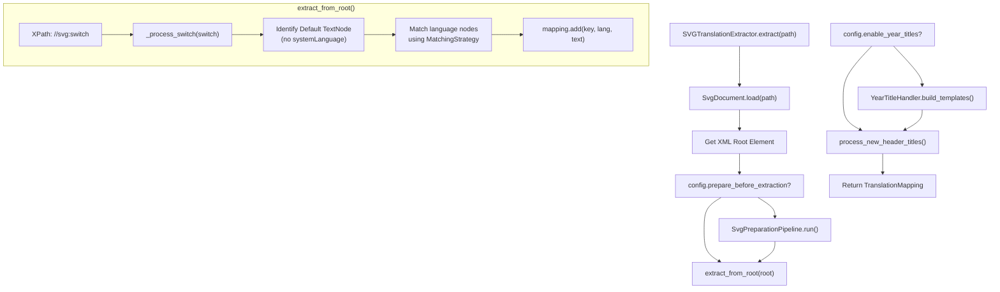
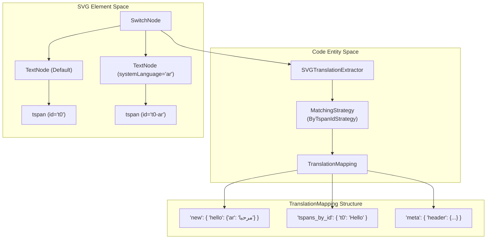

# Extraction

> **Relevant source files**
> * [CopySVGTranslation/extraction/extractor.py](https://github.com/MrIbrahem/CopySVGTranslation/blob/d984a401/CopySVGTranslation/extraction/extractor.py)
> * [tests/e2e/extraction/test_extract.py](https://github.com/MrIbrahem/CopySVGTranslation/blob/d984a401/tests/e2e/extraction/test_extract.py)
> * [tests/e2e/extraction/test_extract_2.py](https://github.com/MrIbrahem/CopySVGTranslation/blob/d984a401/tests/e2e/extraction/test_extract_2.py)
> * [tests/e2e/extraction/test_extract_extended.py](https://github.com/MrIbrahem/CopySVGTranslation/blob/d984a401/tests/e2e/extraction/test_extract_extended.py)
> * [tests/unit/extraction/test_extractor_header.py](https://github.com/MrIbrahem/CopySVGTranslation/blob/d984a401/tests/unit/extraction/test_extractor_header.py)
> * [tests/unit/extraction/test_svg_extractor_class.py](https://github.com/MrIbrahem/CopySVGTranslation/blob/d984a401/tests/unit/extraction/test_svg_extractor_class.py)

## Purpose and Scope

The extraction phase is the first step in the translation workflow. It identifies translatable text within SVG files—specifically within `<switch>` elements—and generates structured translation mappings. This process transforms hierarchical XML data into a normalized JSON format, enabling the reuse of translations across different SVG files.

The extraction logic is encapsulated in the `SVGTranslationExtractor` class, which handles XML parsing, switch element traversal, language identification, and text normalization.

**Sources:** [CopySVGTranslation/extraction/extractor.py L1-L27](https://github.com/MrIbrahem/CopySVGTranslation/blob/d984a401/CopySVGTranslation/extraction/extractor.py#L1-L27)

 [CopySVGTranslation/core/mapping.py L1-L20](https://github.com/MrIbrahem/CopySVGTranslation/blob/d984a401/CopySVGTranslation/core/mapping.py#L1-L20)

---

## Function Signature

The primary entry point for extraction is the `extract()` method of the `SVGTranslationExtractor` class.

```python
def extract(self, path: Path | str) -> TranslationMapping:
```

**Parameters:**

| Parameter | Type | Description |
| --- | --- | --- |
| `path` | `Path` or `str` | The file system path to the source SVG file. |

**Returns:**

* `TranslationMapping`: A specialized dataclass containing extracted translations, metadata, and diagnostic information.

**Sources:** [CopySVGTranslation/extraction/extractor.py L136-L157](https://github.com/MrIbrahem/CopySVGTranslation/blob/d984a401/CopySVGTranslation/extraction/extractor.py#L136-L157)

 [CopySVGTranslation/core/mapping.py L12-L32](https://github.com/MrIbrahem/CopySVGTranslation/blob/d984a401/CopySVGTranslation/core/mapping.py#L12-L32)

---

## Extraction Process Overview

The extraction process follows a structured pipeline from file I/O to template generation.



**Diagram: Extraction Process Flow**

**Sources:** [CopySVGTranslation/extraction/extractor.py L112-L157](https://github.com/MrIbrahem/CopySVGTranslation/blob/d984a401/CopySVGTranslation/extraction/extractor.py#L112-L157)

 [CopySVGTranslation/extraction/extractor.py L41-L90](https://github.com/MrIbrahem/CopySVGTranslation/blob/d984a401/CopySVGTranslation/extraction/extractor.py#L41-L90)

---

## Data Transformation: SVG to Mapping

The extractor maps complex SVG structures into a flat, queryable `TranslationMapping` object.



**Diagram: SVG-to-JSON Transformation**

**Sources:** [CopySVGTranslation/extraction/extractor.py L41-L90](https://github.com/MrIbrahem/CopySVGTranslation/blob/d984a401/CopySVGTranslation/extraction/extractor.py#L41-L90)

 [CopySVGTranslation/core/mapping.py L12-L32](https://github.com/MrIbrahem/CopySVGTranslation/blob/d984a401/CopySVGTranslation/core/mapping.py#L12-L32)

 [CopySVGTranslation/extraction/strategies.py L1-L50](https://github.com/MrIbrahem/CopySVGTranslation/blob/d984a401/CopySVGTranslation/extraction/strategies.py#L1-L50)

---

## TranslationMapping Structure

The extraction result is a `TranslationMapping` object, which can be converted to JSON via `.to_json()`.

### The "new" Namespace

This is the primary storage for translations. It uses normalized English text as the key.

* **Key**: Normalized English string (e.g., `"population 2020"`).
* **Value**: A dictionary mapping language codes (e.g., `"ar"`) to translated strings.

### The "tspans_by_id" Namespace

Used for diagnostic purposes and positional matching fallback. It maps the `id` attribute of `<tspan>` elements to their raw text content.

### The "meta" Namespace

Contains specialized metadata, such as header-specific translations extracted from elements with `id="header"`.

**Sources:** [CopySVGTranslation/core/mapping.py L12-L32](https://github.com/MrIbrahem/CopySVGTranslation/blob/d984a401/CopySVGTranslation/core/mapping.py#L12-L32)

 [CopySVGTranslation/extraction/extractor.py L59-L63](https://github.com/MrIbrahem/CopySVGTranslation/blob/d984a401/CopySVGTranslation/extraction/extractor.py#L59-L63)

 [CopySVGTranslation/extraction/extractor.py L124-L129](https://github.com/MrIbrahem/CopySVGTranslation/blob/d984a401/CopySVGTranslation/extraction/extractor.py#L124-L129)

---

## Switch Element Processing

The `_process_switch` method is the core logic for extracting text from individual `<switch>` elements.

1. **Default Identification**: It identifies the "default" `<text>` node (the one without a `systemLanguage` attribute). [CopySVGTranslation/extraction/extractor.py L47-L49](https://github.com/MrIbrahem/CopySVGTranslation/blob/d984a401/CopySVGTranslation/extraction/extractor.py#L47-L49)
2. **Key Generation**: The text from the default node is normalized (whitespace collapsed, and optionally lowercased based on `config.case_insensitive`) to serve as the dictionary key. [CopySVGTranslation/extraction/extractor.py L65-L69](https://github.com/MrIbrahem/CopySVGTranslation/blob/d984a401/CopySVGTranslation/extraction/extractor.py#L65-L69)
3. **Language Matching**: For every other `<text>` node in the switch, the extractor uses a `MatchingStrategy` (defaulting to `ByTspanIdStrategy`) to correlate translated segments with the default segments. [CopySVGTranslation/extraction/extractor.py L71-L82](https://github.com/MrIbrahem/CopySVGTranslation/blob/d984a401/CopySVGTranslation/extraction/extractor.py#L71-L82)
4. **Mapping Update**: Matches are added to the `TranslationMapping` via the `mapping.add()` method. [CopySVGTranslation/extraction/extractor.py L83-L90](https://github.com/MrIbrahem/CopySVGTranslation/blob/d984a401/CopySVGTranslation/extraction/extractor.py#L83-L90)

**Sources:** [CopySVGTranslation/extraction/extractor.py L41-L91](https://github.com/MrIbrahem/CopySVGTranslation/blob/d984a401/CopySVGTranslation/extraction/extractor.py#L41-L91)

 [CopySVGTranslation/extraction/strategies.py L21-L50](https://github.com/MrIbrahem/CopySVGTranslation/blob/d984a401/CopySVGTranslation/extraction/strategies.py#L21-L50)

---

## Header-Specific Extraction

The extractor performs a specialized pass for header elements. It targets `<switch>` elements within `<g id="header">` but excludes those within `<g id="subtitle">`. These are stored in `mapping.meta["header"]`.

This separation allows the system to apply different logic to titles, such as the `YearTitleHandler`, which builds templates for titles containing years (e.g., converting "Population 2020" into a "Population {year}" template).

**Sources:** [CopySVGTranslation/extraction/extractor.py L92-L110](https://github.com/MrIbrahem/CopySVGTranslation/blob/d984a401/CopySVGTranslation/extraction/extractor.py#L92-L110)

 [CopySVGTranslation/extraction/extractor.py L124-L129](https://github.com/MrIbrahem/CopySVGTranslation/blob/d984a401/CopySVGTranslation/extraction/extractor.py#L124-L129)

 [CopySVGTranslation/titles/handler.py L1-L50](https://github.com/MrIbrahem/CopySVGTranslation/blob/d984a401/CopySVGTranslation/titles/handler.py#L1-L50)

---

## Error Handling

Extraction includes robust error handling for file and XML issues:

* **FileNotFoundError**: Raises `SvgIOError`. [CopySVGTranslation/extraction/extractor.py L150-L152](https://github.com/MrIbrahem/CopySVGTranslation/blob/d984a401/CopySVGTranslation/extraction/extractor.py#L150-L152)
* **XMLSyntaxError**: Raises `SvgParseError`. [CopySVGTranslation/extraction/extractor.py L153-L155](https://github.com/MrIbrahem/CopySVGTranslation/blob/d984a401/CopySVGTranslation/extraction/extractor.py#L153-L155)
* **Empty Switches**: If no translatable text is found, the `TranslationMapping` will contain empty dictionaries. [CopySVGTranslation/extraction/extractor.py L48-L49](https://github.com/MrIbrahem/CopySVGTranslation/blob/d984a401/CopySVGTranslation/extraction/extractor.py#L48-L49)

**Sources:** [CopySVGTranslation/extraction/extractor.py L142-L157](https://github.com/MrIbrahem/CopySVGTranslation/blob/d984a401/CopySVGTranslation/extraction/extractor.py#L142-L157)

 [CopySVGTranslation/exceptions.py L1-L20](https://github.com/MrIbrahem/CopySVGTranslation/blob/d984a401/CopySVGTranslation/exceptions.py#L1-L20)