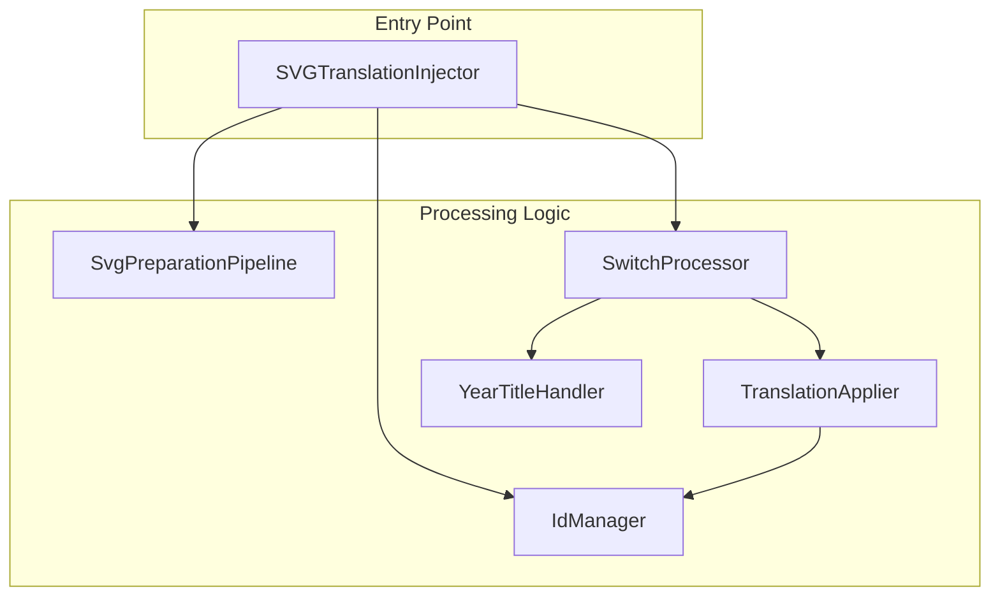
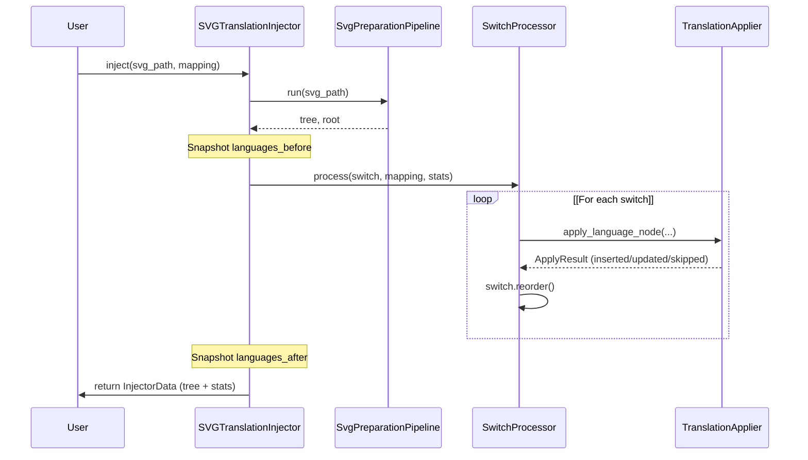

# Injection

> **Relevant source files**
>
> -   [CopySVGTranslation/core/text_node.py](https://github.com/MrIbrahem/CopySVGTranslation/blob/d984a401/CopySVGTranslation/core/text_node.py)
> -   [CopySVGTranslation/injection/injector.py](https://github.com/MrIbrahem/CopySVGTranslation/blob/d984a401/CopySVGTranslation/injection/injector.py)
> -   [CopySVGTranslation/injection/switch_processor.py](https://github.com/MrIbrahem/CopySVGTranslation/blob/d984a401/CopySVGTranslation/injection/switch_processor.py)
> -   [CopySVGTranslation/injection/translation_applier.py](https://github.com/MrIbrahem/CopySVGTranslation/blob/d984a401/CopySVGTranslation/injection/translation_applier.py)
> -   [tests/unit/injection/test_svg_injector_class.py](https://github.com/MrIbrahem/CopySVGTranslation/blob/d984a401/tests/unit/injection/test_svg_injector_class.py)
> -   [tests/unit/injection/test_switch_processor.py](https://github.com/MrIbrahem/CopySVGTranslation/blob/d984a401/tests/unit/injection/test_switch_processor.py)

## Purpose and Scope

The injection module applies translation mappings to SVG files by inserting or updating `<text systemLanguage="XX">` elements within `<switch>` blocks. The core of this functionality is encapsulated in the `SVGTranslationInjector` class and its `inject()` method. The system is designed to handle complex SVG structures, generate unique element IDs, and provide detailed statistics on the injection process.

This page documents the technical implementation of the injection workflow. For extracting translations from source SVGs, see [Extraction](/MrIbrahem/CopySVGTranslation/4.1-extraction). For preparing SVG structure before injection, see [SVG Preparation](/MrIbrahem/CopySVGTranslation/5.2-svg-preparation). For processing multiple files at once, see [Batch Processing](/MrIbrahem/CopySVGTranslation/4.4-batch-processing).

**Sources:** [CopySVGTranslation/injection/injector.py L30-L32](https://github.com/MrIbrahem/CopySVGTranslation/blob/d984a401/CopySVGTranslation/injection/injector.py#L30-L32)

[CopySVGTranslation/injection/injector.py L59-L69](https://github.com/MrIbrahem/CopySVGTranslation/blob/d984a401/CopySVGTranslation/injection/injector.py#L59-L69)

## Core Entities and Data Flow

The injection process is distributed across several specialized classes to separate concerns such as ID management, switch processing, and XML manipulation.

### Code Entity Space to System Logic

The following diagram maps internal code entities to their roles in the injection pipeline.



**Sources:** [CopySVGTranslation/injection/injector.py L33-L47](https://github.com/MrIbrahem/CopySVGTranslation/blob/d984a401/CopySVGTranslation/injection/injector.py#L33-L47)

[CopySVGTranslation/injection/switch_processor.py L21-L32](https://github.com/MrIbrahem/CopySVGTranslation/blob/d984a401/CopySVGTranslation/injection/switch_processor.py#L21-L32)

[CopySVGTranslation/injection/translation_applier.py L26-L29](https://github.com/MrIbrahem/CopySVGTranslation/blob/d984a401/CopySVGTranslation/injection/translation_applier.py#L26-L29)

## The inject() Method

The `inject()` method is the primary API for applying translations. It manages the lifecycle of an injection operation, from parsing the file to returning results and statistics.

### Function Signature

[CopySVGTranslation/injection/injector.py L59-L66](https://github.com/MrIbrahem/CopySVGTranslation/blob/d984a401/CopySVGTranslation/injection/injector.py#L59-L66)

```python
def inject(    self,    svg_path: Path | str,    mapping: TranslationMapping | dict,    *,    save_path: Path | None = None,    save: bool = False,) -> InjectorData:
```

### Injection Workflow Implementation

The execution flow within `inject()` follows a strict sequence to ensure XML integrity and accurate statistics tracking.



1. **Preparation**: The `SvgPreparationPipeline` validates the SVG and ensures it is "translation-ready" (e.g., fixing nested tspans) [CopySVGTranslation/injection/injector.py L87-L109](https://github.com/MrIbrahem/CopySVGTranslation/blob/d984a401/CopySVGTranslation/injection/injector.py#L87-L109)
2. **Language Snapshot**: The system records existing languages using `extract_root_languages()` before any changes are made [CopySVGTranslation/injection/injector.py L114-L115](https://github.com/MrIbrahem/CopySVGTranslation/blob/d984a401/CopySVGTranslation/injection/injector.py#L114-L115)
3. **ID Seeding**: The `IdManager` scans the document for all existing `id` attributes to prevent collisions during new node generation [CopySVGTranslation/injection/injector.py L118](https://github.com/MrIbrahem/CopySVGTranslation/blob/d984a401/CopySVGTranslation/injection/injector.py#L118-L118)
4. **Switch Processing**: The `SwitchProcessor` iterates through every `<switch>` element found via XPath `//svg:switch` [CopySVGTranslation/injection/injector.py L167-L175](https://github.com/MrIbrahem/CopySVGTranslation/blob/d984a401/CopySVGTranslation/injection/injector.py#L167-L175)
5. **Finalization**: If `TranslationConfig.sort_switches` is enabled, the injector reorders elements within the switch blocks [CopySVGTranslation/injection/injector.py L49-L57](https://github.com/MrIbrahem/CopySVGTranslation/blob/d984a401/CopySVGTranslation/injection/injector.py#L49-L57)

**Sources:** [CopySVGTranslation/injection/injector.py L87-L149](https://github.com/MrIbrahem/CopySVGTranslation/blob/d984a401/CopySVGTranslation/injection/injector.py#L87-L149)

[CopySVGTranslation/injection/switch_processor.py L34-L50](https://github.com/MrIbrahem/CopySVGTranslation/blob/d984a401/CopySVGTranslation/injection/switch_processor.py#L34-L50)

## Switch Processing and Translation Application

The `SwitchProcessor` manages the logic for individual `<switch>` blocks, while the `TranslationApplier` performs the actual XML mutations.

### Node Creation and Updating

When applying a translation for a specific language, the `TranslationApplier` follows these rules:

-   **Insert**: If the language is missing, the fallback (default) `<text>` node is cloned. The `systemLanguage` attribute is set, and text content is replaced with translated values [CopySVGTranslation/injection/translation_applier.py L129-L131](https://github.com/MrIbrahem/CopySVGTranslation/blob/d984a401/CopySVGTranslation/injection/translation_applier.py#L129-L131)
-   **Update**: If the language exists and `overwrite_translations` is `True`, the text within the existing node's `tspans` is updated in place [CopySVGTranslation/injection/translation_applier.py L106-L126](https://github.com/MrIbrahem/CopySVGTranslation/blob/d984a401/CopySVGTranslation/injection/translation_applier.py#L106-L126)
-   **Skip**: If the language exists and `overwrite_translations` is `False`, the node is left unchanged [CopySVGTranslation/injection/translation_applier.py L103-L104](https://github.com/MrIbrahem/CopySVGTranslation/blob/d984a401/CopySVGTranslation/injection/translation_applier.py#L103-L104)

### Unique ID Generation

To maintain valid XML, every cloned node must have a unique ID. The `TranslationApplier` calls `_reassign_ids`, which utilizes the `IdManager` to generate new identifiers based on the original ID and the target language code [CopySVGTranslation/injection/translation_applier.py L75-L84](https://github.com/MrIbrahem/CopySVGTranslation/blob/d984a401/CopySVGTranslation/injection/translation_applier.py#L75-L84)

**Sources:** [CopySVGTranslation/injection/translation_applier.py L31-L65](https://github.com/MrIbrahem/CopySVGTranslation/blob/d984a401/CopySVGTranslation/injection/translation_applier.py#L31-L65)

[CopySVGTranslation/injection/switch_processor.py L83-L116](https://github.com/MrIbrahem/CopySVGTranslation/blob/d984a401/CopySVGTranslation/injection/switch_processor.py#L83-L116)

## Statistics and Return Values

The `inject()` method returns an `InjectorData` object, which contains the modified XML tree and an `InjectorStats` instance.

### InjectorStats Attributes

The system tracks the following metrics during the injection process:

| Attribute               | Description                                                                                                                                                                                                                 |
| ----------------------- | --------------------------------------------------------------------------------------------------------------------------------------------------------------------------------------------------------------------------- |
| `processed_switches`    | Total `<switch>` elements encountered [CopySVGTranslation/injection/switch_processor.py L81](https://github.com/MrIbrahem/CopySVGTranslation/blob/d984a401/CopySVGTranslation/injection/switch_processor.py#L81-L81)        |
| `inserted_translations` | New `<text>` elements created [CopySVGTranslation/injection/switch_processor.py L111](https://github.com/MrIbrahem/CopySVGTranslation/blob/d984a401/CopySVGTranslation/injection/switch_processor.py#L111-L111)             |
| `updated_translations`  | Existing `<text>` elements modified [CopySVGTranslation/injection/switch_processor.py L113](https://github.com/MrIbrahem/CopySVGTranslation/blob/d984a401/CopySVGTranslation/injection/switch_processor.py#L113-L113)       |
| `skipped_translations`  | Elements ignored due to `overwrite=False` [CopySVGTranslation/injection/switch_processor.py L115](https://github.com/MrIbrahem/CopySVGTranslation/blob/d984a401/CopySVGTranslation/injection/switch_processor.py#L115-L115) |
| `all_languages_count`   | Total unique `systemLanguage` values after injection [CopySVGTranslation/injection/injector.py L192](https://github.com/MrIbrahem/CopySVGTranslation/blob/d984a401/CopySVGTranslation/injection/injector.py#L192-L192)      |
| `new_languages_count`   | Count of languages that did not exist before injection [CopySVGTranslation/injection/injector.py L193](https://github.com/MrIbrahem/CopySVGTranslation/blob/d984a401/CopySVGTranslation/injection/injector.py#L193-L193)    |

**Sources:** [CopySVGTranslation/result.py L1-L40](https://github.com/MrIbrahem/CopySVGTranslation/blob/d984a401/CopySVGTranslation/result.py#L1-L40)

[CopySVGTranslation/injection/injector.py L184-L203](https://github.com/MrIbrahem/CopySVGTranslation/blob/d984a401/CopySVGTranslation/injection/injector.py#L184-L203)

## Text Matching and Normalization

The `SwitchProcessor` uses the `TranslationConfig.case_insensitive` setting to resolve mappings. Before looking up a translation, the source text from the default `<text>` node is normalized (whitespace collapsed) [CopySVGTranslation/injection/switch_processor.py L58-L61](https://github.com/MrIbrahem/CopySVGTranslation/blob/d984a401/CopySVGTranslation/injection/switch_processor.py#L58-L61)

If a specific segment lacks a translation and `fallback_to_default_text` is enabled in the config, the injector will use the original source text for that segment in the translated node [CopySVGTranslation/injection/switch_processor.py L93-L94](https://github.com/MrIbrahem/CopySVGTranslation/blob/d984a401/CopySVGTranslation/injection/switch_processor.py#L93-L94)

**Sources:** [CopySVGTranslation/injection/switch_processor.py L87-L94](https://github.com/MrIbrahem/CopySVGTranslation/blob/d984a401/CopySVGTranslation/injection/switch_processor.py#L87-L94)

[CopySVGTranslation/core/text_node.py L53-L63](https://github.com/MrIbrahem/CopySVGTranslation/blob/d984a401/CopySVGTranslation/core/text_node.py#L53-L63)

## Year Title Enrichment

Before processing a switch, the `SwitchProcessor` calls the `YearTitleHandler`. This component automatically generates translations for titles containing years (e.g., "Population 2020") by using base patterns found in the mapping. This allows the system to handle dynamic titles without requiring explicit entries for every possible year in the JSON mapping files.

**Sources:** [CopySVGTranslation/injection/switch_processor.py L67-L68](https://github.com/MrIbrahem/CopySVGTranslation/blob/d984a401/CopySVGTranslation/injection/switch_processor.py#L67-L68)

[CopySVGTranslation/injection/switch_processor.py L123-L128](https://github.com/MrIbrahem/CopySVGTranslation/blob/d984a401/CopySVGTranslation/injection/switch_processor.py#L123-L128)
