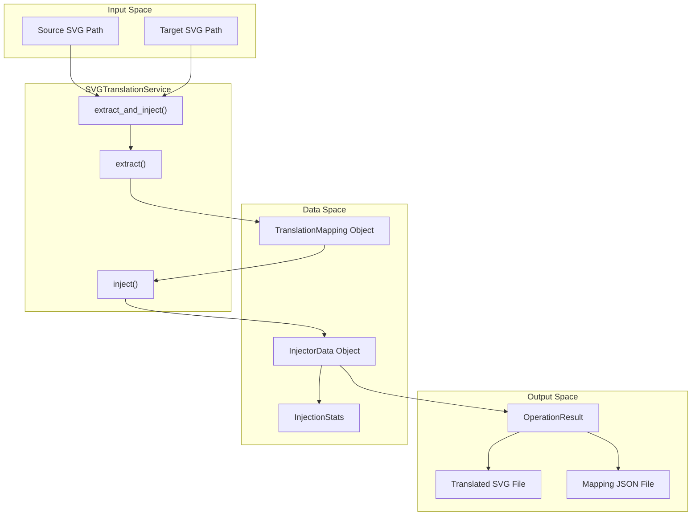
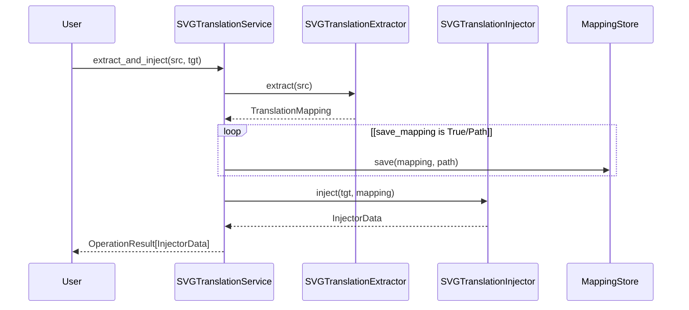

# Combined Workflow

> **Relevant source files**
> * [CopySVGTranslation/service.py](https://github.com/MrIbrahem/CopySVGTranslation/blob/d984a401/CopySVGTranslation/service.py)
> * [tests/e2e/injection/test_inject_extended.py](https://github.com/MrIbrahem/CopySVGTranslation/blob/d984a401/tests/e2e/injection/test_inject_extended.py)
> * [tests/e2e/test_additional.py](https://github.com/MrIbrahem/CopySVGTranslation/blob/d984a401/tests/e2e/test_additional.py)
> * [tests/e2e/test_full.py](https://github.com/MrIbrahem/CopySVGTranslation/blob/d984a401/tests/e2e/test_full.py)
> * [tests/unit/test_service.py](https://github.com/MrIbrahem/CopySVGTranslation/blob/d984a401/tests/unit/test_service.py)

This page documents the high-level API provided by `SVGTranslationService` for performing extraction and injection in a single operation. While the legacy `svg_extract_and_inject()` function exists for backward compatibility, modern workflows utilize the `SVGTranslationService.extract_and_inject()` method, which offers enhanced error reporting and configuration management.

For details on the underlying extraction process, see [Extraction](/MrIbrahem/CopySVGTranslation/4.1-extraction). For details on the injection mechanism, see [Injection](/MrIbrahem/CopySVGTranslation/4.2-injection). For processing multiple files, see [Batch Processing](/MrIbrahem/CopySVGTranslation/4.4-batch-processing).

---

## Purpose and Operation

The combined workflow performs the following operations in sequence:

1. **Extraction**: Extracts translation mappings from a source SVG file using `SVGTranslationExtractor`.
2. **Mapping Storage**: Optionally persists the extracted mappings to a JSON file via `MappingStore`.
3. **Injection**: Injects the mappings into a target SVG file using `SVGTranslationInjector`.
4. **Output Resolution**: Optionally saves the translated SVG to disk using resolved output paths.

This workflow is implemented in `SVGTranslationService.extract_and_inject()` [CopySVGTranslation/service.py L215-L263](https://github.com/MrIbrahem/CopySVGTranslation/blob/d984a401/CopySVGTranslation/service.py#L215-L263)

### Workflow Data Flow

The following diagram bridges the high-level workflow to the internal code entities and data structures.

**Title: Combined Workflow Code Entity Mapping**



**Sources:** [CopySVGTranslation/service.py L215-L263](https://github.com/MrIbrahem/CopySVGTranslation/blob/d984a401/CopySVGTranslation/service.py#L215-L263)

 [CopySVGTranslation/result.py L8-L35](https://github.com/MrIbrahem/CopySVGTranslation/blob/d984a401/CopySVGTranslation/result.py#L8-L35)

---

## Function Signature

The primary method for this workflow is `SVGTranslationService.extract_and_inject()`:

```python
def extract_and_inject(    self,    src_svg: Path | str,    tgt_svg: Path | str,    *,    output: Path | str | None = None,    save_mapping: bool | Path | None = None,    save: bool | None = None,) -> OperationResult[InjectorData]:
```

**Sources:** [CopySVGTranslation/service.py L215-L223](https://github.com/MrIbrahem/CopySVGTranslation/blob/d984a401/CopySVGTranslation/service.py#L215-L223)

### Parameters

| Parameter | Type | Default | Description |
| --- | --- | --- | --- |
| `src_svg` | `Path \| str` | *required* | Source SVG file containing existing translations [CopySVGTranslation/service.py L218](https://github.com/MrIbrahem/CopySVGTranslation/blob/d984a401/CopySVGTranslation/service.py#L218-L218) |
| `tgt_svg` | `Path \| str` | *required* | Target SVG file that needs translations [CopySVGTranslation/service.py L219](https://github.com/MrIbrahem/CopySVGTranslation/blob/d984a401/CopySVGTranslation/service.py#L219-L219) |
| `output` | `Path \| str \| None` | `None` | Destination path for the translated SVG [CopySVGTranslation/service.py L221](https://github.com/MrIbrahem/CopySVGTranslation/blob/d984a401/CopySVGTranslation/service.py#L221-L221) |
| `save_mapping` | `bool \| Path \| None` | `None` | If `True` or a `Path`, saves the extracted JSON mapping [CopySVGTranslation/service.py L222](https://github.com/MrIbrahem/CopySVGTranslation/blob/d984a401/CopySVGTranslation/service.py#L222-L222) |
| `save` | `bool \| None` | `None` | Overrides `config.auto_save` for the resulting SVG [CopySVGTranslation/service.py L223](https://github.com/MrIbrahem/CopySVGTranslation/blob/d984a401/CopySVGTranslation/service.py#L223-L223) |

---

## Implementation Details

The service layer manages the interaction between the extractor and injector, wrapping the entire process in an `OperationResult` to handle errors gracefully.

### Internal Logic Flow

**Title: Service-Level Execution Logic**



**Sources:** [CopySVGTranslation/service.py L238-L263](https://github.com/MrIbrahem/CopySVGTranslation/blob/d984a401/CopySVGTranslation/service.py#L238-L263)

 [tests/unit/test_service.py L100-L121](https://github.com/MrIbrahem/CopySVGTranslation/blob/d984a401/tests/unit/test_service.py#L100-L121)

---

## Usage Examples

### Standard Service Workflow

The recommended way to perform a combined operation is via the `SVGTranslationService` [tests/unit/test_service.py L115-L121](https://github.com/MrIbrahem/CopySVGTranslation/blob/d984a401/tests/unit/test_service.py#L115-L121)

```javascript
from CopySVGTranslation.service import SVGTranslationServicefrom CopySVGTranslation.config import TranslationConfig # Initialize service with configurationconfig = TranslationConfig(auto_save=True)service = SVGTranslationService(config) # Execute combined workflowresult = service.extract_and_inject(    src_svg="source.svg",    tgt_svg="target.svg",    output="output/translated.svg",    save_mapping=True) if result.success:    print(f"Inserted: {result.stats.inserted_translations}")
```

**Sources:** [tests/unit/test_service.py L115-L121](https://github.com/MrIbrahem/CopySVGTranslation/blob/d984a401/tests/unit/test_service.py#L115-L121)

 [CopySVGTranslation/service.py L215-L263](https://github.com/MrIbrahem/CopySVGTranslation/blob/d984a401/CopySVGTranslation/service.py#L215-L263)

### Handling Results and Statistics

Unlike the legacy standalone function, the service method returns an `OperationResult` containing `InjectorData`, which includes full statistics [CopySVGTranslation/service.py L263](https://github.com/MrIbrahem/CopySVGTranslation/blob/d984a401/CopySVGTranslation/service.py#L263-L263)

| Attribute | Description |
| --- | --- |
| `result.success` | Boolean indicating if the entire chain succeeded [CopySVGTranslation/result.py L16](https://github.com/MrIbrahem/CopySVGTranslation/blob/d984a401/CopySVGTranslation/result.py#L16-L16) |
| `result.data` | The `InjectorData` object containing the modified XML tree [CopySVGTranslation/service.py L263](https://github.com/MrIbrahem/CopySVGTranslation/blob/d984a401/CopySVGTranslation/service.py#L263-L263) |
| `result.stats` | The `InjectionStats` object (e.g., `inserted_translations`, `processed_switches`) [tests/unit/test_service.py L119-L120](https://github.com/MrIbrahem/CopySVGTranslation/blob/d984a401/tests/unit/test_service.py#L119-L120) |
| `result.error` | Error message string if `success` is `False` [CopySVGTranslation/result.py L17](https://github.com/MrIbrahem/CopySVGTranslation/blob/d984a401/CopySVGTranslation/result.py#L17-L17) |

---

## Error Handling

The combined workflow can fail at two main stages:

1. **Extraction Failure**: If the source SVG is missing or contains no translatable content, the process stops and returns a failure result with `error_code="no_translations"` [CopySVGTranslation/service.py L138-L142](https://github.com/MrIbrahem/CopySVGTranslation/blob/d984a401/CopySVGTranslation/service.py#L138-L142)
2. **Injection Failure**: If the target SVG is malformed or if saving the result fails (e.g., `save=True` but no `output` path), it returns `error_code="injection_error"` or `missing_output_path` [CopySVGTranslation/service.py L184-L188](https://github.com/MrIbrahem/CopySVGTranslation/blob/d984a401/CopySVGTranslation/service.py#L184-L188)  [CopySVGTranslation/service.py L199-L204](https://github.com/MrIbrahem/CopySVGTranslation/blob/d984a401/CopySVGTranslation/service.py#L199-L204)

**Sources:** [CopySVGTranslation/service.py L127-L154](https://github.com/MrIbrahem/CopySVGTranslation/blob/d984a401/CopySVGTranslation/service.py#L127-L154)

 [CopySVGTranslation/service.py L156-L213](https://github.com/MrIbrahem/CopySVGTranslation/blob/d984a401/CopySVGTranslation/service.py#L156-L213)

 [tests/unit/test_service.py L64-L71](https://github.com/MrIbrahem/CopySVGTranslation/blob/d984a401/tests/unit/test_service.py#L64-L71)