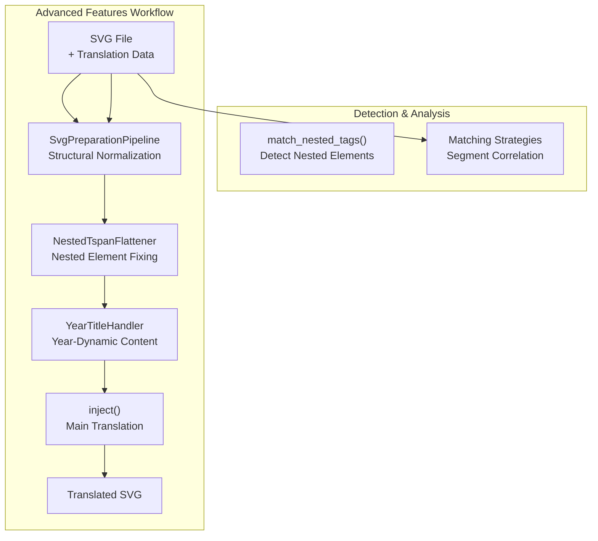
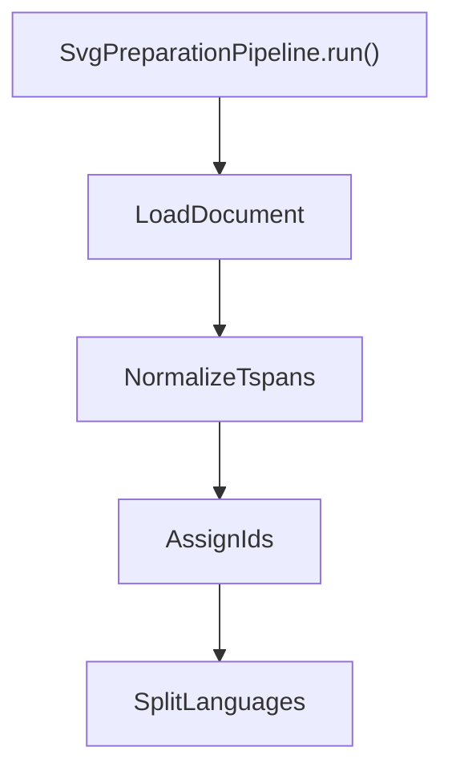
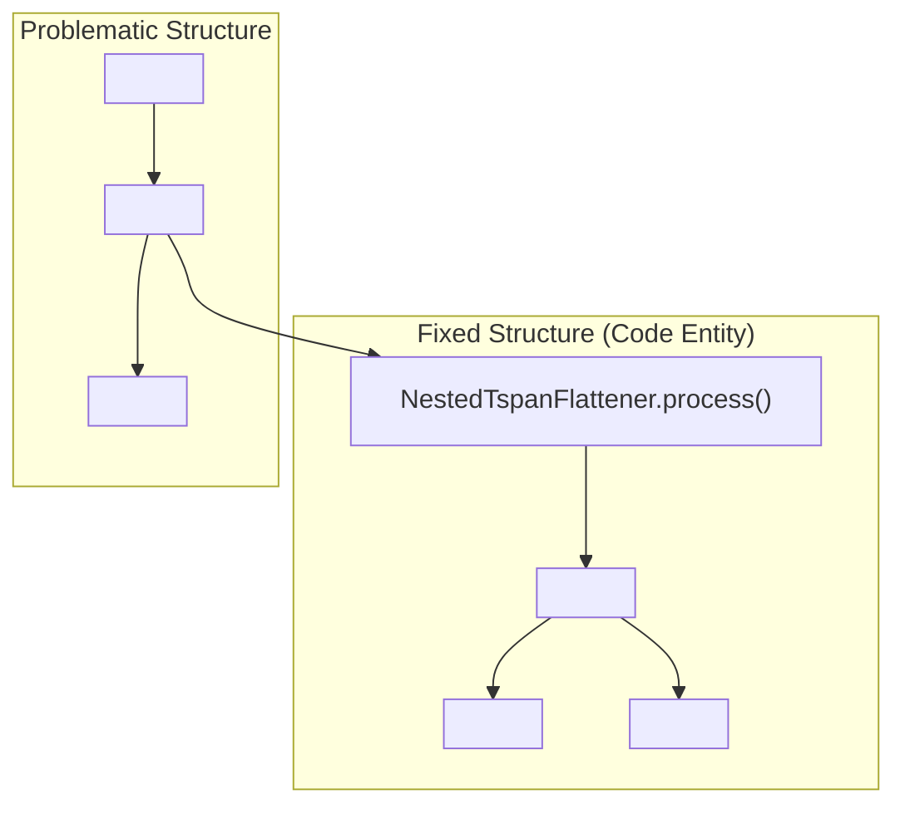

# Advanced Features

> **Relevant source files**
> * [CopySVGTranslation/preparation/preparer.py](https://github.com/MrIbrahem/CopySVGTranslation/blob/d984a401/CopySVGTranslation/preparation/preparer.py)
> * [CopySVGTranslation/preparation/steps/__init__.py](https://github.com/MrIbrahem/CopySVGTranslation/blob/d984a401/CopySVGTranslation/preparation/steps/__init__.py)
> * [CopySVGTranslation/preparation/steps/assign_ids.py](https://github.com/MrIbrahem/CopySVGTranslation/blob/d984a401/CopySVGTranslation/preparation/steps/assign_ids.py)
> * [CopySVGTranslation/preparation/steps/normalize_tspans.py](https://github.com/MrIbrahem/CopySVGTranslation/blob/d984a401/CopySVGTranslation/preparation/steps/normalize_tspans.py)
> * [CopySVGTranslation/preparation/steps/split_languages.py](https://github.com/MrIbrahem/CopySVGTranslation/blob/d984a401/CopySVGTranslation/preparation/steps/split_languages.py)
> * [CopySVGTranslation/titles/__init__.py](https://github.com/MrIbrahem/CopySVGTranslation/blob/d984a401/CopySVGTranslation/titles/__init__.py)
> * [CopySVGTranslation/titles/year_handler.py](https://github.com/MrIbrahem/CopySVGTranslation/blob/d984a401/CopySVGTranslation/titles/year_handler.py)
> * [CopySVGTranslation/titles/year_stripper.py](https://github.com/MrIbrahem/CopySVGTranslation/blob/d984a401/CopySVGTranslation/titles/year_stripper.py)
> * [tests/unit/titles/test_year_stripper.py](https://github.com/MrIbrahem/CopySVGTranslation/blob/d984a401/tests/unit/titles/test_year_stripper.py)

This page documents specialized functionality for handling complex SVG translation scenarios. These features address edge cases and structural issues that arise when working with real-world SVG files containing dynamic content, problematic nesting, or requiring structural normalization before translation.

For basic translation workflows (extraction and injection), see [Main Features](/MrIbrahem/CopySVGTranslation/4-main-features). For general concepts about text normalization and language tracking, see [Core Concepts](/MrIbrahem/CopySVGTranslation/3-core-concepts).

---

## Overview of Advanced Features

The CopySVGTranslation package provides advanced capabilities beyond basic extraction and injection:

| Feature | Purpose | Primary Functions / Classes |
| --- | --- | --- |
| Title Translations with Year Suffixes | Handle dynamic text containing years (e.g., "Population 2020") | `YearTitleHandler`, `YearPatternStripper` |
| SVG Preparation | Normalize SVG structure before injection | `SvgPreparationPipeline`, `make_translation_ready()` |
| Nested Element Handling | Detect and fix problematic nested `<tspan>` and `<a>` elements | `NestedTspanFlattener`, `match_nested_tags()`, `fix_nested_file()` |
| Matching Strategies | Correlate text segments during extraction | `CompositeMatchingStrategy`, `ByPositionStrategy` |

These features are typically used when:

* Translation data contains year-specific titles that need to work across multiple years.
* Target SVG files have structural issues preventing successful injection.
* SVG files contain nested elements that violate translation tool expectations.



**Diagram: Advanced Features Integration Flow** - Shows how advanced features interact with the main translation workflow.

Sources: [CopySVGTranslation/preparation/preparer.py L28-L52](https://github.com/MrIbrahem/CopySVGTranslation/blob/d984a401/CopySVGTranslation/preparation/preparer.py#L28-L52)

 [CopySVGTranslation/titles/year_handler.py L18-L28](https://github.com/MrIbrahem/CopySVGTranslation/blob/d984a401/CopySVGTranslation/titles/year_handler.py#L18-L28)

 [CopySVGTranslation/nested_analyze/find_nested_new.py L1-L175](https://github.com/MrIbrahem/CopySVGTranslation/blob/d984a401/CopySVGTranslation/nested_analyze/find_nested_new.py#L1-L175)

---

## Title Translations with Year Suffixes

### Problem Statement

SVG files often contain text elements with embedded years (e.g., "COVID-19 Pandemic 2020"). When creating translations for multiple years, storing separate translations for each year-text combination creates redundant data. The `YearTitleHandler` extracts year-independent translations that can be dynamically applied to any year using `{year}` placeholders.

### Workflow

The system uses `YearPatternStripper` to identify language-specific year suffixes (e.g., `, {year}` for English or `年{year}` for Japanese) and `YearTitleHandler` to manage the lifecycle of these templates.

For details, see [Title Translations with Year Suffixes](/MrIbrahem/CopySVGTranslation/5.1-title-translations-with-year-suffixes).

```

```

**Diagram: Year Suffix Normalization** - Bridging raw text to the `TranslationMapping` entity.

Sources: [CopySVGTranslation/titles/year_handler.py L18-L28](https://github.com/MrIbrahem/CopySVGTranslation/blob/d984a401/CopySVGTranslation/titles/year_handler.py#L18-L28)

 [CopySVGTranslation/titles/year_stripper.py L14-L35](https://github.com/MrIbrahem/CopySVGTranslation/blob/d984a401/CopySVGTranslation/titles/year_stripper.py#L14-L35)

 [CopySVGTranslation/titles/year_stripper.py L148-L164](https://github.com/MrIbrahem/CopySVGTranslation/blob/d984a401/CopySVGTranslation/titles/year_stripper.py#L148-L164)

---

## SVG Preparation

### SvgPreparationPipeline

The `SvgPreparationPipeline` ensures structural invariants are met before translations are injected. It executes a series of `PreparationStep` objects to normalize the SVG.

**Key Steps:**

* **ValidateStructure**: Ensures basic SVG validity.
* **NormalizeTspans**: Wraps loose text in `<tspan>` and flattens nesting.
* **AssignIds**: Automatically assigns missing `trsvgN` IDs to translatable elements.
* **SplitLanguages**: Expands comma-separated `systemLanguage` values into cloned `<text>` nodes.

For details, see [SVG Preparation](/MrIbrahem/CopySVGTranslation/5.2-svg-preparation).



**Diagram: Preparation Pipeline Steps** - Order of operations in `CopySVGTranslation/preparation/preparer.py`.

Sources: [CopySVGTranslation/preparation/preparer.py L28-L52](https://github.com/MrIbrahem/CopySVGTranslation/blob/d984a401/CopySVGTranslation/preparation/preparer.py#L28-L52)

 [CopySVGTranslation/preparation/steps/split_languages.py L21-L40](https://github.com/MrIbrahem/CopySVGTranslation/blob/d984a401/CopySVGTranslation/preparation/steps/split_languages.py#L21-L40)

 [CopySVGTranslation/preparation/steps/assign_ids.py L11-L44](https://github.com/MrIbrahem/CopySVGTranslation/blob/d984a401/CopySVGTranslation/preparation/steps/assign_ids.py#L11-L44)

---

## Nested Element Handling

### Problem: Nested tspan Elements

SVG files sometimes contain `<tspan>` elements nested inside other `<tspan>` elements for inline styling. This structure causes issues for many translation tools. The `NestedTspanFlattener` and `fix_nested_file()` utility detect and fix these problematic structures by converting them into flat sibling elements.

For details, see [Nested Element Handling](/MrIbrahem/CopySVGTranslation/5.3-nested-element-handling).



**Diagram: Flattening Logic** - Associating the nested XML problem with the `NestedTspanFlattener` class.

Sources: [CopySVGTranslation/preparation/steps/normalize_tspans.py L15-L27](https://github.com/MrIbrahem/CopySVGTranslation/blob/d984a401/CopySVGTranslation/preparation/steps/normalize_tspans.py#L15-L27)

 [CopySVGTranslation/nested_analyze/find_nested_new.py L44-L105](https://github.com/MrIbrahem/CopySVGTranslation/blob/d984a401/CopySVGTranslation/nested_analyze/find_nested_new.py#L44-L105)

---

## Matching Strategies

During extraction, the system must correlate default text segments with translated segments. This is handled by the `CompositeMatchingStrategy`, which orchestrates multiple approaches:

1. **ByTspanIdStrategy**: Matches segments based on their unique `id` attributes.
2. **ByPositionStrategy**: Matches segments based on their sequential order within the parent `<text>` element.

The result of these strategies is a `SegmentMatch` data structure, which ensures that translations are correctly mapped even when IDs are missing or structure varies slightly.

For details, see [Matching Strategies](/MrIbrahem/CopySVGTranslation/5.4-matching-strategies).

Sources: [CopySVGTranslation/preparation/steps/reorder.py L1-L31](https://github.com/MrIbrahem/CopySVGTranslation/blob/d984a401/CopySVGTranslation/preparation/steps/reorder.py#L1-L31)

 [CopySVGTranslation/preparation/steps/split_languages.py L86-L139](https://github.com/MrIbrahem/CopySVGTranslation/blob/d984a401/CopySVGTranslation/preparation/steps/split_languages.py#L86-L139)