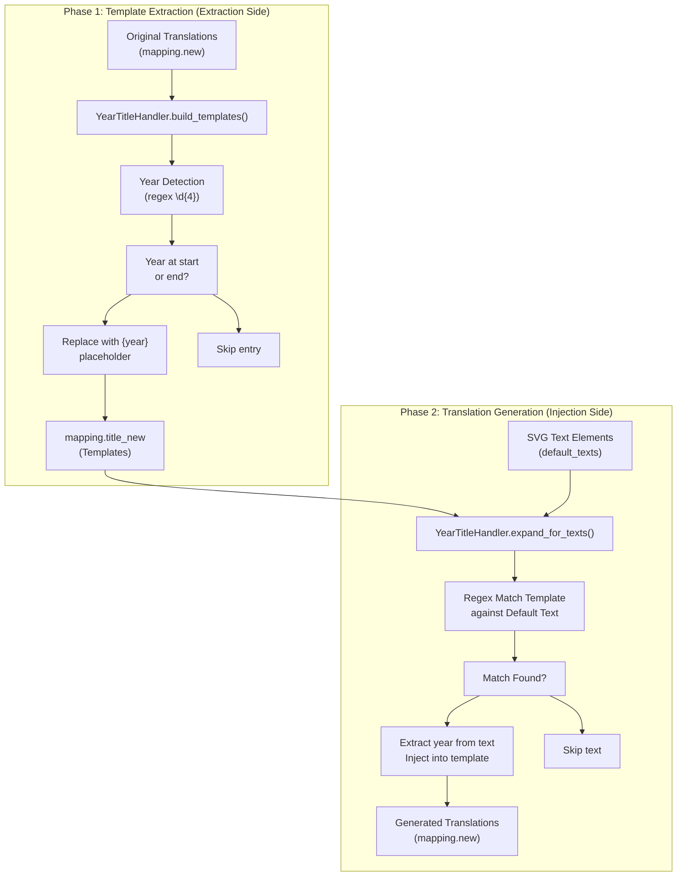
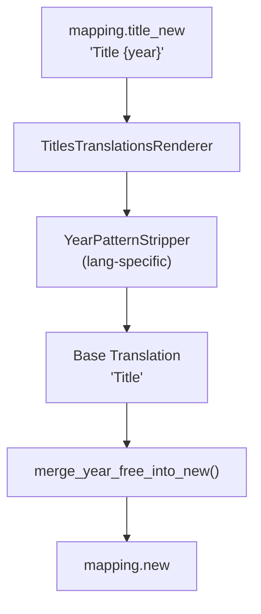

# Title Translations with Year Suffixes

> **Relevant source files**
> * [CopySVGTranslation/titles/__init__.py](https://github.com/MrIbrahem/CopySVGTranslation/blob/d984a401/CopySVGTranslation/titles/__init__.py)
> * [CopySVGTranslation/titles/year_handler.py](https://github.com/MrIbrahem/CopySVGTranslation/blob/d984a401/CopySVGTranslation/titles/year_handler.py)
> * [CopySVGTranslation/titles/year_stripper.py](https://github.com/MrIbrahem/CopySVGTranslation/blob/d984a401/CopySVGTranslation/titles/year_stripper.py)
> * [tests/unit/core/test_switch_node.py](https://github.com/MrIbrahem/CopySVGTranslation/blob/d984a401/tests/unit/core/test_switch_node.py)
> * [tests/unit/core/test_text_node.py](https://github.com/MrIbrahem/CopySVGTranslation/blob/d984a401/tests/unit/core/test_text_node.py)
> * [tests/unit/extraction/test_strategies.py](https://github.com/MrIbrahem/CopySVGTranslation/blob/d984a401/tests/unit/extraction/test_strategies.py)
> * [tests/unit/injection/test_translation_applier.py](https://github.com/MrIbrahem/CopySVGTranslation/blob/d984a401/tests/unit/injection/test_translation_applier.py)
> * [tests/unit/io/test_mapping_store.py](https://github.com/MrIbrahem/CopySVGTranslation/blob/d984a401/tests/unit/io/test_mapping_store.py)
> * [tests/unit/test_result.py](https://github.com/MrIbrahem/CopySVGTranslation/blob/d984a401/tests/unit/test_result.py)
> * [tests/unit/titles/test_year_handler.py](https://github.com/MrIbrahem/CopySVGTranslation/blob/d984a401/tests/unit/titles/test_year_handler.py)
> * [tests/unit/titles/test_year_stripper.py](https://github.com/MrIbrahem/CopySVGTranslation/blob/d984a401/tests/unit/titles/test_year_stripper.py)

## Purpose and Scope

This document explains the specialized functionality for handling dynamic title translations that contain year suffixes. The system provides tools within the `CopySVGTranslation.titles` module to extract year-independent translation templates and regenerate translations with different years.

This feature is useful when SVG files contain titles like "Population Growth 2020" that need to be translated to multiple target years (2021, 2022, etc.) without manually creating translations for each year variant. For general text extraction and injection workflows, see [Extraction](/MrIbrahem/CopySVGTranslation/4.1-extraction) and [Injection](/MrIbrahem/CopySVGTranslation/4.2-injection).

## Concept Overview

Title translations with year suffixes solve a common problem in data visualization: SVG files often contain titles that reference a specific year (e.g., "COVID-19 Cases 2020"). The `YearTitleHandler` class provides the unified logic for these operations [CopySVGTranslation/titles/year_handler.py L18-L23](https://github.com/MrIbrahem/CopySVGTranslation/blob/d984a401/CopySVGTranslation/titles/year_handler.py#L18-L23)

The solution involves two phases:

1. **Template Extraction**: Remove year suffixes from existing translations to create reusable templates using `build_title_new_templates()` [CopySVGTranslation/titles/year_handler.py L143-L145](https://github.com/MrIbrahem/CopySVGTranslation/blob/d984a401/CopySVGTranslation/titles/year_handler.py#L143-L145)
2. **Translation Generation**: Apply templates to new years to generate complete translations via `expand_for_texts()` [CopySVGTranslation/titles/year_handler.py L195-L201](https://github.com/MrIbrahem/CopySVGTranslation/blob/d984a401/CopySVGTranslation/titles/year_handler.py#L195-L201)

| Phase | Logic | Input Example | Output Example |
| --- | --- | --- | --- |
| **Template Extraction** | `build_title_new_templates` | `"COVID-19 2020"` → `{"es": "COVID-19 2020"}` | `"COVID-19 {year}"` → `{"es": "COVID-19 {year}"}` |
| **Translation Generation** | `expand_for_texts` | Template + `"COVID-19 2025"` | `"COVID-19 2025"` → `{"es": "COVID-19 2025"}` |

Sources: [CopySVGTranslation/titles/year_handler.py L143-L230](https://github.com/MrIbrahem/CopySVGTranslation/blob/d984a401/CopySVGTranslation/titles/year_handler.py#L143-L230)

 [tests/unit/titles/test_year_handler.py L45-L78](https://github.com/MrIbrahem/CopySVGTranslation/blob/d984a401/tests/unit/titles/test_year_handler.py#L45-L78)

## Workflow Diagram

**Description**: This diagram shows the data flow from raw translations to templated storage, and finally to dynamic generation during injection. The `YearTitleHandler` uses regex to identify years at the boundaries of strings [CopySVGTranslation/titles/year_handler.py L32-L45](https://github.com/MrIbrahem/CopySVGTranslation/blob/d984a401/CopySVGTranslation/titles/year_handler.py#L32-L45)

Sources: [CopySVGTranslation/titles/year_handler.py L124-L190](https://github.com/MrIbrahem/CopySVGTranslation/blob/d984a401/CopySVGTranslation/titles/year_handler.py#L124-L190)

 [CopySVGTranslation/titles/year_handler.py L195-L230](https://github.com/MrIbrahem/CopySVGTranslation/blob/d984a401/CopySVGTranslation/titles/year_handler.py#L195-L230)

## Implementation: YearTitleHandler

The `YearTitleHandler` is the core class managing these transformations. It relies on `TranslationConfig.enable_year_titles` to activate [CopySVGTranslation/titles/year_handler.py L25-L27](https://github.com/MrIbrahem/CopySVGTranslation/blob/d984a401/CopySVGTranslation/titles/year_handler.py#L25-L27)

### Year Detection and Replacement

The handler looks for 4-digit years at the start or end of a string [CopySVGTranslation/titles/year_handler.py L32-L45](https://github.com/MrIbrahem/CopySVGTranslation/blob/d984a401/CopySVGTranslation/titles/year_handler.py#L32-L45)

* **`match_year(text)`**: Returns the 4-digit year if found at boundaries [CopySVGTranslation/titles/year_handler.py L32-L37](https://github.com/MrIbrahem/CopySVGTranslation/blob/d984a401/CopySVGTranslation/titles/year_handler.py#L32-L37)
* **`replace_year_with_placeholder(text, year)`**: Swaps the concrete year for `{year}` [CopySVGTranslation/titles/year_handler.py L61-L66](https://github.com/MrIbrahem/CopySVGTranslation/blob/d984a401/CopySVGTranslation/titles/year_handler.py#L61-L66)
* **`apply_year(template, year)`**: Reverses the process, injecting a year into a template [CopySVGTranslation/titles/year_handler.py L77-L80](https://github.com/MrIbrahem/CopySVGTranslation/blob/d984a401/CopySVGTranslation/titles/year_handler.py#L77-L80)

Sources: [CopySVGTranslation/titles/year_handler.py L32-L80](https://github.com/MrIbrahem/CopySVGTranslation/blob/d984a401/CopySVGTranslation/titles/year_handler.py#L32-L80)

 [tests/unit/titles/test_year_handler.py L17-L78](https://github.com/MrIbrahem/CopySVGTranslation/blob/d984a401/tests/unit/titles/test_year_handler.py#L17-L78)

### Extraction side: Template Building

During extraction, the system populates `mapping.title_new` from `mapping.new`.

* **`build_templates(mapping)`**: Iterates through translations and stores templated versions in the mapping object [CopySVGTranslation/titles/year_handler.py L124-L141](https://github.com/MrIbrahem/CopySVGTranslation/blob/d984a401/CopySVGTranslation/titles/year_handler.py#L124-L141)
* **Validation**: It only creates a template if the translation in every language contains the same year as the source key [CopySVGTranslation/titles/year_handler.py L147-L158](https://github.com/MrIbrahem/CopySVGTranslation/blob/d984a401/CopySVGTranslation/titles/year_handler.py#L147-L158)

Sources: [CopySVGTranslation/titles/year_handler.py L124-L190](https://github.com/MrIbrahem/CopySVGTranslation/blob/d984a401/CopySVGTranslation/titles/year_handler.py#L124-L190)

 [tests/unit/titles/test_year_handler.py L100-L154](https://github.com/MrIbrahem/CopySVGTranslation/blob/d984a401/tests/unit/titles/test_year_handler.py#L100-L154)

### Injection side: Expansion

During injection, `expand_for_texts()` takes the text found in the target SVG and generates new entries for `mapping.new`.

* **Matching**: It uses `re.match` to see if a `default_text` (like "Population 2025") matches a template (like "Population {year}") [CopySVGTranslation/titles/year_handler.py L218-L223](https://github.com/MrIbrahem/CopySVGTranslation/blob/d984a401/CopySVGTranslation/titles/year_handler.py#L218-L223)
* **Generation**: If a match is found, it extracts the year and populates translations for all languages defined in the template [CopySVGTranslation/titles/year_handler.py L225-L230](https://github.com/MrIbrahem/CopySVGTranslation/blob/d984a401/CopySVGTranslation/titles/year_handler.py#L225-L230)

Sources: [CopySVGTranslation/titles/year_handler.py L195-L230](https://github.com/MrIbrahem/CopySVGTranslation/blob/d984a401/CopySVGTranslation/titles/year_handler.py#L195-L230)

 [tests/unit/titles/test_year_handler.py L155-L182](https://github.com/MrIbrahem/CopySVGTranslation/blob/d984a401/tests/unit/titles/test_year_handler.py#L155-L182)

## Year Pattern Stripping

The system also supports stripping years entirely to create "year-free" base translations. This is handled by `YearPatternStripper` and `YearFreeTitleMerger` [CopySVGTranslation/titles/year_stripper.py L14-L115](https://github.com/MrIbrahem/CopySVGTranslation/blob/d984a401/CopySVGTranslation/titles/year_stripper.py#L14-L115)

### Language-Specific Stripping

`YearPatternStripper` handles variations in how years are attached to titles across different languages [CopySVGTranslation/titles/year_stripper.py L14-L17](https://github.com/MrIbrahem/CopySVGTranslation/blob/d984a401/CopySVGTranslation/titles/year_stripper.py#L14-L17)

| Language | Pattern Examples | Logic |
| --- | --- | --- |
| **Generic** | `, {year}`, `{year}` | Strips standard suffixes [CopySVGTranslation/titles/year_stripper.py L19-L25](https://github.com/MrIbrahem/CopySVGTranslation/blob/d984a401/CopySVGTranslation/titles/year_stripper.py#L19-L25) |
| **Japanese (ja)** | `{year}年の`, `年{year}` | Strips specific prefixes/suffixes [CopySVGTranslation/titles/year_stripper.py L31-L34](https://github.com/MrIbrahem/CopySVGTranslation/blob/d984a401/CopySVGTranslation/titles/year_stripper.py#L31-L34) |
| **Abron (abr)** | `, afe {year}` | Strips specific suffix [CopySVGTranslation/titles/year_stripper.py L28-L30](https://github.com/MrIbrahem/CopySVGTranslation/blob/d984a401/CopySVGTranslation/titles/year_stripper.py#L28-L30) |

Sources: [CopySVGTranslation/titles/year_stripper.py L19-L64](https://github.com/MrIbrahem/CopySVGTranslation/blob/d984a401/CopySVGTranslation/titles/year_stripper.py#L19-L64)

 [tests/unit/titles/test_year_stripper.py L48-L118](https://github.com/MrIbrahem/CopySVGTranslation/blob/d984a401/tests/unit/titles/test_year_stripper.py#L48-L118)

### Merging Year-Free Titles

The `merge_year_free_into_new()` function takes templates from `mapping.title_new`, strips the `{year}` placeholder, and adds the resulting base translation to `mapping.new` [CopySVGTranslation/titles/year_stripper.py L157-L164](https://github.com/MrIbrahem/CopySVGTranslation/blob/d984a401/CopySVGTranslation/titles/year_stripper.py#L157-L164)

Sources: [CopySVGTranslation/titles/year_stripper.py L67-L105](https://github.com/MrIbrahem/CopySVGTranslation/blob/d984a401/CopySVGTranslation/titles/year_stripper.py#L67-L105)

 [CopySVGTranslation/titles/year_stripper.py L157-L164](https://github.com/MrIbrahem/CopySVGTranslation/blob/d984a401/CopySVGTranslation/titles/year_stripper.py#L157-L164)

## Integration with TranslationMapping

The `TranslationMapping` object acts as the data carrier for these features.

* **`mapping.new`**: Stores concrete translations (e.g., "Population 2020").
* **`mapping.title_new`**: Stores templates (e.g., "Population {year}").
* **`mapping.meta['header']`**: Often contains the source titles processed by `process_header_titles()` [CopySVGTranslation/titles/year_handler.py L86-L92](https://github.com/MrIbrahem/CopySVGTranslation/blob/d984a401/CopySVGTranslation/titles/year_handler.py#L86-L92)

Sources: [CopySVGTranslation/titles/year_handler.py L86-L122](https://github.com/MrIbrahem/CopySVGTranslation/blob/d984a401/CopySVGTranslation/titles/year_handler.py#L86-L122)

 [CopySVGTranslation/core/mapping.py L10-L33](https://github.com/MrIbrahem/CopySVGTranslation/blob/d984a401/CopySVGTranslation/core/mapping.py#L10-L33)

## Summary of Key Classes

| Class | Responsibility |
| --- | --- |
| `YearTitleHandler` | Unified management of templating and expansion [CopySVGTranslation/titles/year_handler.py L18](https://github.com/MrIbrahem/CopySVGTranslation/blob/d984a401/CopySVGTranslation/titles/year_handler.py#L18-L18) |
| `YearPatternStripper` | Removing `{year}` strings based on language rules [CopySVGTranslation/titles/year_stripper.py L14](https://github.com/MrIbrahem/CopySVGTranslation/blob/d984a401/CopySVGTranslation/titles/year_stripper.py#L14-L14) |
| `TitlesTranslationsRenderer` | Converting a batch of templates into year-free strings [CopySVGTranslation/titles/year_stripper.py L67](https://github.com/MrIbrahem/CopySVGTranslation/blob/d984a401/CopySVGTranslation/titles/year_stripper.py#L67-L67) |
| `YearFreeTitleMerger` | Updating `mapping.new` with year-free versions of titles [CopySVGTranslation/titles/year_stripper.py L108](https://github.com/MrIbrahem/CopySVGTranslation/blob/d984a401/CopySVGTranslation/titles/year_stripper.py#L108-L108) |

Sources: [CopySVGTranslation/titles/__init__.py L1-L17](https://github.com/MrIbrahem/CopySVGTranslation/blob/d984a401/CopySVGTranslation/titles/__init__.py#L1-L17)