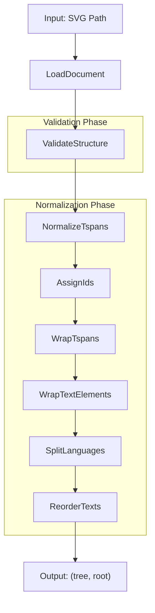
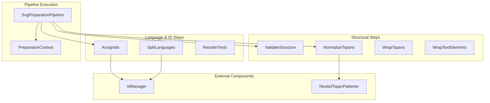

# SVG Preparation

> **Relevant source files**
> * [CopySVGTranslation/config.py](https://github.com/MrIbrahem/CopySVGTranslation/blob/d984a401/CopySVGTranslation/config.py)
> * [CopySVGTranslation/preparation/preparer.py](https://github.com/MrIbrahem/CopySVGTranslation/blob/d984a401/CopySVGTranslation/preparation/preparer.py)
> * [CopySVGTranslation/preparation/steps/__init__.py](https://github.com/MrIbrahem/CopySVGTranslation/blob/d984a401/CopySVGTranslation/preparation/steps/__init__.py)
> * [CopySVGTranslation/preparation/steps/assign_ids.py](https://github.com/MrIbrahem/CopySVGTranslation/blob/d984a401/CopySVGTranslation/preparation/steps/assign_ids.py)
> * [CopySVGTranslation/preparation/steps/normalize_tspans.py](https://github.com/MrIbrahem/CopySVGTranslation/blob/d984a401/CopySVGTranslation/preparation/steps/normalize_tspans.py)
> * [CopySVGTranslation/preparation/steps/split_languages.py](https://github.com/MrIbrahem/CopySVGTranslation/blob/d984a401/CopySVGTranslation/preparation/steps/split_languages.py)
> * [tests/e2e/injection/test_inject2.py](https://github.com/MrIbrahem/CopySVGTranslation/blob/d984a401/tests/e2e/injection/test_inject2.py)
> * [tests/e2e/preparation/test_make_translation_ready.py](https://github.com/MrIbrahem/CopySVGTranslation/blob/d984a401/tests/e2e/preparation/test_make_translation_ready.py)
> * [tests/e2e/test_manual_workflows.py](https://github.com/MrIbrahem/CopySVGTranslation/blob/d984a401/tests/e2e/test_manual_workflows.py)

This document describes the SVG preparation system, which validates and normalizes SVG structure before translation injection. The system is centered around the `SvgPreparationPipeline`, which ensures that SVG files conform to the structural requirements needed for reliable translation injection.

For information about fixing nested elements detected during preparation, see [Nested Element Handling](/MrIbrahem/CopySVGTranslation/5.3-nested-element-handling). For the injection process that follows preparation, see [Injection](/MrIbrahem/CopySVGTranslation/4.2-injection).

## Purpose and Scope

SVG preparation ensures that SVG files conform to the structural requirements needed for reliable translation injection. This includes:

* Validating SVG syntax and structural invariants [CopySVGTranslation/preparation/preparer.py L32-L39](https://github.com/MrIbrahem/CopySVGTranslation/blob/d984a401/CopySVGTranslation/preparation/preparer.py#L32-L39)
* Detecting and reporting unsupported constructs like nested tspans or duplicate languages [CopySVGTranslation/preparation/steps/split_languages.py L93-L99](https://github.com/MrIbrahem/CopySVGTranslation/blob/d984a401/CopySVGTranslation/preparation/steps/split_languages.py#L93-L99)
* Normalizing text elements by ensuring translatable text is wrapped in `<tspan>` elements [CopySVGTranslation/preparation/steps/normalize_tspans.py L25-L27](https://github.com/MrIbrahem/CopySVGTranslation/blob/d984a401/CopySVGTranslation/preparation/steps/normalize_tspans.py#L25-L27)
* Ensuring all translatable nodes have unique, normalized IDs [CopySVGTranslation/preparation/steps/assign_ids.py L31-L36](https://github.com/MrIbrahem/CopySVGTranslation/blob/d984a401/CopySVGTranslation/preparation/steps/assign_ids.py#L31-L36)
* Normalizing language codes and expanding comma-separated `systemLanguage` values into cloned nodes [CopySVGTranslation/preparation/steps/split_languages.py L33-L34](https://github.com/MrIbrahem/CopySVGTranslation/blob/d984a401/CopySVGTranslation/preparation/steps/split_languages.py#L33-L34)
* Reordering text elements within switches for deterministic rendering [CopySVGTranslation/preparation/preparer.py L38-L39](https://github.com/MrIbrahem/CopySVGTranslation/blob/d984a401/CopySVGTranslation/preparation/preparer.py#L38-L39)

**Sources:** [CopySVGTranslation/preparation/preparer.py L28-L39](https://github.com/MrIbrahem/CopySVGTranslation/blob/d984a401/CopySVGTranslation/preparation/preparer.py#L28-L39)

 [CopySVGTranslation/preparation/steps/split_languages.py L86-L107](https://github.com/MrIbrahem/CopySVGTranslation/blob/d984a401/CopySVGTranslation/preparation/steps/split_languages.py#L86-L107)

 [CopySVGTranslation/preparation/steps/normalize_tspans.py L15-L28](https://github.com/MrIbrahem/CopySVGTranslation/blob/d984a401/CopySVGTranslation/preparation/steps/normalize_tspans.py#L15-L28)

## Preparation Workflow

The preparation process follows a multi-stage pipeline defined in `SvgPreparationPipeline`. Each step is a discrete operation executed in sequence.

### Preparation Pipeline Diagram



**Sources:** [CopySVGTranslation/preparation/preparer.py L43-L52](https://github.com/MrIbrahem/CopySVGTranslation/blob/d984a401/CopySVGTranslation/preparation/preparer.py#L43-L52)

 [CopySVGTranslation/preparation/steps/__init__.py L2-L9](https://github.com/MrIbrahem/CopySVGTranslation/blob/d984a401/CopySVGTranslation/preparation/steps/__init__.py#L2-L9)

## Main Class: SvgPreparationPipeline

The `SvgPreparationPipeline` class manages the execution of preparation steps. It uses a `PreparationContext` to share state (like the `IdManager` and the XML tree) across steps [CopySVGTranslation/preparation/preparer.py L62-L66](https://github.com/MrIbrahem/CopySVGTranslation/blob/d984a401/CopySVGTranslation/preparation/preparer.py#L62-L66)

### Class Definition

| Entity | Location | Description |
| --- | --- | --- |
| `SvgPreparationPipeline` | [CopySVGTranslation/preparation/preparer.py L28](https://github.com/MrIbrahem/CopySVGTranslation/blob/d984a401/CopySVGTranslation/preparation/preparer.py#L28-L28) | Orchestrates the preparation steps. |
| `PreparationContext` | [CopySVGTranslation/preparation/steps/base.py](https://github.com/MrIbrahem/CopySVGTranslation/blob/d984a401/CopySVGTranslation/preparation/steps/base.py) | Data container for the tree, root, config, and ID manager. |
| `run()` | [CopySVGTranslation/preparation/preparer.py L57](https://github.com/MrIbrahem/CopySVGTranslation/blob/d984a401/CopySVGTranslation/preparation/preparer.py#L57-L57) | Executes the pipeline on a given file path. |

### Configuration Influence

The pipeline behavior is controlled by `TranslationConfig` [CopySVGTranslation/config.py L10](https://github.com/MrIbrahem/CopySVGTranslation/blob/d984a401/CopySVGTranslation/config.py#L10-L10)

:

* `nested_strategy`: Determines how nested `<tspan>` elements are handled (e.g., `"raise"`, `"flatten"`) [CopySVGTranslation/config.py L28-L34](https://github.com/MrIbrahem/CopySVGTranslation/blob/d984a401/CopySVGTranslation/config.py#L28-L34)
* `assign_missing_ids`: If `True`, the `AssignIds` step will generate `trsvgN` IDs for nodes lacking them [CopySVGTranslation/config.py L66-L67](https://github.com/MrIbrahem/CopySVGTranslation/blob/d984a401/CopySVGTranslation/config.py#L66-L67)
* `normalize_languages`: Controls if `systemLanguage` values are standardized [CopySVGTranslation/config.py L63-L64](https://github.com/MrIbrahem/CopySVGTranslation/blob/d984a401/CopySVGTranslation/config.py#L63-L64)

**Sources:** [CopySVGTranslation/preparation/preparer.py L41-L70](https://github.com/MrIbrahem/CopySVGTranslation/blob/d984a401/CopySVGTranslation/preparation/preparer.py#L41-L70)

 [CopySVGTranslation/config.py L9-L81](https://github.com/MrIbrahem/CopySVGTranslation/blob/d984a401/CopySVGTranslation/config.py#L9-L81)

## Code Entity Architecture

This diagram maps system logic to specific implementation classes within the `preparation` module.



**Sources:** [CopySVGTranslation/preparation/preparer.py L43-L52](https://github.com/MrIbrahem/CopySVGTranslation/blob/d984a401/CopySVGTranslation/preparation/preparer.py#L43-L52)

 [CopySVGTranslation/preparation/steps/normalize_tspans.py L21-L23](https://github.com/MrIbrahem/CopySVGTranslation/blob/d984a401/CopySVGTranslation/preparation/steps/normalize_tspans.py#L21-L23)

 [CopySVGTranslation/preparation/steps/assign_ids.py L19-L22](https://github.com/MrIbrahem/CopySVGTranslation/blob/d984a401/CopySVGTranslation/preparation/steps/assign_ids.py#L19-L22)

## Key Normalization Operations

### Text Wrapping (NormalizeTspans)

This step ensures that "loose" text (text nodes directly under `<text>` or text tails after children) is wrapped in `<tspan>` elements to make them addressable for translation [CopySVGTranslation/preparation/steps/normalize_tspans.py L25-L27](https://github.com/MrIbrahem/CopySVGTranslation/blob/d984a401/CopySVGTranslation/preparation/steps/normalize_tspans.py#L25-L27)

**Before:**

```xml
<text>Loose text <tspan>Existing</tspan> Tail text</text>
```

**After:**

```xml
<text>    <tspan>Loose text </tspan>    <tspan>Existing</tspan>    <tspan> Tail text</tspan></text>
```

**Sources:** [CopySVGTranslation/preparation/steps/normalize_tspans.py L29-L57](https://github.com/MrIbrahem/CopySVGTranslation/blob/d984a401/CopySVGTranslation/preparation/steps/normalize_tspans.py#L29-L57)

### Language Splitting (SplitLanguages)

If a `<text>` element declares multiple languages in `systemLanguage` (e.g., `ar,fr`), the pipeline clones the element so each node represents exactly one language [CopySVGTranslation/preparation/steps/split_languages.py L32-L34](https://github.com/MrIbrahem/CopySVGTranslation/blob/d984a401/CopySVGTranslation/preparation/steps/split_languages.py#L32-L34)

**Validation:** The step raises `SvgStructureError` if the same language is declared twice in a switch or within one element [CopySVGTranslation/preparation/steps/split_languages.py L97-L99](https://github.com/MrIbrahem/CopySVGTranslation/blob/d984a401/CopySVGTranslation/preparation/steps/split_languages.py#L97-L99)

**ID Reassignment:** Cloned elements receive new unique IDs via the `IdManager` to prevent ID collisions [CopySVGTranslation/preparation/steps/split_languages.py L72-L84](https://github.com/MrIbrahem/CopySVGTranslation/blob/d984a401/CopySVGTranslation/preparation/steps/split_languages.py#L72-L84)

**Sources:** [CopySVGTranslation/preparation/steps/split_languages.py L41-L85](https://github.com/MrIbrahem/CopySVGTranslation/blob/d984a401/CopySVGTranslation/preparation/steps/split_languages.py#L41-L85)

 [CopySVGTranslation/preparation/steps/split_languages.py L121-L136](https://github.com/MrIbrahem/CopySVGTranslation/blob/d984a401/CopySVGTranslation/preparation/steps/split_languages.py#L121-L136)

### ID Assignment (AssignIds)

The `AssignIds` step ensures every translatable node has an ID. It first registers all existing IDs in the `IdManager` to prevent duplicates [CopySVGTranslation/preparation/steps/assign_ids.py L17-L22](https://github.com/MrIbrahem/CopySVGTranslation/blob/d984a401/CopySVGTranslation/preparation/steps/assign_ids.py#L17-L22)

 If `assign_missing_ids` is enabled, it generates `trsvgN` IDs for `<text>` and `<tspan>` elements missing them [CopySVGTranslation/preparation/steps/assign_ids.py L31-L43](https://github.com/MrIbrahem/CopySVGTranslation/blob/d984a401/CopySVGTranslation/preparation/steps/assign_ids.py#L31-L43)

**Sources:** [CopySVGTranslation/preparation/steps/assign_ids.py L11-L43](https://github.com/MrIbrahem/CopySVGTranslation/blob/d984a401/CopySVGTranslation/preparation/steps/assign_ids.py#L11-L43)

## Validation and Exceptions

The pipeline performs rigorous structural validation. If a violation is found, it raises specific exceptions:

| Error Code | Source | Condition |
| --- | --- | --- |
| `structure-error-multiple-text-same-lang` | [split_languages.py L134](https://github.com/MrIbrahem/CopySVGTranslation/blob/d984a401/split_languages.py#L134-L134) | Two different `<text>` elements in a switch share a language. |
| `structure-error-multiple-lang-in-text` | [split_languages.py L129](https://github.com/MrIbrahem/CopySVGTranslation/blob/d984a401/split_languages.py#L129-L129) | A single `<text>` element repeats a language in its `systemLanguage` attribute. |
| `structure-error-switch-child-not-text` | [split_languages.py L119](https://github.com/MrIbrahem/CopySVGTranslation/blob/d984a401/split_languages.py#L119-L119) | A `<switch>` contains a child that is not a `<text>` element. |
| `structure-error-invalid-node-id` | [normalize_tspans.py L92](https://github.com/MrIbrahem/CopySVGTranslation/blob/d984a401/normalize_tspans.py#L92-L92) | An ID contains forbidden characters like ` |

**Sources:** [CopySVGTranslation/preparation/steps/split_languages.py L111-L139](https://github.com/MrIbrahem/CopySVGTranslation/blob/d984a401/CopySVGTranslation/preparation/steps/split_languages.py#L111-L139)

 [CopySVGTranslation/preparation/steps/normalize_tspans.py L79-L101](https://github.com/MrIbrahem/CopySVGTranslation/blob/d984a401/CopySVGTranslation/preparation/steps/normalize_tspans.py#L79-L101)

## Usage Example

The pipeline is typically used via the `run()` method. In many tests, a wrapper function `preparer_run` is used for convenience.

```javascript
from pathlib import Pathfrom CopySVGTranslation.preparation import SvgPreparationPipelinefrom CopySVGTranslation import TranslationConfig config = TranslationConfig(nested_strategy="raise", assign_missing_ids=True)pipeline = SvgPreparationPipeline(config) # Run preparationtree, root = pipeline.run(path=Path("input.svg")) # The resulting tree is now normalized and ready for injectiontree.write("prepared.svg", pretty_print=True, encoding="utf-8")
```

**Sources:** [tests/e2e/preparation/test_make_translation_ready.py L16-L25](https://github.com/MrIbrahem/CopySVGTranslation/blob/d984a401/tests/e2e/preparation/test_make_translation_ready.py#L16-L25)

 [CopySVGTranslation/preparation/preparer.py L57-L70](https://github.com/MrIbrahem/CopySVGTranslation/blob/d984a401/CopySVGTranslation/preparation/preparer.py#L57-L70)