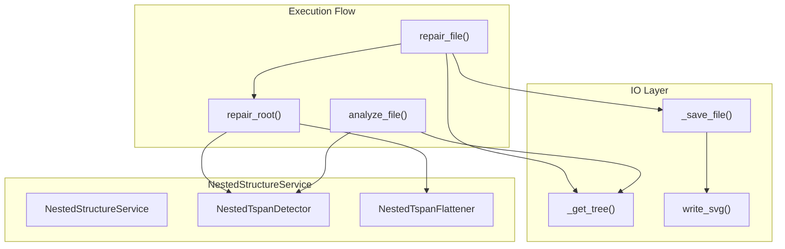
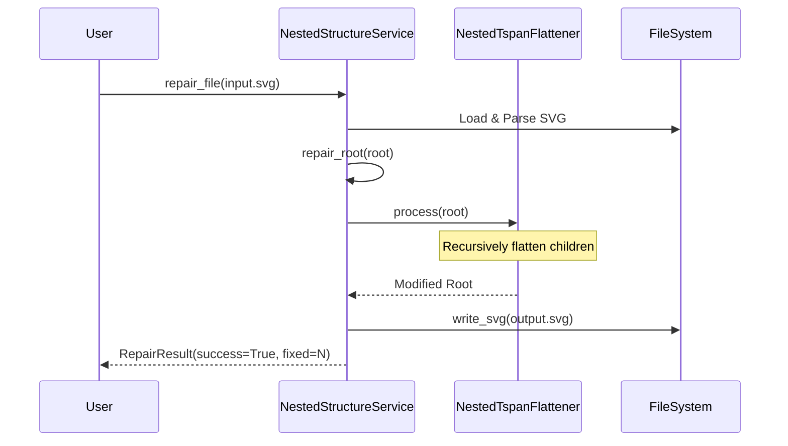

# Nested Element Handling

> **Relevant source files**
> * [CopySVGTranslation/io/output_paths.py](https://github.com/MrIbrahem/CopySVGTranslation/blob/d984a401/CopySVGTranslation/io/output_paths.py)
> * [CopySVGTranslation/io/svg_document.py](https://github.com/MrIbrahem/CopySVGTranslation/blob/d984a401/CopySVGTranslation/io/svg_document.py)
> * [CopySVGTranslation/nested/objects.py](https://github.com/MrIbrahem/CopySVGTranslation/blob/d984a401/CopySVGTranslation/nested/objects.py)
> * [CopySVGTranslation/nested/service.py](https://github.com/MrIbrahem/CopySVGTranslation/blob/d984a401/CopySVGTranslation/nested/service.py)
> * [tests/integration/nested/test_fixer_flatten_strategy.py](https://github.com/MrIbrahem/CopySVGTranslation/blob/d984a401/tests/integration/nested/test_fixer_flatten_strategy.py)
> * [tests/integration/nested/test_fixer_nested_file.py](https://github.com/MrIbrahem/CopySVGTranslation/blob/d984a401/tests/integration/nested/test_fixer_nested_file.py)
> * [tests/integration/nested/test_fixer_nested_links.py](https://github.com/MrIbrahem/CopySVGTranslation/blob/d984a401/tests/integration/nested/test_fixer_nested_links.py)

This page documents the detection and correction of nested `<tspan>` and `<a>` elements within SVG files. The CopySVGTranslation system provides the `NestedStructureService` to handle these problematic structures, ensuring SVG files are compatible with translation injection workflows.

---

## Purpose and Problem Statement

SVG files generated by data visualization tools often contain nested `<tspan>` elements within parent `<tspan>` elements, or `<a>` (anchor/link) elements nested inside `<tspan>` elements. This nesting violates the expectations of many translation tools and the internal injection logic, which expect flat text structures.

**Problematic Structure (Nested Tspans):**
[tests/integration/nested/test_fixer_nested_file.py L62](https://github.com/MrIbrahem/CopySVGTranslation/blob/d984a401/tests/integration/nested/test_fixer_nested_file.py#L62-L62)

```xml
<text><tspan>One<tspan>Two</tspan>Three</tspan></text>
```

**Problematic Structure (Nested Links):**
[tests/integration/nested/test_fixer_nested_links.py L35](https://github.com/MrIbrahem/CopySVGTranslation/blob/d984a401/tests/integration/nested/test_fixer_nested_links.py#L35-L35)

```xml
<text><tspan>See <a href="https://ex.com">link</a></tspan></text>
```

The `NestedStructureService` detects these structures and applies a flattening strategy to normalize the SVG tree.

**Sources:** [CopySVGTranslation/nested/service.py L21-L36](https://github.com/MrIbrahem/CopySVGTranslation/blob/d984a401/CopySVGTranslation/nested/service.py#L21-L36)

 [tests/integration/nested/test_fixer_nested_file.py L61-L70](https://github.com/MrIbrahem/CopySVGTranslation/blob/d984a401/tests/integration/nested/test_fixer_nested_file.py#L61-L70)

---

## System Architecture

The nested handling logic is encapsulated in the `nested` module, utilizing a service-based architecture that separates detection, transformation, and I/O.

### Natural Language to Code Entity Mapping

| Concept | Code Entity | Role |
| --- | --- | --- |
| **Service Entry Point** | `NestedStructureService` | Orchestrates detection and repair operations. |
| **Detection Engine** | `NestedTspanDetector` | Identifies elements with child elements. |
| **Repair Strategy** | `NestedTspanFlattener` | Implements the "flatten" logic for tspans and links. |
| **Repair Statistics** | `RepairResult` | Data class holding success status and tag counts. |
| **File Writer** | `write_svg` | Persists modified SVG trees to disk. |

### System Flow Diagram



**Diagram: Nested Element Handling System Architecture**

**Sources:** [CopySVGTranslation/nested/service.py L21-L37](https://github.com/MrIbrahem/CopySVGTranslation/blob/d984a401/CopySVGTranslation/nested/service.py#L21-L37)

 [CopySVGTranslation/nested/objects.py L10-L23](https://github.com/MrIbrahem/CopySVGTranslation/blob/d984a401/CopySVGTranslation/nested/objects.py#L10-L23)

---

## Detection Mechanism

The detection phase identifies `<tspan>` elements that contain child elements (rather than just text content).

### analyze_file()

This method performs a read-only scan of an SVG file.

**Function Signature:**
[CopySVGTranslation/nested/service.py L38-L41](https://github.com/MrIbrahem/CopySVGTranslation/blob/d984a401/CopySVGTranslation/nested/service.py#L38-L41)

```python
def analyze_file(self, source: Path | str) -> list[str]:
```

**Detection Logic:**

1. **Load:** Parses the SVG using `lxml.etree.XMLParser` with `remove_blank_text=True` to ignore formatting whitespace [CopySVGTranslation/nested/service.py L51](https://github.com/MrIbrahem/CopySVGTranslation/blob/d984a401/CopySVGTranslation/nested/service.py#L51-L51)
2. **Scan:** The `NestedTspanDetector` traverses the tree to find `<tspan>` elements that have element children [tests/integration/nested/test_fixer_nested_file.py L96-L98](https://github.com/MrIbrahem/CopySVGTranslation/blob/d984a401/tests/integration/nested/test_fixer_nested_file.py#L96-L98)
3. **Serialize:** Each match is returned as a serialized XML string for reporting [CopySVGTranslation/nested/service.py L44](https://github.com/MrIbrahem/CopySVGTranslation/blob/d984a401/CopySVGTranslation/nested/service.py#L44-L44)

**Sources:** [CopySVGTranslation/nested/service.py L38-L65](https://github.com/MrIbrahem/CopySVGTranslation/blob/d984a401/CopySVGTranslation/nested/service.py#L38-L65)

 [tests/integration/nested/test_fixer_nested_file.py L28-L30](https://github.com/MrIbrahem/CopySVGTranslation/blob/d984a401/tests/integration/nested/test_fixer_nested_file.py#L28-L30)

---

## Repair Mechanism

The repair process uses the `NestedTspanFlattener` to remove nesting while preserving the text sequence.

### repair_file()

The primary entry point for modifying files. It parses the source, applies repairs, and optionally saves the result.

[CopySVGTranslation/nested/service.py L83-L89](https://github.com/MrIbrahem/CopySVGTranslation/blob/d984a401/CopySVGTranslation/nested/service.py#L83-L89)

```python
def repair_file(    self,    source: Path | str,    output: Path | str | None = None,    strategy: NestedStrategy | None = None,    save: bool = True,) -> RepairResult:
```

### Flattening Strategy

The current implementation primarily uses the `"flatten"` strategy.

**Transformation Logic:**

1. **Concatenation:** All text within the nested structure is concatenated into the parent's `.text` attribute [tests/integration/nested/test_fixer_nested_file.py L153-L157](https://github.com/MrIbrahem/CopySVGTranslation/blob/d984a401/tests/integration/nested/test_fixer_nested_file.py#L153-L157)
2. **Attribute Preservation:** Attributes on the outer `<tspan>` (like `x`, `y`, `class`) are preserved [tests/integration/nested/test_fixer_nested_file.py L169-L179](https://github.com/MrIbrahem/CopySVGTranslation/blob/d984a401/tests/integration/nested/test_fixer_nested_file.py#L169-L179)
3. **Link Handling:** If `also_fix_a` is enabled (default `True`), anchor `<a>` tags are stripped, and their text content is merged into the parent `<tspan>` [tests/integration/nested/test_fixer_nested_links.py L136-L153](https://github.com/MrIbrahem/CopySVGTranslation/blob/d984a401/tests/integration/nested/test_fixer_nested_links.py#L136-L153)

**Repair Workflow Diagram:**



**Diagram: Repair Execution Sequence**

**Sources:** [CopySVGTranslation/nested/service.py L83-L130](https://github.com/MrIbrahem/CopySVGTranslation/blob/d984a401/CopySVGTranslation/nested/service.py#L83-L130)

 [tests/integration/nested/test_fixer_nested_file.py L135-L143](https://github.com/MrIbrahem/CopySVGTranslation/blob/d984a401/tests/integration/nested/test_fixer_nested_file.py#L135-L143)

 [tests/integration/nested/test_fixer_nested_links.py L126-L135](https://github.com/MrIbrahem/CopySVGTranslation/blob/d984a401/tests/integration/nested/test_fixer_nested_links.py#L126-L135)

---

## Repair Statistics: RepairResult

Every repair operation returns a `RepairResult` dataclass containing execution metadata.

| Field | Type | Description |
| --- | --- | --- |
| `success` | `bool` | Whether the operation completed without exceptions. |
| `len_tags_before_fix` | `int` | Number of nested structures detected before repair. |
| `len_tags_after_fix` | `int` | Number of nested structures remaining after repair (should be 0). |
| `len_tags_fixed` | `int` | Calculated as `before - after`. |
| `warnings` | `list[str]` | List of non-fatal errors or parsing warnings. |

**Sources:** [CopySVGTranslation/nested/objects.py L9-L23](https://github.com/MrIbrahem/CopySVGTranslation/blob/d984a401/CopySVGTranslation/nested/objects.py#L9-L23)

---

## Integration with I/O

The service integrates with the `SvgDocument` and `write_svg` utilities to ensure consistent XML serialization.

1. **Path Resolution:** Uses `resolve_svg_output_path` to handle output directories [CopySVGTranslation/io/output_paths.py L10-L20](https://github.com/MrIbrahem/CopySVGTranslation/blob/d984a401/CopySVGTranslation/io/output_paths.py#L10-L20)
2. **XML Consistency:** Uses the standard `SVG_NS` (`http://www.w3.org/2000/svg`) and ensures the default namespace is correctly applied [CopySVGTranslation/io/svg_document.py L15-L16](https://github.com/MrIbrahem/CopySVGTranslation/blob/d984a401/CopySVGTranslation/io/svg_document.py#L15-L16)  [CopySVGTranslation/io/svg_document.py L78-L84](https://github.com/MrIbrahem/CopySVGTranslation/blob/d984a401/CopySVGTranslation/io/svg_document.py#L78-L84)
3. **Serialization:** The `_save_file` method calls `write_svg`, which respects the `TranslationConfig` for formatting and encoding [CopySVGTranslation/nested/service.py L177-L185](https://github.com/MrIbrahem/CopySVGTranslation/blob/d984a401/CopySVGTranslation/nested/service.py#L177-L185)

**Sources:** [CopySVGTranslation/nested/service.py L177-L185](https://github.com/MrIbrahem/CopySVGTranslation/blob/d984a401/CopySVGTranslation/nested/service.py#L177-L185)

 [CopySVGTranslation/io/svg_document.py L19-L43](https://github.com/MrIbrahem/CopySVGTranslation/blob/d984a401/CopySVGTranslation/io/svg_document.py#L19-L43)

 [CopySVGTranslation/io/output_paths.py L10-L20](https://github.com/MrIbrahem/CopySVGTranslation/blob/d984a401/CopySVGTranslation/io/output_paths.py#L10-L20)