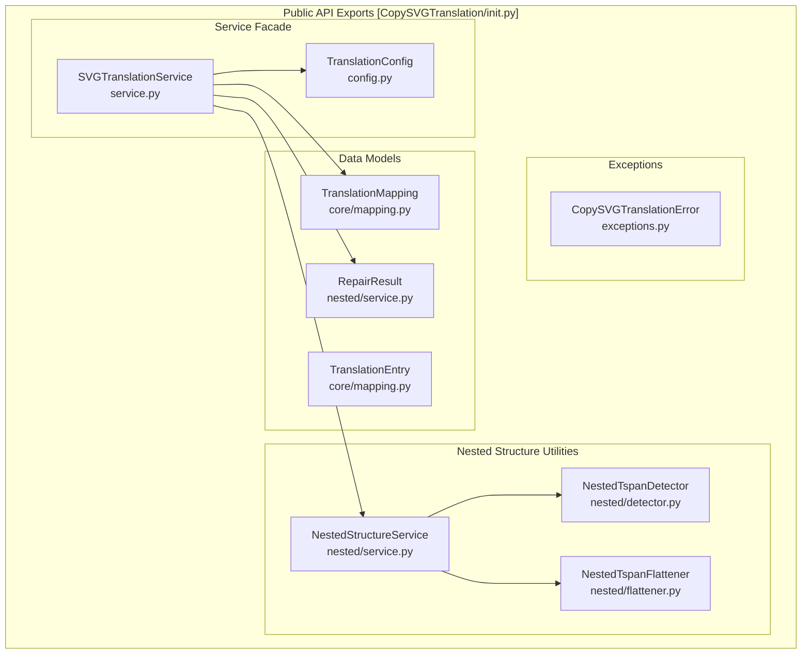

# API Reference

> **Relevant source files**
> * [CLAUDE.md](https://github.com/MrIbrahem/CopySVGTranslation/blob/d984a401/CLAUDE.md?plain=1)
> * [CopySVGTranslation/__init__.py](https://github.com/MrIbrahem/CopySVGTranslation/blob/d984a401/CopySVGTranslation/__init__.py)
> * [CopySVGTranslation/nested/__init__.py](https://github.com/MrIbrahem/CopySVGTranslation/blob/d984a401/CopySVGTranslation/nested/__init__.py)
> * [README.md](https://github.com/MrIbrahem/CopySVGTranslation/blob/d984a401/README.md?plain=1)
> * [requirements.txt](https://github.com/MrIbrahem/CopySVGTranslation/blob/d984a401/requirements.txt)

This document provides comprehensive documentation of all public functions, classes, and exceptions exported by the `CopySVGTranslation` package. It covers function signatures, parameters, return values, and usage patterns for programmatic access to the translation system.

For conceptual explanations of the translation workflow, see [Core Concepts](/MrIbrahem/CopySVGTranslation/3-core-concepts). For step-by-step usage instructions, see [Getting Started](/MrIbrahem/CopySVGTranslation/2-getting-started). For detailed behavior of specific subsystems, refer to [Main Features](/MrIbrahem/CopySVGTranslation/4-main-features) and [Advanced Features](/MrIbrahem/CopySVGTranslation/5-advanced-features).

---

## Public API Surface

The `CopySVGTranslation` package exports its primary functionality through a high-level facade, `SVGTranslationService`, while maintaining access to lower-level utilities and data structures.

### API Entity Map



**Sources:** [CopySVGTranslation/__init__.py L1-L31](https://github.com/MrIbrahem/CopySVGTranslation/blob/d984a401/CopySVGTranslation/__init__.py#L1-L31)

 [CLAUDE.md L33-L54](https://github.com/MrIbrahem/CopySVGTranslation/blob/d984a401/CLAUDE.md?plain=1#L33-L54)

### Public API Summary Table

| Class / Component | Module | Primary Purpose |
| --- | --- | --- |
| `SVGTranslationService` | `service.py` | Main high-level facade for all operations. |
| `TranslationConfig` | `config.py` | Configuration object for matching, output, and behavior. |
| `TranslationMapping` | `core/mapping.py` | Data structure representing extracted translations. |
| `NestedStructureService` | `nested/service.py` | Handles detection and flattening of nested SVG elements. |
| `CopySVGTranslationError` | `exceptions.py` | Base exception for all package-specific errors. |

**Sources:** [CopySVGTranslation/__init__.py L1-L31](https://github.com/MrIbrahem/CopySVGTranslation/blob/d984a401/CopySVGTranslation/__init__.py#L1-L31)

 [CLAUDE.md L33-L54](https://github.com/MrIbrahem/CopySVGTranslation/blob/d984a401/CLAUDE.md?plain=1#L33-L54)

---

## Core Service: SVGTranslationService

The `SVGTranslationService` is the primary entry point for the library. It orchestrates extraction, injection, and preparation.

### extract()

Extracts translation strings from an SVG file containing multilingual text elements organized in `<switch>` blocks. For details, see [Extraction Module API](/MrIbrahem/CopySVGTranslation/6.2-extraction-module-api).

**Method Signature:**

```python
def extract(    self,     svg_path: str | Path,     *,     save_mapping: bool | str | Path | None = None) -> OperationResult[TranslationMapping]
```

**Sources:** [CopySVGTranslation/service.py L126-L168](https://github.com/MrIbrahem/CopySVGTranslation/blob/d984a401/CopySVGTranslation/service.py#L126-L168)

 [README.md L123-L158](https://github.com/MrIbrahem/CopySVGTranslation/blob/d984a401/README.md?plain=1#L123-L158)

---

### inject()

Applies translation mappings to an SVG file by inserting or updating `<text systemLanguage="XX">` elements. For details, see [Injection Module API](/MrIbrahem/CopySVGTranslation/6.3-injection-module-api).

**Method Signature:**

```python
def inject(    self,    svg_path: str | Path,    mapping: TranslationMapping,    *,    output: str | Path | None = None,    save: bool | None = None,) -> OperationResult[InjectorData]
```

**Sources:** [CopySVGTranslation/service.py L170-L218](https://github.com/MrIbrahem/CopySVGTranslation/blob/d984a401/CopySVGTranslation/service.py#L170-L218)

 [README.md L162-L207](https://github.com/MrIbrahem/CopySVGTranslation/blob/d984a401/README.md?plain=1#L162-L207)

---

## Configuration: TranslationConfig

The `TranslationConfig` class controls the behavior of the service, including matching strategies and file handling.

| Attribute | Type | Default | Description |
| --- | --- | --- | --- |
| `case_insensitive` | `bool` | `True` | Normalizes keys for matching. |
| `overwrite_translations` | `bool` | `False` | If `True`, replaces existing `<text>` nodes. |
| `nested_strategy` | `str` | `"raise"` | How to handle nested tspans (`"raise"`, `"flatten"`, `"ignore"`). |
| `pretty_print` | `bool` | `True` | Whether to format the output XML. |

**Sources:** [CopySVGTranslation/config.py L10-L45](https://github.com/MrIbrahem/CopySVGTranslation/blob/d984a401/CopySVGTranslation/config.py#L10-L45)

 [README.md L41-L51](https://github.com/MrIbrahem/CopySVGTranslation/blob/d984a401/README.md?plain=1#L41-L51)

---

## Nested Structure API

Utilities for detecting and repairing nested `<tspan>` or `<a>` structures that interfere with translation injection. For details, see [Utility Functions API](/MrIbrahem/CopySVGTranslation/6.4-utility-functions-api).

### analyze_nested()

Detects nested structures without modifying the file.
[CopySVGTranslation/service.py L84-L102](https://github.com/MrIbrahem/CopySVGTranslation/blob/d984a401/CopySVGTranslation/service.py#L84-L102)

### repair_nested()

Applies flattening strategies to fix nested structures.
[CopySVGTranslation/service.py L104-L124](https://github.com/MrIbrahem/CopySVGTranslation/blob/d984a401/CopySVGTranslation/service.py#L104-L124)

---

## Exceptions

The library uses a hierarchy of exceptions to communicate structural issues in SVG files. For details, see [Exceptions](/MrIbrahem/CopySVGTranslation/6.5-exceptions).

| Exception | Purpose |
| --- | --- |
| `CopySVGTranslationError` | Base class for all library errors. |
| `SvgStructureError` | Raised when SVG XML structure is invalid or unsupported. |
| `SvgNestedTspanError` | Specific error for nested `<tspan>` elements. |

**Sources:** [CopySVGTranslation/exceptions.py L1-L40](https://github.com/MrIbrahem/CopySVGTranslation/blob/d984a401/CopySVGTranslation/exceptions.py#L1-L40)

 [CLAUDE.md L84-L89](https://github.com/MrIbrahem/CopySVGTranslation/blob/d984a401/CLAUDE.md?plain=1#L84-L89)

---

## Data Structures

### TranslationMapping

The primary data container for extracted text.

```python
@dataclassclass TranslationMapping:    new: dict[str, dict[str, str]]     # source text -> lang -> translation    tspans_by_id: dict[str, str]       # tspan id -> text content    title_new: dict[str, Any]          # year-suffixed title translations    meta: dict[str, Any]               # metadata
```

**Sources:** [CopySVGTranslation/core/mapping.py L46-L64](https://github.com/MrIbrahem/CopySVGTranslation/blob/d984a401/CopySVGTranslation/core/mapping.py#L46-L64)

 [CLAUDE.md L64-L73](https://github.com/MrIbrahem/CopySVGTranslation/blob/d984a401/CLAUDE.md?plain=1#L64-L73)

### OperationResult

Every service method returns this uniform wrapper.

```python
@dataclassclass OperationResult(Generic[T]):    success: bool    data: T | None    error: str | None = None    error_code: str | None = None    warnings: list[str] = field(default_factory=list)    stats: InjectorStats | None = None
```

**Sources:** [CopySVGTranslation/service.py L27-L41](https://github.com/MrIbrahem/CopySVGTranslation/blob/d984a401/CopySVGTranslation/service.py#L27-L41)

 [README.md L97-L121](https://github.com/MrIbrahem/CopySVGTranslation/blob/d984a401/README.md?plain=1#L97-L121)