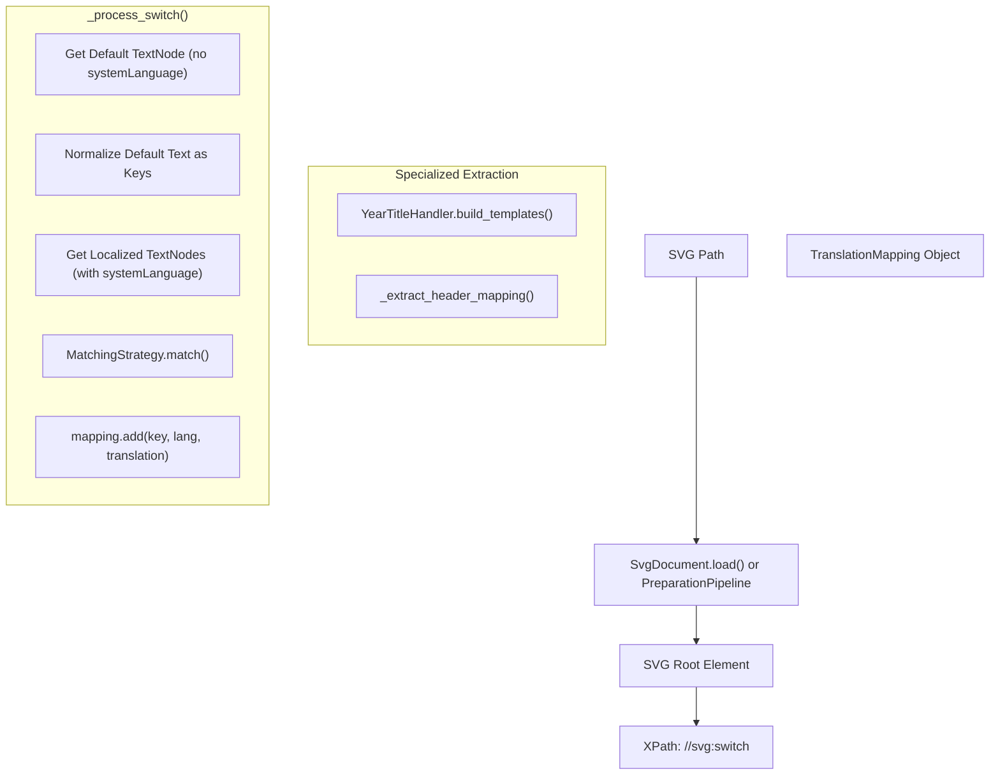
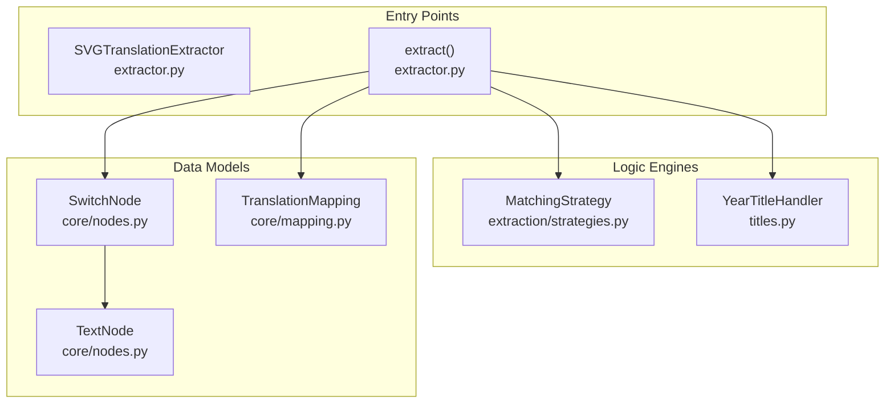

# Extraction Module API

> **Relevant source files**
> * [CopySVGTranslation/extraction/__init__.py](https://github.com/MrIbrahem/CopySVGTranslation/blob/d984a401/CopySVGTranslation/extraction/__init__.py)
> * [CopySVGTranslation/extraction/extractor.py](https://github.com/MrIbrahem/CopySVGTranslation/blob/d984a401/CopySVGTranslation/extraction/extractor.py)
> * [tests/unit/extraction/test_extractor_header.py](https://github.com/MrIbrahem/CopySVGTranslation/blob/d984a401/tests/unit/extraction/test_extractor_header.py)
> * [tests/unit/extraction/test_svg_extractor_class.py](https://github.com/MrIbrahem/CopySVGTranslation/blob/d984a401/tests/unit/extraction/test_svg_extractor_class.py)

## Purpose and Scope

This page documents the extraction capabilities of CopySVGTranslation, primarily focused on the `SVGTranslationExtractor` class and the high-level `extract()` function. These tools extract existing translations from multilingual SVG files—specifically those using the SVG `<switch>` element pattern—and convert them into structured `TranslationMapping` objects or JSON.

For information about applying these translations to other SVG files, see [Injection Module API](/MrIbrahem/CopySVGTranslation/6.3-injection-module-api). For the complete workflow that combines extraction and injection, see [Combined Workflow](/MrIbrahem/CopySVGTranslation/4.3-combined-workflow).

**Sources:** [CopySVGTranslation/extraction/extractor.py L1-L20](https://github.com/MrIbrahem/CopySVGTranslation/blob/d984a401/CopySVGTranslation/extraction/extractor.py#L1-L20)

 [CopySVGTranslation/extraction/extractor.py L136-L139](https://github.com/MrIbrahem/CopySVGTranslation/blob/d984a401/CopySVGTranslation/extraction/extractor.py#L136-L139)

---

## Function Signature

The primary entry point is the `extract` method of the `SVGTranslationExtractor` class, or the top-level convenience function.

```markdown
# Via the Extractor classextractor = SVGTranslationExtractor(config=None, matching_strategy=None)mapping = extractor.extract(path) # Return as JSON-compatible dictjson_data = extractor.extract_json(path)
```

**Sources:** [CopySVGTranslation/extraction/extractor.py L24-L37](https://github.com/MrIbrahem/CopySVGTranslation/blob/d984a401/CopySVGTranslation/extraction/extractor.py#L24-L37)

 [CopySVGTranslation/extraction/extractor.py L136-L165](https://github.com/MrIbrahem/CopySVGTranslation/blob/d984a401/CopySVGTranslation/extraction/extractor.py#L136-L165)

---

## Parameters

### SVGTranslationExtractor Constructor

| Parameter | Type | Default | Description |
| --- | --- | --- | --- |
| `config` | `TranslationConfig` | `None` | Configuration object controlling case sensitivity, year titles, and preparation steps. |
| `matching_strategy` | `MatchingStrategy` | `ByTspanIdStrategy` | The strategy used to correlate default text segments with translated segments. |

**Sources:** [CopySVGTranslation/extraction/extractor.py L29-L36](https://github.com/MrIbrahem/CopySVGTranslation/blob/d984a401/CopySVGTranslation/extraction/extractor.py#L29-L36)

 [CopySVGTranslation/extraction/extractor.py L143-L148](https://github.com/MrIbrahem/CopySVGTranslation/blob/d984a401/CopySVGTranslation/extraction/extractor.py#L143-L148)

### extract(path) Method

| Parameter | Type | Default | Description |
| --- | --- | --- | --- |
| `path` | `str` or `Path` | Required | Path to the SVG file containing translations to extract. |

**Sources:** [CopySVGTranslation/extraction/extractor.py L136-L140](https://github.com/MrIbrahem/CopySVGTranslation/blob/d984a401/CopySVGTranslation/extraction/extractor.py#L136-L140)

---

## Return Value: TranslationMapping

The `extract()` method returns a `TranslationMapping` object. When converted to JSON via `extract_json()` or `to_json()`, it follows this structure:

```json
{    "new": {        "normalized source text": {            "lang_code": "translated text"        }    },    "tspans_by_id": {        "id1": "Original Text"    },    "title_new": {},    "meta": {        "header": {            "source text": {"lang": "translation"}        }    },    "error": ""}
```

**Sources:** [CopySVGTranslation/extraction/extractor.py L159-L165](https://github.com/MrIbrahem/CopySVGTranslation/blob/d984a401/CopySVGTranslation/extraction/extractor.py#L159-L165)

 [tests/unit/extraction/test_svg_extractor_class.py L51-L61](https://github.com/MrIbrahem/CopySVGTranslation/blob/d984a401/tests/unit/extraction/test_svg_extractor_class.py#L51-L61)

---

## Extraction Data Flow

The extraction process involves parsing the SVG, locating `<switch>` elements, and identifying pairs of default (fallback) text and their localized counterparts.



**Diagram: Extraction Process Flow**

**Sources:** [CopySVGTranslation/extraction/extractor.py L41-L91](https://github.com/MrIbrahem/CopySVGTranslation/blob/d984a401/CopySVGTranslation/extraction/extractor.py#L41-L91)

 [CopySVGTranslation/extraction/extractor.py L112-L130](https://github.com/MrIbrahem/CopySVGTranslation/blob/d984a401/CopySVGTranslation/extraction/extractor.py#L112-L130)

 [CopySVGTranslation/extraction/extractor.py L143-L157](https://github.com/MrIbrahem/CopySVGTranslation/blob/d984a401/CopySVGTranslation/extraction/extractor.py#L143-L157)

---

## Core Logic and Implementation

### Text Normalization and Keys

Extraction relies heavily on `normalize_text`. If `config.case_insensitive` is `True` (default), all keys in the `new` dictionary are lowercased and whitespace-collapsed to ensure they can be matched against different SVG sources later.

**Sources:** [CopySVGTranslation/extraction/extractor.py L66-L68](https://github.com/MrIbrahem/CopySVGTranslation/blob/d984a401/CopySVGTranslation/extraction/extractor.py#L66-L68)

 [tests/unit/extraction/test_svg_extractor_class.py L158-L174](https://github.com/MrIbrahem/CopySVGTranslation/blob/d984a401/tests/unit/extraction/test_svg_extractor_class.py#L158-L174)

### Matching Strategies

The extractor uses a `MatchingStrategy` to align segments within a `<switch>`. By default, it uses `ByTspanIdStrategy`, which matches `<tspan>` elements between the default `<text>` and the localized `<text>` based on their IDs (often suffixed with the language code).

**Sources:** [CopySVGTranslation/extraction/extractor.py L36](https://github.com/MrIbrahem/CopySVGTranslation/blob/d984a401/CopySVGTranslation/extraction/extractor.py#L36-L36)

 [CopySVGTranslation/extraction/extractor.py L78-L82](https://github.com/MrIbrahem/CopySVGTranslation/blob/d984a401/CopySVGTranslation/extraction/extractor.py#L78-L82)

### Header and Title Handling

The extractor performs specialized extraction for headers:

1. **Header Extraction**: It targets `<switch>` elements inside `<g id='header'>` but excludes the subtitle. These are stored in `mapping.meta["header"]`.
2. **Year Titles**: If `enable_year_titles` is active, the `YearTitleHandler` processes the mappings to identify titles containing years (e.g., "Population 2020") and creates generic templates.

**Sources:** [CopySVGTranslation/extraction/extractor.py L92-L110](https://github.com/MrIbrahem/CopySVGTranslation/blob/d984a401/CopySVGTranslation/extraction/extractor.py#L92-L110)

 [CopySVGTranslation/extraction/extractor.py L121-L129](https://github.com/MrIbrahem/CopySVGTranslation/blob/d984a401/CopySVGTranslation/extraction/extractor.py#L121-L129)

 [tests/unit/extraction/test_extractor_header.py L117-L140](https://github.com/MrIbrahem/CopySVGTranslation/blob/d984a401/tests/unit/extraction/test_extractor_header.py#L117-L140)

---

## Code Entity Mapping

This diagram associates the logical extraction steps with specific classes and methods in the codebase.



**Diagram: Code Entity Mapping**

**Sources:** [CopySVGTranslation/extraction/extractor.py L24-L37](https://github.com/MrIbrahem/CopySVGTranslation/blob/d984a401/CopySVGTranslation/extraction/extractor.py#L24-L37)

 [CopySVGTranslation/extraction/extractor.py L41-L47](https://github.com/MrIbrahem/CopySVGTranslation/blob/d984a401/CopySVGTranslation/extraction/extractor.py#L41-L47)

 [CopySVGTranslation/extraction/extractor.py L78-L82](https://github.com/MrIbrahem/CopySVGTranslation/blob/d984a401/CopySVGTranslation/extraction/extractor.py#L78-L82)

---

## Error Handling

The extraction module uses custom exceptions to handle common failure modes:

* **`SvgIOError`**: Raised if the file is not found or cannot be read.
* **`SvgParseError`**: Raised if the XML is malformed or cannot be parsed by `lxml`.

**Sources:** [CopySVGTranslation/extraction/extractor.py L150-L155](https://github.com/MrIbrahem/CopySVGTranslation/blob/d984a401/CopySVGTranslation/extraction/extractor.py#L150-L155)

 [CopySVGTranslation/extraction/extractor.py L14-L15](https://github.com/MrIbrahem/CopySVGTranslation/blob/d984a401/CopySVGTranslation/extraction/extractor.py#L14-L15)

---

## Usage Examples

### Standard Extraction

```javascript
from pathlib import Pathfrom CopySVGTranslation.extraction import SVGTranslationExtractor extractor = SVGTranslationExtractor()mapping = extractor.extract("chart.svg") # Access translations for a specific term# The key is normalized (lowercased) by defaultif "death rate" in mapping.new:    print(mapping.new["death rate"]["es"]) # Output: "Tasa de mortalidad"
```

**Sources:** [tests/unit/extraction/test_svg_extractor_class.py L119-L134](https://github.com/MrIbrahem/CopySVGTranslation/blob/d984a401/tests/unit/extraction/test_svg_extractor_class.py#L119-L134)

 [CopySVGTranslation/extraction/extractor.py L136-L157](https://github.com/MrIbrahem/CopySVGTranslation/blob/d984a401/CopySVGTranslation/extraction/extractor.py#L136-L157)

### Extraction with Preparation

If the source SVG is messy (e.g., has nested tspans that break the switch structure), the `prepare_before_extraction` config option can be enabled to run the `SvgPreparationPipeline` before extracting.

```javascript
from CopySVGTranslation.config import TranslationConfigfrom CopySVGTranslation.extraction import SVGTranslationExtractor config = TranslationConfig(prepare_before_extraction=True)extractor = SVGTranslationExtractor(config=config)mapping = extractor.extract("messy_source.svg")
```

**Sources:** [CopySVGTranslation/extraction/extractor.py L143-L147](https://github.com/MrIbrahem/CopySVGTranslation/blob/d984a401/CopySVGTranslation/extraction/extractor.py#L143-L147)