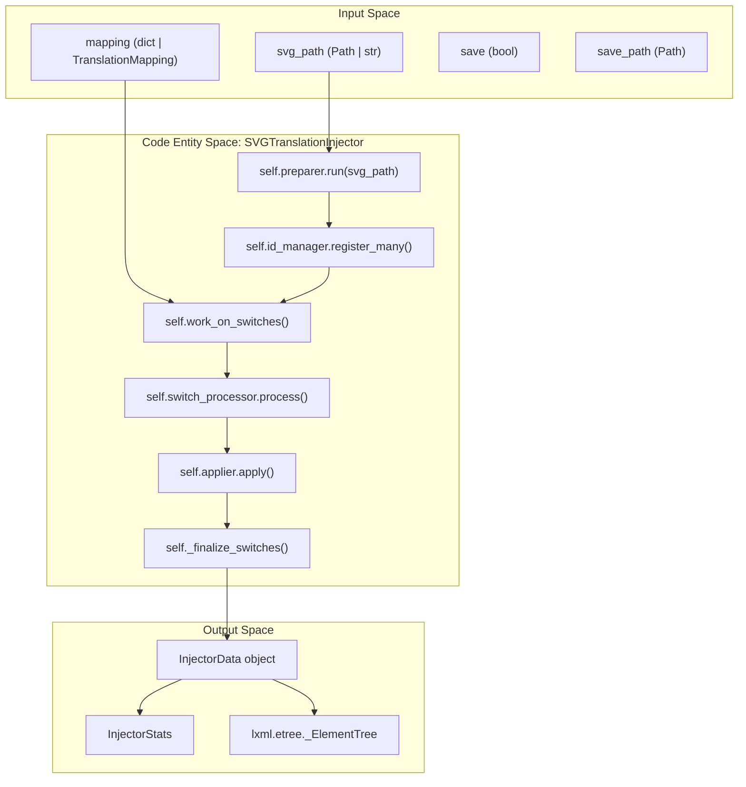
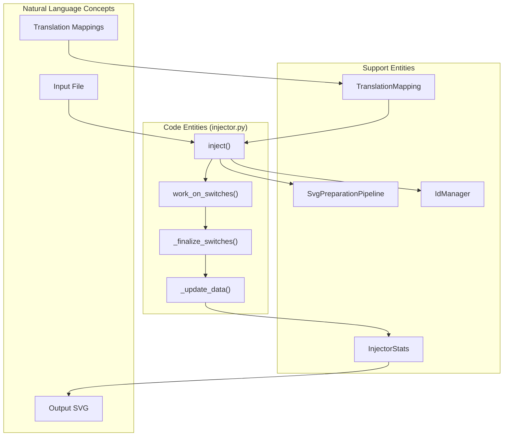

# Injection Module API

> **Relevant source files**
> * [CopySVGTranslation/injection/__init__.py](https://github.com/MrIbrahem/CopySVGTranslation/blob/d984a401/CopySVGTranslation/injection/__init__.py)
> * [CopySVGTranslation/injection/injector.py](https://github.com/MrIbrahem/CopySVGTranslation/blob/d984a401/CopySVGTranslation/injection/injector.py)
> * [tests/e2e/injection/test_injector_extended.py](https://github.com/MrIbrahem/CopySVGTranslation/blob/d984a401/tests/e2e/injection/test_injector_extended.py)
> * [tests/unit/injection/test_svg_injector_class.py](https://github.com/MrIbrahem/CopySVGTranslation/blob/d984a401/tests/unit/injection/test_svg_injector_class.py)
> * [tests/unit/injection/test_worker.py](https://github.com/MrIbrahem/CopySVGTranslation/blob/d984a401/tests/unit/injection/test_worker.py)

This page provides comprehensive documentation for the injection logic, primarily focused on the `SVGTranslationInjector` class and its `inject()` method. This API is responsible for applying translations from mappings into target SVG files by managing `<switch>` blocks, generating unique IDs, and tracking language statistics.

## Function Overview

The injection process involves several stages: preparation, ID registration, text matching, and XML manipulation. The system ensures that translations are placed correctly within SVG `<switch>` elements while maintaining unique IDs across the document.



**Sources:** [CopySVGTranslation/injection/injector.py L30-L66](https://github.com/MrIbrahem/CopySVGTranslation/blob/d984a401/CopySVGTranslation/injection/injector.py#L30-L66)

 [CopySVGTranslation/injection/injector.py L151-L176](https://github.com/MrIbrahem/CopySVGTranslation/blob/d984a401/CopySVGTranslation/injection/injector.py#L151-L176)

## The SVGTranslationInjector Class

The `SVGTranslationInjector` is the central coordinator for the injection process. It aggregates several specialized components to handle different aspects of the SVG manipulation.

### Initialization

[CopySVGTranslation/injection/injector.py L33-L47](https://github.com/MrIbrahem/CopySVGTranslation/blob/d984a401/CopySVGTranslation/injection/injector.py#L33-L47)

```python
def __init__(self, config: TranslationConfig | None = None) -> None: ...
```

* **`id_manager`**: An `IdManager` instance that tracks all IDs in the SVG to prevent collisions [CopySVGTranslation/injection/injector.py L40](https://github.com/MrIbrahem/CopySVGTranslation/blob/d984a401/CopySVGTranslation/injection/injector.py#L40-L40)
* **`applier`**: A `TranslationApplier` that handles the actual creation or update of XML elements [CopySVGTranslation/injection/injector.py L41](https://github.com/MrIbrahem/CopySVGTranslation/blob/d984a401/CopySVGTranslation/injection/injector.py#L41-L41)
* **`switch_processor`**: A `SwitchProcessor` that iterates through `<switch>` elements and determines which translations need to be applied [CopySVGTranslation/injection/injector.py L42-L47](https://github.com/MrIbrahem/CopySVGTranslation/blob/d984a401/CopySVGTranslation/injection/injector.py#L42-L47)
* **`preparer`**: An `SvgPreparationPipeline` used to normalize the SVG before processing [CopySVGTranslation/injection/injector.py L38](https://github.com/MrIbrahem/CopySVGTranslation/blob/d984a401/CopySVGTranslation/injection/injector.py#L38-L38)

**Sources:** [CopySVGTranslation/injection/injector.py L33-L47](https://github.com/MrIbrahem/CopySVGTranslation/blob/d984a401/CopySVGTranslation/injection/injector.py#L33-L47)

## The inject() Method

The `inject()` method is the primary entry point for applying translations to a single file.

### Method Signature

[CopySVGTranslation/injection/injector.py L59-L66](https://github.com/MrIbrahem/CopySVGTranslation/blob/d984a401/CopySVGTranslation/injection/injector.py#L59-L66)

```python
def inject(    self,    svg_path: Path | str,    mapping: TranslationMapping | dict,    *,    save_path: Path | None = None,    save: bool = False,) -> InjectorData: ...
```

### Parameters

| Parameter | Type | Description |
| --- | --- | --- |
| `svg_path` | `Path \| str` | The filesystem path to the source SVG file. |
| `mapping` | `TranslationMapping \| dict` | The translation data. If a `dict` is passed, it is converted to a `TranslationMapping` object [CopySVGTranslation/injection/injector.py L121](https://github.com/MrIbrahem/CopySVGTranslation/blob/d984a401/CopySVGTranslation/injection/injector.py#L121-L121) |
| `save_path` | `Path \| None` | The path where the resulting SVG should be written if `save` is `True`. |
| `save` | `bool` | If `True`, the modified tree is written to `save_path` using `write_svg` [CopySVGTranslation/injection/injector.py L144](https://github.com/MrIbrahem/CopySVGTranslation/blob/d984a401/CopySVGTranslation/injection/injector.py#L144-L144) |

### Return Value: InjectorData

The method returns an `InjectorData` object [CopySVGTranslation/core/mapping.py L123-L125](https://github.com/MrIbrahem/CopySVGTranslation/blob/d984a401/CopySVGTranslation/core/mapping.py#L123-L125)

 which contains:

* **`tree`**: The modified `lxml.etree._ElementTree`.
* **`inject_stats`**: An `InjectorStats` object containing processing metrics.
* **`error`**: An error container that captures failures during preparation or processing.

**Sources:** [CopySVGTranslation/injection/injector.py L67-L149](https://github.com/MrIbrahem/CopySVGTranslation/blob/d984a401/CopySVGTranslation/injection/injector.py#L67-L149)

 [CopySVGTranslation/core/mapping.py L123-L125](https://github.com/MrIbrahem/CopySVGTranslation/blob/d984a401/CopySVGTranslation/core/mapping.py#L123-L125)

## Processing Logic and Data Flow

The `inject()` method follows a strict execution pipeline:

1. **Preparation**: Runs the `SvgPreparationPipeline` to handle nested tspans and structural validation [CopySVGTranslation/injection/injector.py L88](https://github.com/MrIbrahem/CopySVGTranslation/blob/d984a401/CopySVGTranslation/injection/injector.py#L88-L88)
2. **Language Snapshot**: Records languages present in the SVG before injection using `tree_languages()` [CopySVGTranslation/injection/injector.py L114-L115](https://github.com/MrIbrahem/CopySVGTranslation/blob/d984a401/CopySVGTranslation/injection/injector.py#L114-L115)
3. **ID Seeding**: Extracts all existing IDs from the SVG and registers them in the `IdManager` to ensure new translation IDs are unique [CopySVGTranslation/injection/injector.py L118](https://github.com/MrIbrahem/CopySVGTranslation/blob/d984a401/CopySVGTranslation/injection/injector.py#L118-L118)
4. **Switch Processing**: Calls `work_on_switches()`, which locates every `<svg:switch>` element and delegates to the `SwitchProcessor` [CopySVGTranslation/injection/injector.py L123-L127](https://github.com/MrIbrahem/CopySVGTranslation/blob/d984a401/CopySVGTranslation/injection/injector.py#L123-L127)
5. **Finalization**: Optionally sorts switch elements and fixes namespace tags [CopySVGTranslation/injection/injector.py L130](https://github.com/MrIbrahem/CopySVGTranslation/blob/d984a401/CopySVGTranslation/injection/injector.py#L130-L130)
6. **Stats Update**: Compares the language set before and after injection to calculate `new_languages_count` [CopySVGTranslation/injection/injector.py L133-L134](https://github.com/MrIbrahem/CopySVGTranslation/blob/d984a401/CopySVGTranslation/injection/injector.py#L133-L134)



**Sources:** [CopySVGTranslation/injection/injector.py L67-L149](https://github.com/MrIbrahem/CopySVGTranslation/blob/d984a401/CopySVGTranslation/injection/injector.py#L67-L149)

 [CopySVGTranslation/injection/injector.py L184-L202](https://github.com/MrIbrahem/CopySVGTranslation/blob/d984a401/CopySVGTranslation/injection/injector.py#L184-L202)

## Return Statistics (InjectorStats)

The `InjectorStats` dataclass provides granular details about the operation's impact on the SVG file.

| Field | Description |
| --- | --- |
| `processed_switches` | Total number of `<switch>` tags encountered [CopySVGTranslation/core/mapping.py L107](https://github.com/MrIbrahem/CopySVGTranslation/blob/d984a401/CopySVGTranslation/core/mapping.py#L107-L107) |
| `inserted_translations` | Number of new `<text>` elements added [CopySVGTranslation/core/mapping.py L108](https://github.com/MrIbrahem/CopySVGTranslation/blob/d984a401/CopySVGTranslation/core/mapping.py#L108-L108) |
| `updated_translations` | Number of existing translations modified (requires `overwrite_translations=True`) [CopySVGTranslation/core/mapping.py L110](https://github.com/MrIbrahem/CopySVGTranslation/blob/d984a401/CopySVGTranslation/core/mapping.py#L110-L110) |
| `skipped_translations` | Translations found in mapping but already present in SVG (and not overwritten) [CopySVGTranslation/core/mapping.py L109](https://github.com/MrIbrahem/CopySVGTranslation/blob/d984a401/CopySVGTranslation/core/mapping.py#L109-L109) |
| `languages_before` | List of language codes present in the file before injection [CopySVGTranslation/core/mapping.py L111](https://github.com/MrIbrahem/CopySVGTranslation/blob/d984a401/CopySVGTranslation/core/mapping.py#L111-L111) |
| `languages_after` | List of new language codes added during this session [CopySVGTranslation/core/mapping.py L112](https://github.com/MrIbrahem/CopySVGTranslation/blob/d984a401/CopySVGTranslation/core/mapping.py#L112-L112) |

**Sources:** [CopySVGTranslation/core/mapping.py L102-L120](https://github.com/MrIbrahem/CopySVGTranslation/blob/d984a401/CopySVGTranslation/core/mapping.py#L102-L120)

 [CopySVGTranslation/injection/injector.py L184-L202](https://github.com/MrIbrahem/CopySVGTranslation/blob/d984a401/CopySVGTranslation/injection/injector.py#L184-L202)

## Error Handling

The injection module handles several specific error conditions during the `inject()` call:

* **`SvgNestedTspanError`**: Raised if the SVG contains nested `<tspan>` elements that the pipeline cannot automatically resolve [CopySVGTranslation/injection/injector.py L89-L91](https://github.com/MrIbrahem/CopySVGTranslation/blob/d984a401/CopySVGTranslation/injection/injector.py#L89-L91)
* **`SvgStructureError`**: Raised for general SVG malformations that prevent translation [CopySVGTranslation/injection/injector.py L93-L95](https://github.com/MrIbrahem/CopySVGTranslation/blob/d984a401/CopySVGTranslation/injection/injector.py#L93-L95)
* **`etree.XMLSyntaxError`**: Raised if the source file is not valid XML [CopySVGTranslation/injection/injector.py L97-L100](https://github.com/MrIbrahem/CopySVGTranslation/blob/d984a401/CopySVGTranslation/injection/injector.py#L97-L100)

When an error occurs, the `InjectorData.error` object is populated with a code and label, and the method returns early [CopySVGTranslation/injection/injector.py L76-L94](https://github.com/MrIbrahem/CopySVGTranslation/blob/d984a401/CopySVGTranslation/injection/injector.py#L76-L94)

**Sources:** [CopySVGTranslation/injection/injector.py L87-L105](https://github.com/MrIbrahem/CopySVGTranslation/blob/d984a401/CopySVGTranslation/injection/injector.py#L87-L105)

 [CopySVGTranslation/exceptions.py L1-L20](https://github.com/MrIbrahem/CopySVGTranslation/blob/d984a401/CopySVGTranslation/exceptions.py#L1-L20)