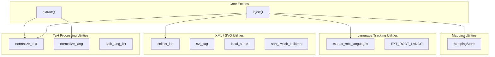
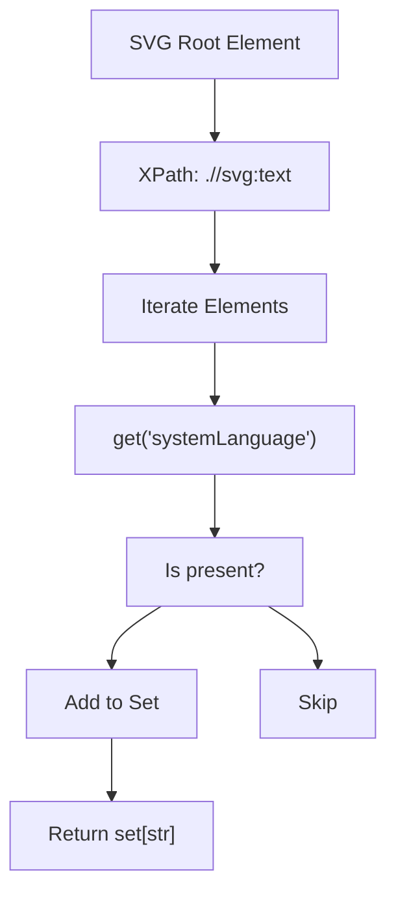

# Utility Functions API

> **Relevant source files**
> * [CopySVGTranslation/io/__init__.py](https://github.com/MrIbrahem/CopySVGTranslation/blob/d984a401/CopySVGTranslation/io/__init__.py)
> * [CopySVGTranslation/io/mapping_store.py](https://github.com/MrIbrahem/CopySVGTranslation/blob/d984a401/CopySVGTranslation/io/mapping_store.py)
> * [CopySVGTranslation/utils/__init__.py](https://github.com/MrIbrahem/CopySVGTranslation/blob/d984a401/CopySVGTranslation/utils/__init__.py)
> * [CopySVGTranslation/utils/text.py](https://github.com/MrIbrahem/CopySVGTranslation/blob/d984a401/CopySVGTranslation/utils/text.py)
> * [CopySVGTranslation/utils/xml.py](https://github.com/MrIbrahem/CopySVGTranslation/blob/d984a401/CopySVGTranslation/utils/xml.py)

This page documents the utility functions provided by CopySVGTranslation that support the main translation workflows. These functions handle text processing, ID generation, language tracking, and translation mapping operations. For the main translation functions, see [Extraction Module API](/MrIbrahem/CopySVGTranslation/6.2-extraction-module-api) and [Injection Module API](/MrIbrahem/CopySVGTranslation/6.3-injection-module-api).

## Overview of Utility Functions

CopySVGTranslation provides several utility functions that are used internally by the main translation modules but are also exposed as part of the public API. These utilities fall into four categories:



**Sources:** [CopySVGTranslation/utils/__init__.py L1-L35](https://github.com/MrIbrahem/CopySVGTranslation/blob/d984a401/CopySVGTranslation/utils/__init__.py#L1-L35)

 [CopySVGTranslation/io/mapping_store.py L15-L18](https://github.com/MrIbrahem/CopySVGTranslation/blob/d984a401/CopySVGTranslation/io/mapping_store.py#L15-L18)

## Text Processing Utilities

### normalize_text()

**Purpose:** Normalizes text content for consistent matching by collapsing whitespace and optionally converting to lowercase.

**Module Location:** [CopySVGTranslation/utils/text.py L46](https://github.com/MrIbrahem/CopySVGTranslation/blob/d984a401/CopySVGTranslation/utils/text.py#L46-L46)

**Function Signature:**

```
normalize_text(text: str | None, case_insensitive: bool = False) -> str
```

**Parameters:**

| Parameter | Type | Default | Description |
| --- | --- | --- | --- |
| `text` | `str \| None` | Required | The text to normalize. Returns empty string if `None`. |
| `case_insensitive` | `bool` | `False` | If `True`, converts text to lowercase. |

**Return Value:** Normalized string with collapsed whitespace and trimmed leading/trailing spaces [CopySVGTranslation/utils/text.py L53-L57](https://github.com/MrIbrahem/CopySVGTranslation/blob/d984a401/CopySVGTranslation/utils/text.py#L53-L57)

**Sources:** [CopySVGTranslation/utils/text.py L46-L58](https://github.com/MrIbrahem/CopySVGTranslation/blob/d984a401/CopySVGTranslation/utils/text.py#L46-L58)

### normalize_lang()

**Purpose:** Normalizes a language tag to a simple IETF-like form (e.g., `en-US`).

**Module Location:** [CopySVGTranslation/utils/text.py L11](https://github.com/MrIbrahem/CopySVGTranslation/blob/d984a401/CopySVGTranslation/utils/text.py#L11-L11)

**Behavior:**

* Replaces underscores, spaces, or dashes with a single dash [CopySVGTranslation/utils/text.py L22](https://github.com/MrIbrahem/CopySVGTranslation/blob/d984a401/CopySVGTranslation/utils/text.py#L22-L22)
* Lowercases the primary language code [CopySVGTranslation/utils/text.py L23](https://github.com/MrIbrahem/CopySVGTranslation/blob/d984a401/CopySVGTranslation/utils/text.py#L23-L23)
* Uppercases 2-letter region codes (e.g., `US`) and titles others [CopySVGTranslation/utils/text.py L25](https://github.com/MrIbrahem/CopySVGTranslation/blob/d984a401/CopySVGTranslation/utils/text.py#L25-L25)

**Sources:** [CopySVGTranslation/utils/text.py L11-L27](https://github.com/MrIbrahem/CopySVGTranslation/blob/d984a401/CopySVGTranslation/utils/text.py#L11-L27)

## XML and SVG Utilities

### svg_tag() and local_name()

**Purpose:** Handle Clark-notation namespaces for SVG elements.

* `svg_tag(local)`: Returns `{http://www.w3.org/2000/svg}local` [CopySVGTranslation/utils/xml.py L16-L18](https://github.com/MrIbrahem/CopySVGTranslation/blob/d984a401/CopySVGTranslation/utils/xml.py#L16-L18)
* `local_name(element)`: Strips the namespace prefix from an element's tag [CopySVGTranslation/utils/xml.py L21-L27](https://github.com/MrIbrahem/CopySVGTranslation/blob/d984a401/CopySVGTranslation/utils/xml.py#L21-L27)

**Sources:** [CopySVGTranslation/utils/xml.py L16-L27](https://github.com/MrIbrahem/CopySVGTranslation/blob/d984a401/CopySVGTranslation/utils/xml.py#L16-L27)

### collect_ids()

**Purpose:** Scans an element tree and returns a set of all `id` attribute values [CopySVGTranslation/utils/xml.py L61-L63](https://github.com/MrIbrahem/CopySVGTranslation/blob/d984a401/CopySVGTranslation/utils/xml.py#L61-L63)

 This is used during injection to prevent ID collisions.

**Sources:** [CopySVGTranslation/utils/xml.py L61-L63](https://github.com/MrIbrahem/CopySVGTranslation/blob/d984a401/CopySVGTranslation/utils/xml.py#L61-L63)

### sort_switch_children()

**Purpose:** Deterministically reorders `<text>` children inside a `<switch>` element. By default, it ensures the fallback element (no `systemLanguage`) is positioned last [CopySVGTranslation/utils/xml.py L66-L74](https://github.com/MrIbrahem/CopySVGTranslation/blob/d984a401/CopySVGTranslation/utils/xml.py#L66-L74)

**Sorting Logic:**

1. Fallback status (elements without `systemLanguage` go last) [CopySVGTranslation/utils/xml.py L81-L82](https://github.com/MrIbrahem/CopySVGTranslation/blob/d984a401/CopySVGTranslation/utils/xml.py#L81-L82)
2. Numeric suffix in the ID (e.g., `trsvg123`) [CopySVGTranslation/utils/xml.py L79-L80](https://github.com/MrIbrahem/CopySVGTranslation/blob/d984a401/CopySVGTranslation/utils/xml.py#L79-L80)
3. Alphabetical language code [CopySVGTranslation/utils/xml.py L82](https://github.com/MrIbrahem/CopySVGTranslation/blob/d984a401/CopySVGTranslation/utils/xml.py#L82-L82)

**Sources:** [CopySVGTranslation/utils/xml.py L66-L90](https://github.com/MrIbrahem/CopySVGTranslation/blob/d984a401/CopySVGTranslation/utils/xml.py#L66-L90)

## Language Tracking Utilities

### extract_root_languages()

**Purpose:** High-level wrapper to extract all `systemLanguage` values from an `etree._ElementTree` [CopySVGTranslation/utils/xml.py L92-L110](https://github.com/MrIbrahem/CopySVGTranslation/blob/d984a401/CopySVGTranslation/utils/xml.py#L92-L110)

### extract_root_languages()

**Purpose:** Executes an XPath query (`.//svg:text`) on an element to find all defined `systemLanguage` attributes [CopySVGTranslation/utils/xml.py L44-L58](https://github.com/MrIbrahem/CopySVGTranslation/blob/d984a401/CopySVGTranslation/utils/xml.py#L44-L58)



**Sources:** [CopySVGTranslation/utils/xml.py L44-L58](https://github.com/MrIbrahem/CopySVGTranslation/blob/d984a401/CopySVGTranslation/utils/xml.py#L44-L58)

 [CopySVGTranslation/utils/xml.py L92-L110](https://github.com/MrIbrahem/CopySVGTranslation/blob/d984a401/CopySVGTranslation/utils/xml.py#L92-L110)

## Mapping Utilities (MappingStore)

The `MappingStore` class handles the persistence and merging of `TranslationMapping` objects.

### Key Methods

| Method | Description |
| --- | --- |
| `load(path)` | Loads a JSON file and converts it to a `TranslationMapping` [CopySVGTranslation/io/mapping_store.py L26-L36](https://github.com/MrIbrahem/CopySVGTranslation/blob/d984a401/CopySVGTranslation/io/mapping_store.py#L26-L36) |
| `load_many(paths)` | Loads multiple files and merges them into one mapping [CopySVGTranslation/io/mapping_store.py L38-L48](https://github.com/MrIbrahem/CopySVGTranslation/blob/d984a401/CopySVGTranslation/io/mapping_store.py#L38-L48) |
| `save(mapping, path)` | Serializes a mapping to JSON with configurable indentation and directory creation [CopySVGTranslation/io/mapping_store.py L53-L76](https://github.com/MrIbrahem/CopySVGTranslation/blob/d984a401/CopySVGTranslation/io/mapping_store.py#L53-L76) |
| `default_mapping_path(svg_path)` | Returns the conventional path: `data/{filename}.json` [CopySVGTranslation/io/mapping_store.py L81-L84](https://github.com/MrIbrahem/CopySVGTranslation/blob/d984a401/CopySVGTranslation/io/mapping_store.py#L81-L84) |

**Sources:** [CopySVGTranslation/io/mapping_store.py L15-L84](https://github.com/MrIbrahem/CopySVGTranslation/blob/d984a401/CopySVGTranslation/io/mapping_store.py#L15-L84)

## Summary Table

| Function | Module | Primary Purpose |
| --- | --- | --- |
| `normalize_text()` | `utils.text` | Collapse whitespace and normalize case |
| `normalize_lang()` | `utils.text` | Standardize language codes (e.g. `en-US`) |
| `collect_ids()` | `utils.xml` | Get all unique IDs in an SVG tree |
| `extract_root_languages()` | `utils.xml` | List all languages currently in an SVG |
| `sort_switch_children()` | `utils.xml` | Ensure consistent ordering of translations |
| `MappingStore.load()` | `io.mapping_store` | Deserialize translation data from JSON |

**Sources:** [CopySVGTranslation/utils/__init__.py L1-L35](https://github.com/MrIbrahem/CopySVGTranslation/blob/d984a401/CopySVGTranslation/utils/__init__.py#L1-L35)

 [CopySVGTranslation/io/__init__.py L1-L8](https://github.com/MrIbrahem/CopySVGTranslation/blob/d984a401/CopySVGTranslation/io/__init__.py#L1-L8)
