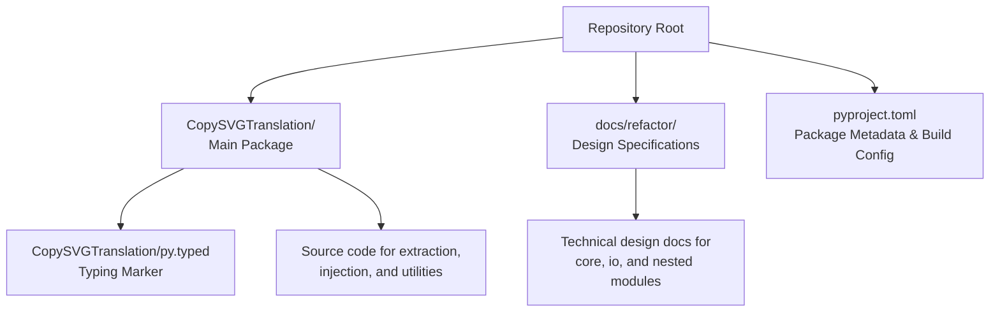
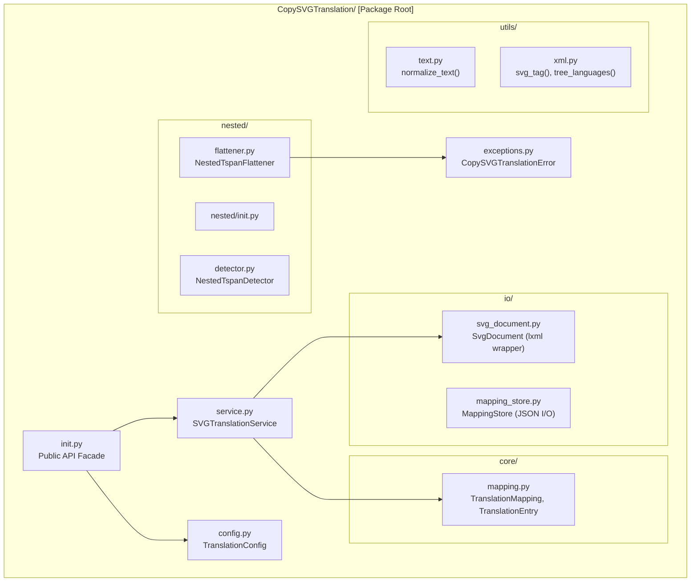
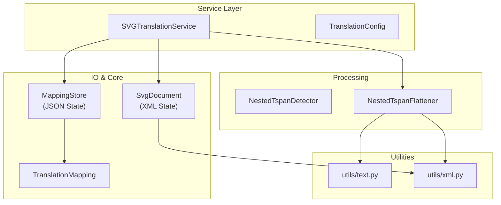

# Project Structure

> **Relevant source files**
> * [CopySVGTranslation/README.md](https://github.com/MrIbrahem/CopySVGTranslation/blob/d984a401/CopySVGTranslation/README.md?plain=1)
> * [CopySVGTranslation/__init__.py](https://github.com/MrIbrahem/CopySVGTranslation/blob/d984a401/CopySVGTranslation/__init__.py)
> * [CopySVGTranslation/nested/__init__.py](https://github.com/MrIbrahem/CopySVGTranslation/blob/d984a401/CopySVGTranslation/nested/__init__.py)
> * [docs/refactor/init.md](https://github.com/MrIbrahem/CopySVGTranslation/blob/d984a401/docs/refactor/init.md?plain=1)
> * [docs/refactor/io.md](https://github.com/MrIbrahem/CopySVGTranslation/blob/d984a401/docs/refactor/io.md?plain=1)
> * [docs/refactor/nested.md](https://github.com/MrIbrahem/CopySVGTranslation/blob/d984a401/docs/refactor/nested.md?plain=1)
> * [docs/refactor/pyproject.toml.md](https://github.com/MrIbrahem/CopySVGTranslation/blob/d984a401/docs/refactor/pyproject.toml.md?plain=1)
> * [docs/refactor/utils.md](https://github.com/MrIbrahem/CopySVGTranslation/blob/d984a401/docs/refactor/utils.md?plain=1)

This document describes the directory layout and module organization of the CopySVGTranslation codebase. It explains the purpose of each major directory and file, helping contributors understand where to find specific functionality and where to add new code.

For information about running tests, see [Testing](/MrIbrahem/CopySVGTranslation/7.2-testing). For build and packaging details, see [Building and Publishing](/MrIbrahem/CopySVGTranslation/7.3-building-and-publishing).

## Repository Layout

The repository follows a standard Python package structure with the main source code in the `CopySVGTranslation/` directory, tests in `tests/`, and build configuration files at the root level.

**Sources:** [docs/refactor/pyproject.toml.md L1-L15](https://github.com/MrIbrahem/CopySVGTranslation/blob/d984a401/docs/refactor/pyproject.toml.md?plain=1#L1-L15)

 [docs/refactor/pyproject.toml.md L166-L168](https://github.com/MrIbrahem/CopySVGTranslation/blob/d984a401/docs/refactor/pyproject.toml.md?plain=1#L166-L168)

## Main Package Structure

The `CopySVGTranslation/` directory is organized into specialized submodules that handle distinct parts of the translation lifecycle. The `__init__.py` file serves as the primary public API facade.

**Sources:** [CopySVGTranslation/__init__.py L1-L31](https://github.com/MrIbrahem/CopySVGTranslation/blob/d984a401/CopySVGTranslation/__init__.py#L1-L31)

 [docs/refactor/init.md L1-L75](https://github.com/MrIbrahem/CopySVGTranslation/blob/d984a401/docs/refactor/init.md?plain=1#L1-L75)

 [docs/refactor/utils.md L1-L8](https://github.com/MrIbrahem/CopySVGTranslation/blob/d984a401/docs/refactor/utils.md?plain=1#L1-L8)

## Module Dependencies and Data Flow

This diagram illustrates how the service layer coordinates between I/O, utilities, and core logic to perform translation tasks.

**Sources:** [docs/refactor/init.md L82-L105](https://github.com/MrIbrahem/CopySVGTranslation/blob/d984a401/docs/refactor/init.md?plain=1#L82-L105)

 [docs/refactor/io.md L1-L13](https://github.com/MrIbrahem/CopySVGTranslation/blob/d984a401/docs/refactor/io.md?plain=1#L1-L13)

 [docs/refactor/nested.md L1-L10](https://github.com/MrIbrahem/CopySVGTranslation/blob/d984a401/docs/refactor/nested.md?plain=1#L1-L10)

## Core Modules Detail

### IO Module

The `io/` package is the exclusive layer for filesystem interaction.

* **`SvgDocument`**: Wraps `lxml.etree`. It handles loading SVGs, ensuring the default namespace is set to `http://www.w3.org/2000/svg`, and saving documents with optional pretty-printing [docs/refactor/io.md L35-L59](https://github.com/MrIbrahem/CopySVGTranslation/blob/d984a401/docs/refactor/io.md?plain=1#L35-L59)
* **`MappingStore`**: Manages the persistence of `TranslationMapping` objects to JSON. It supports merging multiple mapping files into a single in-memory structure [docs/refactor/io.md L160-L188](https://github.com/MrIbrahem/CopySVGTranslation/blob/d984a401/docs/refactor/io.md?plain=1#L160-L188)

**Sources:** [docs/refactor/io.md L1-L226](https://github.com/MrIbrahem/CopySVGTranslation/blob/d984a401/docs/refactor/io.md?plain=1#L1-L226)

### Nested Module

This package addresses SVG structures that break standard translation workflows, specifically nested elements inside `<tspan>` or `<a>` tags.

* **`NestedTspanDetector`**: Scans the XML tree to identify `tspan` elements containing other element children [docs/refactor/nested.md L59-L75](https://github.com/MrIbrahem/CopySVGTranslation/blob/d984a401/docs/refactor/nested.md?plain=1#L59-L75)
* **`NestedTspanFlattener`**: Implements strategies to resolve nesting, including `flatten` (merging text), `preserve_style` (converting to siblings), or `raise` (throwing a `SvgNestedTspanError`) [docs/refactor/nested.md L125-L153](https://github.com/MrIbrahem/CopySVGTranslation/blob/d984a401/docs/refactor/nested.md?plain=1#L125-L153)

**Sources:** [docs/refactor/nested.md L1-L230](https://github.com/MrIbrahem/CopySVGTranslation/blob/d984a401/docs/refactor/nested.md?plain=1#L1-L230)

### Utils Module

Shared, low-level logic without business rules or I/O.

* **`text.py`**: Contains `normalize_text` for whitespace collapsing and `normalize_lang` for BCP-47 style language tag normalization [docs/refactor/utils.md L24-L65](https://github.com/MrIbrahem/CopySVGTranslation/blob/d984a401/docs/refactor/utils.md?plain=1#L24-L65)
* **`xml.py`**: Provides SVG-specific helpers like `svg_tag` (Clark notation), `tree_languages` (extracting `systemLanguage` values), and `sort_switch_children` for deterministic XML ordering [docs/refactor/utils.md L99-L170](https://github.com/MrIbrahem/CopySVGTranslation/blob/d984a401/docs/refactor/utils.md?plain=1#L99-L170)

**Sources:** [docs/refactor/utils.md L1-L206](https://github.com/MrIbrahem/CopySVGTranslation/blob/d984a401/docs/refactor/utils.md?plain=1#L1-L206)

## Exception Hierarchy

The package defines a structured exception hierarchy to allow callers to handle specific failure modes (I/O vs. XML structure vs. Configuration).

| Exception | Purpose |
| --- | --- |
| `CopySVGTranslationError` | Base class for all package exceptions [CopySVGTranslation/exceptions.py L12](https://github.com/MrIbrahem/CopySVGTranslation/blob/d984a401/CopySVGTranslation/exceptions.py#L12-L12) |
| `SvgStructureError` | Raised when SVG XML lacks required elements or is malformed [docs/refactor/init.md L30](https://github.com/MrIbrahem/CopySVGTranslation/blob/d984a401/docs/refactor/init.md?plain=1#L30-L30) |
| `SvgNestedTspanError` | Specific error for unsupported nested tspans when strategy is set to `raise` [docs/refactor/nested.md L181-L190](https://github.com/MrIbrahem/CopySVGTranslation/blob/d984a401/docs/refactor/nested.md?plain=1#L181-L190) |
| `SvgParseError` / `SvgIOError` | Wrapper for `lxml` parsing failures or filesystem permission issues [docs/refactor/init.md L32-L33](https://github.com/MrIbrahem/CopySVGTranslation/blob/d984a401/docs/refactor/init.md?plain=1#L32-L33) |

**Sources:** [CopySVGTranslation/exceptions.py L1-L18](https://github.com/MrIbrahem/CopySVGTranslation/blob/d984a401/CopySVGTranslation/exceptions.py#L1-L18)

 [docs/refactor/init.md L28-L36](https://github.com/MrIbrahem/CopySVGTranslation/blob/d984a401/docs/refactor/init.md?plain=1#L28-L36)

## Build and Metadata

The project uses `setuptools` as the build backend, configured via `pyproject.toml`.

* **Requirements**: Requires Python 3.10+ and `lxml>=4.9` [docs/refactor/pyproject.toml.md L13-L43](https://github.com/MrIbrahem/CopySVGTranslation/blob/d984a401/docs/refactor/pyproject.toml.md?plain=1#L13-L43)
* **Typing**: Includes a `py.typed` file to signal to type checkers (like mypy) that the package provides type hints [docs/refactor/pyproject.toml.md L166-L168](https://github.com/MrIbrahem/CopySVGTranslation/blob/d984a401/docs/refactor/pyproject.toml.md?plain=1#L166-L168)
* **Tooling**: Configured for `pytest` (testing), `ruff` (linting/formatting), and `mypy` (static analysis) [docs/refactor/pyproject.toml.md L81-L160](https://github.com/MrIbrahem/CopySVGTranslation/blob/d984a401/docs/refactor/pyproject.toml.md?plain=1#L81-L160)

**Sources:** [docs/refactor/pyproject.toml.md L1-L214](https://github.com/MrIbrahem/CopySVGTranslation/blob/d984a401/docs/refactor/pyproject.toml.md?plain=1#L1-L214)