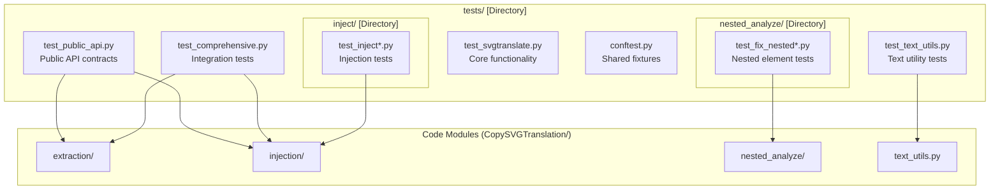
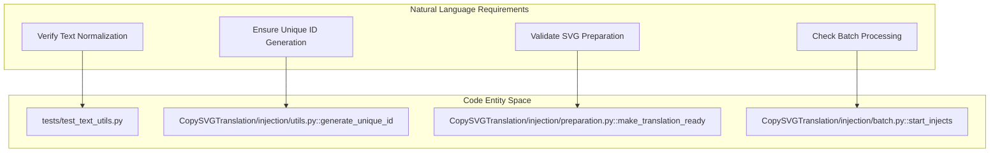

# Testing

> **Relevant source files**
> * [.github/workflows/pytest.yaml](https://github.com/MrIbrahem/CopySVGTranslation/blob/d984a401/.github/workflows/pytest.yaml)
> * [.gitignore](https://github.com/MrIbrahem/CopySVGTranslation/blob/d984a401/.gitignore)
> * [dev-requirements.txt](https://github.com/MrIbrahem/CopySVGTranslation/blob/d984a401/dev-requirements.txt)
> * [pytest.ini](https://github.com/MrIbrahem/CopySVGTranslation/blob/d984a401/pytest.ini)
> * [tests/conftest.py](https://github.com/MrIbrahem/CopySVGTranslation/blob/d984a401/tests/conftest.py)

This document describes the test suite organization, how to run tests, test coverage, and testing best practices for the `CopySVGTranslation` codebase. For information about CI/CD workflows that run these tests automatically, see [7.4 CI/CD Workflows](https://github.com/MrIbrahem/CopySVGTranslation/blob/d984a401/7.4 CI/CD Workflows)

## Purpose and Scope

The `CopySVGTranslation` project maintains a comprehensive test suite using `pytest` as the primary testing framework. The suite validates core functionality including extraction, injection, preparation, and text normalization. It ensures that SVG structure remains valid after manipulation and that translation mappings are correctly merged and applied.

## Test Suite Organization

### Directory Structure

The test suite is located in the `tests/` directory and mirrors the main package structure with dedicated test files for major modules.



Sources: [tests/conftest.py L1-L34](https://github.com/MrIbrahem/CopySVGTranslation/blob/d984a401/tests/conftest.py#L1-L34)

 [pytest.ini L1-L5](https://github.com/MrIbrahem/CopySVGTranslation/blob/d984a401/pytest.ini#L1-L5)

### Test Discovery Configuration

The `pytest.ini` file defines how tests are discovered and executed:

| Configuration | Value | Purpose |
| --- | --- | --- |
| `testpaths` | `tests` | Root directory for test discovery [pytest.ini L2](https://github.com/MrIbrahem/CopySVGTranslation/blob/d984a401/pytest.ini#L2-L2) |
| `python_files` | `test*.py *Test.py` | File patterns to search for [pytest.ini L3](https://github.com/MrIbrahem/CopySVGTranslation/blob/d984a401/pytest.ini#L3-L3) |
| `python_classes` | `Test*` | Class prefix for test discovery [pytest.ini L4](https://github.com/MrIbrahem/CopySVGTranslation/blob/d984a401/pytest.ini#L4-L4) |
| `python_functions` | `test*` | Function prefix for test discovery [pytest.ini L5](https://github.com/MrIbrahem/CopySVGTranslation/blob/d984a401/pytest.ini#L5-L5) |

## Running Tests

### Basic Execution

Execute all tests from the project root:

```
pytest
```

Run tests with verbose output and short tracebacks (default behavior defined in `pytest.ini`):

```
pytest -vv --tb=short
```

Sources: [pytest.ini L6-L9](https://github.com/MrIbrahem/CopySVGTranslation/blob/d984a401/pytest.ini#L6-L9)

### Using Markers

The project uses custom markers to categorize tests. These are defined in `pytest.ini` [pytest.ini L12-L18](https://github.com/MrIbrahem/CopySVGTranslation/blob/d984a401/pytest.ini#L12-L18)

:

* `unit`: Isolated unit tests.
* `integration`: Tests validating interaction between modules.
* `slow`: Tests that take significant time.
* `todo`: Marks unimplemented features (deselected by default via `-m "not todo"` [pytest.ini L10](https://github.com/MrIbrahem/CopySVGTranslation/blob/d984a401/pytest.ini#L10-L10) ).

To run only unit tests:

```
pytest -m unit
```

### GitHub Actions Integration

Tests are automatically executed on every Pull Request to any branch using the `Python pytest` workflow. The workflow:

1. Checks out the code [pytest.yaml L12](https://github.com/MrIbrahem/CopySVGTranslation/blob/d984a401/pytest.yaml#L12-L12)
2. Sets up Python 3.10 [pytest.yaml L17](https://github.com/MrIbrahem/CopySVGTranslation/blob/d984a401/pytest.yaml#L17-L17)
3. Installs dependencies from `requirements.txt` and `dev-requirements.txt` [pytest.yaml L28-L31](https://github.com/MrIbrahem/CopySVGTranslation/blob/d984a401/pytest.yaml#L28-L31)
4. Executes `pytest` [pytest.yaml L34](https://github.com/MrIbrahem/CopySVGTranslation/blob/d984a401/pytest.yaml#L34-L34)

Sources: [.github/workflows/pytest.yaml L1-L34](https://github.com/MrIbrahem/CopySVGTranslation/blob/d984a401/.github/workflows/pytest.yaml#L1-L34)

## Test Fixtures

Common fixtures are defined in `tests/conftest.py` to provide a consistent environment for file-based testing.

| Fixture | Description | Implementation |
| --- | --- | --- |
| `temp_dir` | Creates a temporary directory and cleans it up after the test completes. | [tests/conftest.py L19-L25](https://github.com/MrIbrahem/CopySVGTranslation/blob/d984a401/tests/conftest.py#L19-L25) |
| `fixtures_dir` | Provides the path to the `tests/fixtures` directory. | [tests/conftest.py L27-L30](https://github.com/MrIbrahem/CopySVGTranslation/blob/d984a401/tests/conftest.py#L27-L30) |
| `tests_files_dir` | Provides the path to the `tests/tests_files` directory. | [tests/conftest.py L32-L34](https://github.com/MrIbrahem/CopySVGTranslation/blob/d984a401/tests/conftest.py#L32-L34) |

## Coverage and Best Practices

### Test Coverage

Coverage is tracked using `pytest-cov` [dev-requirements.txt L2](https://github.com/MrIbrahem/CopySVGTranslation/blob/d984a401/dev-requirements.txt#L2-L2)

 The `.coverage` file is ignored by git [.gitignore L8](https://github.com/MrIbrahem/CopySVGTranslation/blob/d984a401/ .gitignore#L8-L8)

To run tests with coverage reporting:

```
pytest --cov=CopySVGTranslation
```

### Natural Language to Code Entity Mapping

The following diagram bridges the conceptual test requirements to the specific code entities they validate.



### Data Flow in Integration Tests

Integration tests typically follow a flow where a source SVG is processed to JSON and then injected into a target SVG.

```mermaid
sequenceDiagram
  participant test_public_api.py
  participant extraction/extractor.py::extract
  participant JSON Mapping
  participant injection/injector.py::inject

  test_public_api.py->>extraction/extractor.py::extract: Provide source.svg
  extraction/extractor.py::extract->>JSON Mapping: Generate translation dictionary
  test_public_api.py->>injection/injector.py::inject: Provide target.svg + JSON
  injection/injector.py::inject->>test_public_api.py: Return injected tree & statistics
```

Sources: [.github/workflows/pytest.yaml L1-L34](https://github.com/MrIbrahem/CopySVGTranslation/blob/d984a401/.github/workflows/pytest.yaml#L1-L34)

 [tests/conftest.py L1-L34](https://github.com/MrIbrahem/CopySVGTranslation/blob/d984a401/tests/conftest.py#L1-L34)

 [pytest.ini L1-L21](https://github.com/MrIbrahem/CopySVGTranslation/blob/d984a401/pytest.ini#L1-L21)