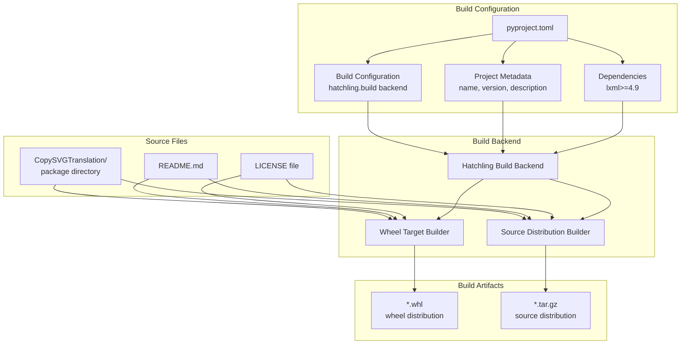
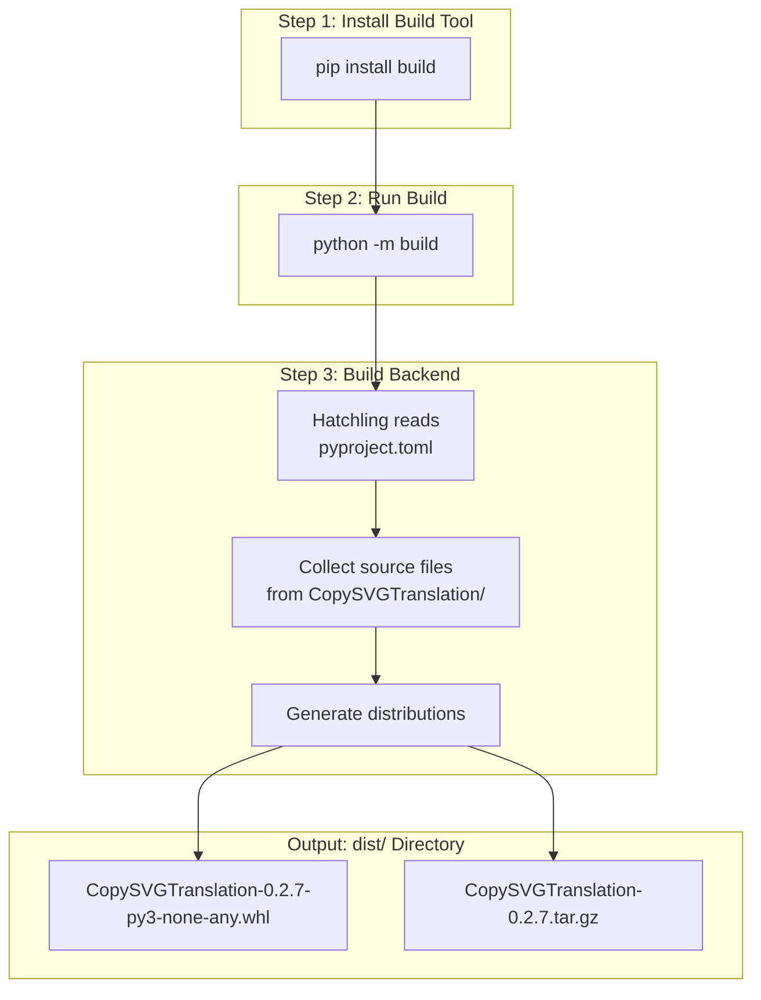
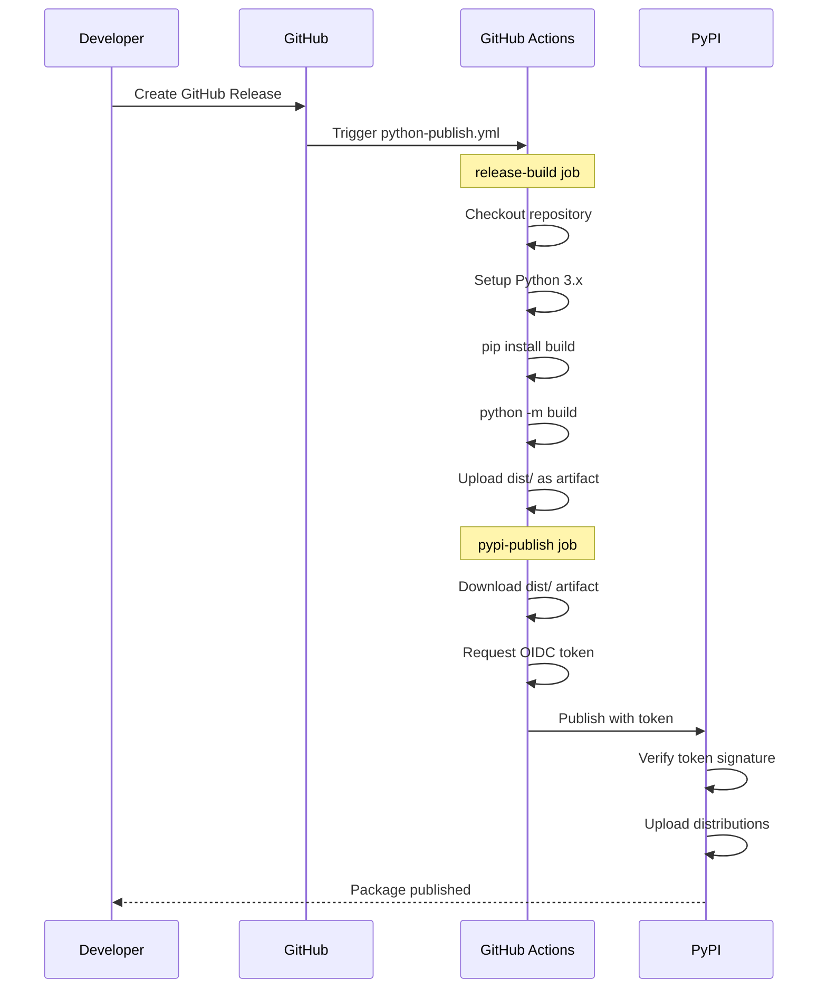

# Building and Publishing

> **Relevant source files**
> * [.github/workflows/python-publish.yml](https://github.com/MrIbrahem/CopySVGTranslation/blob/d984a401/.github/workflows/python-publish.yml)
> * [pyproject.toml](https://github.com/MrIbrahem/CopySVGTranslation/blob/d984a401/pyproject.toml)

This page explains how to build distribution packages for the CopySVGTranslation project and publish them to PyPI. It covers the build system configuration, local build processes, version management, and the automated publishing workflow.

For information about the CI/CD automation that triggers these processes, see [CI/CD Workflows](/MrIbrahem/CopySVGTranslation/7.4-cicd-workflows). For project structure details, see [Project Structure](/MrIbrahem/CopySVGTranslation/7.1-project-structure).

---

## Build System Overview

The CopySVGTranslation project uses **Hatchling** as its build backend, as specified in [pyproject.toml L1-L3](https://github.com/MrIbrahem/CopySVGTranslation/blob/d984a401/pyproject.toml#L1-L3)

 Hatchling is a modern, standards-compliant Python build tool that generates both wheel (`.whl`) and source distribution (`.tar.gz`) packages from the project source code.



**Build Configuration Structure**

Sources: [pyproject.toml L1-L26](https://github.com/MrIbrahem/CopySVGTranslation/blob/d984a401/pyproject.toml#L1-L26)

---

## Project Configuration

The `pyproject.toml` file contains all build and project metadata. The key sections are:

### Build System Declaration

[pyproject.toml L1-L3](https://github.com/MrIbrahem/CopySVGTranslation/blob/d984a401/pyproject.toml#L1-L3)

 declares the build system requirements:

| Key | Value | Purpose |
| --- | --- | --- |
| `requires` | `["hatchling>=1.17"]` | Specifies minimum Hatchling version |
| `build-backend` | `"hatchling.build"` | Identifies the PEP 517 build backend |

### Project Metadata

[pyproject.toml L5-L13](https://github.com/MrIbrahem/CopySVGTranslation/blob/d984a401/pyproject.toml#L5-L13)

 defines the project metadata:

| Field | Value | Description |
| --- | --- | --- |
| `name` | `"CopySVGTranslation"` | Package name on PyPI |
| `version` | `"0.2.7"` | Current package version |
| `description` | `"Utilities for extracting and applying translations to multilingual SVG files."` | Short description |
| `readme` | `"README.md"` | Long description source |
| `requires-python` | `">=3.11"` | Minimum Python version |
| `authors` | `[{ name = "Ibrahim Qasim" }]` | Package author |
| `license` | `{ text = "MIT" }` | License identifier |
| `dependencies` | `["lxml>=4.9"]` | Runtime dependencies |

### Project URLs

[pyproject.toml L15-L18](https://github.com/MrIbrahem/CopySVGTranslation/blob/d984a401/pyproject.toml#L15-L18)

 defines project URLs for PyPI display:

* **Homepage**: `https://github.com/MrIbrahem/CopySVGTranslation`
* **Repository**: `https://github.com/MrIbrahem/CopySVGTranslation`
* **Issues**: `https://github.com/MrIbrahem/CopySVGTranslation/issues`

### Package Selection

[pyproject.toml L20-L21](https://github.com/MrIbrahem/CopySVGTranslation/blob/d984a401/pyproject.toml#L20-L21)

 configures which directories to include in the wheel distribution:

```
[tool.hatch.build.targets.wheel]packages = ["CopySVGTranslation"]
```

This ensures only the `CopySVGTranslation` package directory is included, excluding tests and other development files.

Sources: [pyproject.toml L1-L21](https://github.com/MrIbrahem/CopySVGTranslation/blob/d984a401/pyproject.toml#L1-L21)

---

## Building Distributions Locally

To build distribution packages locally, use the `build` module, which is the standard Python build frontend tool.

### Build Process



**Local Build Workflow**

### Commands

1. **Install the build tool**: ``` python -m pip install build ```
2. **Build distributions**: ``` python -m build ```

This command executes both in [.github/workflows/python-publish.yml L24-L25](https://github.com/MrIbrahem/CopySVGTranslation/blob/d984a401/.github/workflows/python-publish.yml#L24-L25)

 during the automated release process.

### Build Output

The build process creates a `dist/` directory containing:

1. **Wheel Distribution** (`.whl`): Binary distribution for fast installation * Filename format: `CopySVGTranslation-{version}-py3-none-any.whl` * Platform-independent pure Python wheel
2. **Source Distribution** (`.tar.gz`): Source code archive * Filename format: `CopySVGTranslation-{version}.tar.gz` * Contains all source files and metadata

Sources: [.github/workflows/python-publish.yml L21-L31](https://github.com/MrIbrahem/CopySVGTranslation/blob/d984a401/.github/workflows/python-publish.yml#L21-L31)

---

## Version Management

The package version is defined in a single location: [pyproject.toml L7](https://github.com/MrIbrahem/CopySVGTranslation/blob/d984a401/pyproject.toml#L7-L7)

 The current version is `0.2.7`.

### Updating the Version

To release a new version:

1. **Update version number** in [pyproject.toml L7](https://github.com/MrIbrahem/CopySVGTranslation/blob/d984a401/pyproject.toml#L7-L7) ```markdown version = "0.2.8"  # Increment as appropriate ```
2. **Commit the change**: ``` git add pyproject.tomlgit commit -m "Bump version to 0.2.8" ```
3. **Create a Git tag**: ``` git tag v0.2.8git push origin v0.2.8 ```
4. **Create a GitHub Release** from the tag (triggers automated publishing)

### Version Numbering Scheme

The project follows semantic versioning conventions:

| Version Component | Meaning |
| --- | --- |
| Major (0.x.x) | Breaking API changes |
| Minor (x.2.x) | New features, backward compatible |
| Patch (x.x.7) | Bug fixes, backward compatible |

Sources: [pyproject.toml L7](https://github.com/MrIbrahem/CopySVGTranslation/blob/d984a401/pyproject.toml#L7-L7)

---

## Publishing to PyPI

The CopySVGTranslation package is published to the Python Package Index (PyPI), making it installable via `pip install CopySVGTranslation`.

### Automated Publishing Workflow

The primary publishing method uses GitHub Actions and trusted publishing (OIDC-based authentication).



**Automated Publishing Flow via GitHub Actions**

### Workflow Configuration

The publishing workflow is defined in [.github/workflows/python-publish.yml L1-L62](https://github.com/MrIbrahem/CopySVGTranslation/blob/d984a401/.github/workflows/python-publish.yml#L1-L62)

 Key aspects:

| Configuration | Value | Purpose |
| --- | --- | --- |
| **Trigger** | `on: release: types: [published]` | Runs when a GitHub Release is published |
| **Runner** | `ubuntu-latest` | Linux environment for builds |
| **Python Version** | `"3.x"` | Latest stable Python 3 |
| **Authentication** | Trusted Publishing (OIDC) | Token-based auth without passwords |
| **Environment** | `pypi` | Protected deployment environment |

### Workflow Jobs

#### 1. release-build Job

[.github/workflows/python-publish.yml L11-L31](https://github.com/MrIbrahem/CopySVGTranslation/blob/d984a401/.github/workflows/python-publish.yml#L11-L31)

 builds the distributions:

1. **Checkout**: Uses `actions/checkout@v6` to clone the repository
2. **Python Setup**: Installs Python 3.x via `actions/setup-python@v6`
3. **Build**: Runs `python -m pip install build` then `python -m build`
4. **Upload**: Stores `dist/` contents as an artifact named `release-dists`

#### 2. pypi-publish Job

[.github/workflows/python-publish.yml L33-L62](https://github.com/MrIbrahem/CopySVGTranslation/blob/d984a401/.github/workflows/python-publish.yml#L33-L62)

 publishes to PyPI:

1. **Depends On**: Waits for `release-build` job completion
2. **Permissions**: Requests `id-token: write` for OIDC authentication
3. **Environment**: Uses `pypi` deployment environment with protections
4. **Download**: Retrieves `release-dists` artifact to `dist/` directory
5. **Publish**: Uses `pypa/gh-action-pypi-publish@release/v1` action

### Trusted Publishing

The workflow uses PyPI's **Trusted Publishing** feature ([.github/workflows/python-publish.yml L38-L39](https://github.com/MrIbrahem/CopySVGTranslation/blob/d984a401/.github/workflows/python-publish.yml#L38-L39)

), which eliminates the need for API tokens or passwords. Instead:

1. GitHub Actions requests an OIDC token from GitHub's identity provider
2. PyPI validates the token's signature and claims
3. If the token matches the configured publisher, the upload proceeds

This is configured in the PyPI project settings, not in the repository.

Sources: [.github/workflows/python-publish.yml L1-L62](https://github.com/MrIbrahem/CopySVGTranslation/blob/d984a401/.github/workflows/python-publish.yml#L1-L62)

---

## Manual Publishing (Alternative)

While automated publishing via GitHub Actions is recommended, manual publishing is possible for development or testing purposes.

### Manual Publishing Steps

1. **Build distributions**: ``` python -m build ```
2. **Install Twine** (upload tool): ``` pip install twine ```
3. **Upload to Test PyPI** (for testing): ``` twine upload --repository testpypi dist/* ```
4. **Upload to PyPI** (production): ``` twine upload dist/* ```

Manual publishing requires:

* A PyPI account
* Either an API token or username/password
* Proper project permissions on PyPI

**Note**: Manual publishing is not used in the project's standard workflow. The automated GitHub Actions process is the primary publication method.

---

## Release Checklist

When preparing a new release:

1. **Update version** in [pyproject.toml L7](https://github.com/MrIbrahem/CopySVGTranslation/blob/d984a401/pyproject.toml#L7-L7)
2. **Run tests locally**: `pytest` (see [Testing](/MrIbrahem/CopySVGTranslation/7.2-testing))
3. **Commit version bump**: `git commit -m "Bump version to X.Y.Z"`
4. **Create Git tag**: `git tag vX.Y.Z`
5. **Push tag**: `git push origin vX.Y.Z`
6. **Create GitHub Release**: * Go to repository Releases page * Click "Draft a new release" * Select the tag (vX.Y.Z) * Add release notes describing changes * Click "Publish release"
7. **Monitor workflow**: Check [.github/workflows/python-publish.yml](https://github.com/MrIbrahem/CopySVGTranslation/blob/d984a401/.github/workflows/python-publish.yml)  execution in GitHub Actions tab
8. **Verify publication**: Check [https://pypi.org/project/CopySVGTranslation/](https://pypi.org/project/CopySVGTranslation/)

Sources: [pyproject.toml L7](https://github.com/MrIbrahem/CopySVGTranslation/blob/d984a401/pyproject.toml#L7-L7)

 [.github/workflows/python-publish.yml L3-L5](https://github.com/MrIbrahem/CopySVGTranslation/blob/d984a401/.github/workflows/python-publish.yml#L3-L5)

---

## Troubleshooting Build Issues

### Common Build Errors

| Error | Cause | Solution |
| --- | --- | --- |
| `ModuleNotFoundError: No module named 'build'` | Build tool not installed | Run `pip install build` |
| `No module named hatchling` | Build backend missing | Ensure `hatchling>=1.17` in build requirements |
| `error: Multiple top-level packages discovered` | Multiple package directories | Check [pyproject.toml L20-L21](https://github.com/MrIbrahem/CopySVGTranslation/blob/d984a401/pyproject.toml#L20-L21) <br>  `packages` configuration |
| `FileNotFoundError: [Errno 2] No such file or directory: 'README.md'` | Missing README | Ensure `README.md` exists at repository root |

### Workflow Debugging

If the GitHub Actions workflow fails:

1. **Check workflow logs**: GitHub Actions tab → Failed workflow → Job logs
2. **Verify trigger**: Ensure release was published, not just created as draft
3. **Check OIDC permissions**: [.github/workflows/python-publish.yml L38-L39](https://github.com/MrIbrahem/CopySVGTranslation/blob/d984a401/.github/workflows/python-publish.yml#L38-L39)  requires `id-token: write`
4. **Verify environment**: PyPI environment must exist with proper protections
5. **Test locally**: Run `python -m build` locally to reproduce build issues

Sources: [.github/workflows/python-publish.yml L1-L62](https://github.com/MrIbrahem/CopySVGTranslation/blob/d984a401/.github/workflows/python-publish.yml#L1-L62)

 [pyproject.toml L1-L21](https://github.com/MrIbrahem/CopySVGTranslation/blob/d984a401/pyproject.toml#L1-L21)

---

## Dependencies and Build Requirements

The build process has two dependency categories:

### Runtime Dependencies

Specified in [pyproject.toml L13](https://github.com/MrIbrahem/CopySVGTranslation/blob/d984a401/pyproject.toml#L13-L13)

:

| Package | Version | Purpose |
| --- | --- | --- |
| `lxml` | `>=4.9` | XML parsing and manipulation for SVG processing |

### Build Dependencies

Specified in [pyproject.toml L2](https://github.com/MrIbrahem/CopySVGTranslation/blob/d984a401/pyproject.toml#L2-L2)

:

| Package | Version | Purpose |
| --- | --- | --- |
| `hatchling` | `>=1.17` | PEP 517 build backend for creating distributions |

Additional tools used during build/publish (not in pyproject.toml):

| Tool | Purpose | Where Used |
| --- | --- | --- |
| `build` | Build frontend (PEP 517) | Local builds and GitHub Actions |
| `twine` | Upload tool for PyPI | Manual publishing only |

Sources: [pyproject.toml L2](https://github.com/MrIbrahem/CopySVGTranslation/blob/d984a401/pyproject.toml#L2-L2)

 [pyproject.toml L13](https://github.com/MrIbrahem/CopySVGTranslation/blob/d984a401/pyproject.toml#L13-L13)

 [.github/workflows/python-publish.yml L24](https://github.com/MrIbrahem/CopySVGTranslation/blob/d984a401/.github/workflows/python-publish.yml#L24-L24)