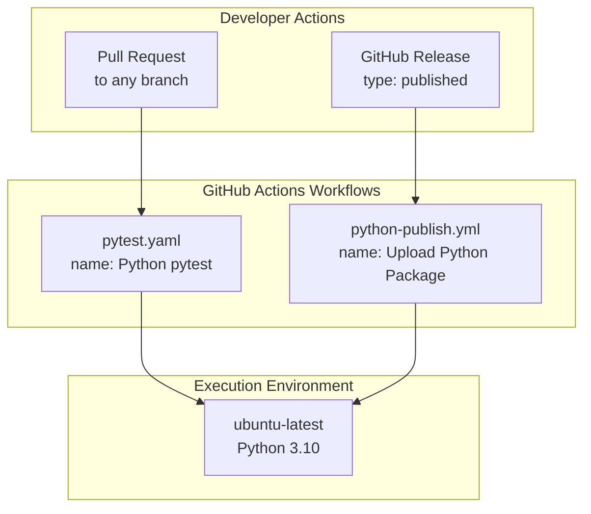
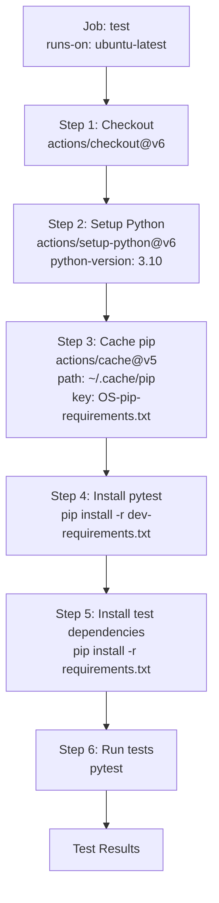
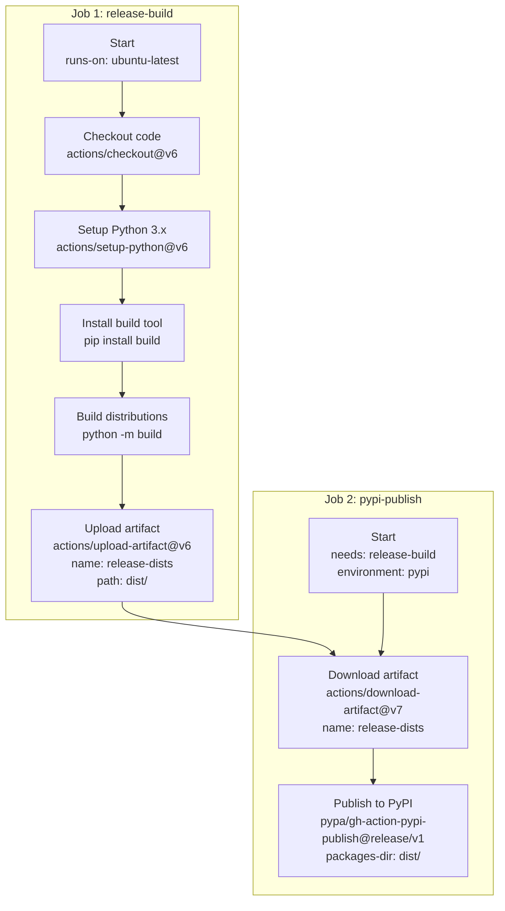
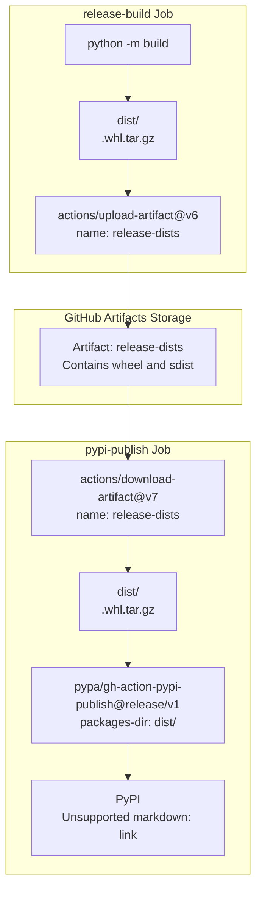

# CI/CD Workflows

> **Relevant source files**
> * [.github/workflows/pytest.yaml](https://github.com/MrIbrahem/CopySVGTranslation/blob/d984a401/.github/workflows/pytest.yaml)
> * [.github/workflows/python-publish.yml](https://github.com/MrIbrahem/CopySVGTranslation/blob/d984a401/.github/workflows/python-publish.yml)
> * [.gitignore](https://github.com/MrIbrahem/CopySVGTranslation/blob/d984a401/.gitignore)
> * [dev-requirements.txt](https://github.com/MrIbrahem/CopySVGTranslation/blob/d984a401/dev-requirements.txt)
> * [pyproject.toml](https://github.com/MrIbrahem/CopySVGTranslation/blob/d984a401/pyproject.toml)
> * [pytest.ini](https://github.com/MrIbrahem/CopySVGTranslation/blob/d984a401/pytest.ini)

This page documents the GitHub Actions continuous integration and continuous deployment (CI/CD) workflows that automate testing and publishing for the CopySVGTranslation package. These workflows ensure code quality through automated testing on pull requests and streamline the release process by automatically publishing to PyPI when new releases are created.

For information about manually building and publishing the package, see [Building and Publishing](https://github.com/MrIbrahem/CopySVGTranslation/blob/d984a401/Building and Publishing)

 For information about test suite organization and running tests locally, see [Testing](https://github.com/MrIbrahem/CopySVGTranslation/blob/d984a401/Testing)

## Overview

The CopySVGTranslation project uses two GitHub Actions workflows:

| Workflow | File | Trigger | Purpose |
| --- | --- | --- | --- |
| **Python pytest** | `.github/workflows/pytest.yaml` | Pull requests to any branch | Runs the test suite to verify code changes |
| **Upload Python Package** | `.github/workflows/python-publish.yml` | Published releases | Builds and publishes package to PyPI |

Both workflows run on `ubuntu-latest` runners and use Python 3.10+ as specified in [pyproject.toml L10](https://github.com/MrIbrahem/CopySVGTranslation/blob/d984a401/pyproject.toml#L10-L10)

**Sources:** [.github/workflows/pytest.yaml L1-L34](https://github.com/MrIbrahem/CopySVGTranslation/blob/d984a401/.github/workflows/pytest.yaml#L1-L34)

 [.github/workflows/python-publish.yml L1-L62](https://github.com/MrIbrahem/CopySVGTranslation/blob/d984a401/.github/workflows/python-publish.yml#L1-L62)

 [pyproject.toml L10](https://github.com/MrIbrahem/CopySVGTranslation/blob/d984a401/pyproject.toml#L10-L10)

## Workflow Trigger Conditions



**Sources:** [.github/workflows/pytest.yaml L3-L5](https://github.com/MrIbrahem/CopySVGTranslation/blob/d984a401/.github/workflows/pytest.yaml#L3-L5)

 [.github/workflows/python-publish.yml L3-L5](https://github.com/MrIbrahem/CopySVGTranslation/blob/d984a401/.github/workflows/python-publish.yml#L3-L5)

## Testing Workflow (pytest.yaml)

The testing workflow runs automatically on all pull requests to ensure code quality before merging.

### Trigger Configuration

The workflow is configured to trigger on pull requests to any branch:

```yaml
on:  pull_request:    branches: ["*"]
```

**Sources:** [.github/workflows/pytest.yaml L3-L5](https://github.com/MrIbrahem/CopySVGTranslation/blob/d984a401/.github/workflows/pytest.yaml#L3-L5)

### Job: test

The workflow defines a single job named `test` that executes the following steps:



**Sources:** [.github/workflows/pytest.yaml L7-L34](https://github.com/MrIbrahem/CopySVGTranslation/blob/d984a401/.github/workflows/pytest.yaml#L7-L34)

### Step Details

#### 1. Repository Checkout

Uses `actions/checkout@v6` to fetch the repository code at the pull request commit.

**Sources:** [.github/workflows/pytest.yaml L12](https://github.com/MrIbrahem/CopySVGTranslation/blob/d984a401/.github/workflows/pytest.yaml#L12-L12)

#### 2. Python Setup

Configures Python 3.10 using `actions/setup-python@v6`, matching the minimum version specified in [pyproject.toml L10](https://github.com/MrIbrahem/CopySVGTranslation/blob/d984a401/pyproject.toml#L10-L10)

**Sources:** [.github/workflows/pytest.yaml L14-L17](https://github.com/MrIbrahem/CopySVGTranslation/blob/d984a401/.github/workflows/pytest.yaml#L14-L17)

#### 3. Pip Cache

Implements caching for pip dependencies to speed up workflow execution. The cache key is based on `requirements.txt` contents, so the cache is invalidated when dependencies change.

```
path: ~/.cache/pipkey: ${{ runner.os }}-pip-${{ hashFiles('**/requirements.txt') }}restore-keys: |  ${{ runner.os }}-pip-
```

**Sources:** [.github/workflows/pytest.yaml L19-L25](https://github.com/MrIbrahem/CopySVGTranslation/blob/d984a401/.github/workflows/pytest.yaml#L19-L25)

#### 4-5. Dependency Installation

Installs testing tools from `dev-requirements.txt` (including `pytest` and `pytest-cov`) and the project's runtime dependencies from `requirements.txt` (which must include `lxml>=4.9`).

**Sources:** [.github/workflows/pytest.yaml L27-L31](https://github.com/MrIbrahem/CopySVGTranslation/blob/d984a401/.github/workflows/pytest.yaml#L27-L31)

 [dev-requirements.txt L1-L2](https://github.com/MrIbrahem/CopySVGTranslation/blob/d984a401/dev-requirements.txt#L1-L2)

 [pyproject.toml L13](https://github.com/MrIbrahem/CopySVGTranslation/blob/d984a401/pyproject.toml#L13-L13)

#### 6. Test Execution

Runs the test suite using the `pytest` command. The configuration in `pytest.ini` defines test discovery patterns (e.g., `test*.py`) and filters markers like `todo`.

**Sources:** [.github/workflows/pytest.yaml L33-L34](https://github.com/MrIbrahem/CopySVGTranslation/blob/d984a401/.github/workflows/pytest.yaml#L33-L34)

 [pytest.ini L1-L21](https://github.com/MrIbrahem/CopySVGTranslation/blob/d984a401/pytest.ini#L1-L21)

## Publishing Workflow (python-publish.yml)

The publishing workflow automates the process of building and uploading package distributions to PyPI when a new release is published on GitHub.

### Trigger Configuration

The workflow triggers on GitHub release publication events:

```yaml
on:  release:    types: [published]
```

**Sources:** [.github/workflows/python-publish.yml L3-L5](https://github.com/MrIbrahem/CopySVGTranslation/blob/d984a401/.github/workflows/python-publish.yml#L3-L5)

### Workflow Architecture

The publishing workflow uses a two-job architecture to separate build and publish concerns:



**Sources:** [.github/workflows/python-publish.yml L10-L62](https://github.com/MrIbrahem/CopySVGTranslation/blob/d984a401/.github/workflows/python-publish.yml#L10-L62)

### Job 1: release-build

This job builds the package distributions without publishing them, allowing the build artifacts to be inspected before publication.

#### Build Steps

| Step | Action | Purpose |
| --- | --- | --- |
| 1 | `actions/checkout@v6` | Fetch repository at release tag |
| 2 | `actions/setup-python@v6` | Configure Python 3.x |
| 3 | Install `build` | Install the `build` package for PEP 517 builds |
| 4 | `python -m build` | Build wheel and source distributions using hatchling backend |
| 5 | `actions/upload-artifact@v6` | Upload `dist/` directory as artifact `release-dists` |

The build process uses the `hatchling` backend specified in [pyproject.toml L1-L3](https://github.com/MrIbrahem/CopySVGTranslation/blob/d984a401/pyproject.toml#L1-L3)

:

```
[build-system]requires = ["hatchling>=1.17"]build-backend = "hatchling.build"
```

**Sources:** [.github/workflows/python-publish.yml L11-L31](https://github.com/MrIbrahem/CopySVGTranslation/blob/d984a401/.github/workflows/python-publish.yml#L11-L31)

 [pyproject.toml L1-L3](https://github.com/MrIbrahem/CopySVGTranslation/blob/d984a401/pyproject.toml#L1-L3)

### Job 2: pypi-publish

This job handles the actual publication to PyPI using OpenID Connect (OIDC) trusted publishing.

#### Job Configuration

```yaml
needs:  - release-buildpermissions:  id-token: writeenvironment:  name: pypi
```

The job depends on `release-build` completing successfully and requires `id-token: write` permission for trusted publishing authentication.

**Sources:** [.github/workflows/python-publish.yml L33-L50](https://github.com/MrIbrahem/CopySVGTranslation/blob/d984a401/.github/workflows/python-publish.yml#L33-L50)

#### Publish Steps

| Step | Action | Purpose |
| --- | --- | --- |
| 1 | `actions/download-artifact@v7` | Retrieve `release-dists` artifact from build job |
| 2 | `pypa/gh-action-pypi-publish@release/v1` | Upload distributions to PyPI using trusted publishing |

The publish action uses the `packages-dir: dist/` parameter to locate the distribution files.

**Sources:** [.github/workflows/python-publish.yml L52-L62](https://github.com/MrIbrahem/CopySVGTranslation/blob/d984a401/.github/workflows/python-publish.yml#L52-L62)

### Trusted Publishing

The workflow uses PyPI's trusted publishing mechanism, which eliminates the need for long-lived API tokens. Authentication is handled through OIDC tokens issued by GitHub Actions.

**Requirements:**

* The PyPI project must be configured to trust the GitHub repository
* The workflow must have `id-token: write` permission
* The workflow must use a GitHub environment (optionally with protection rules)

**Sources:** [.github/workflows/python-publish.yml L37-L50](https://github.com/MrIbrahem/CopySVGTranslation/blob/d984a401/.github/workflows/python-publish.yml#L37-L50)

## Artifact Flow

The following diagram shows how build artifacts flow between workflow jobs:



**Sources:** [.github/workflows/python-publish.yml L21-L31](https://github.com/MrIbrahem/CopySVGTranslation/blob/d984a401/.github/workflows/python-publish.yml#L21-L31)

 [.github/workflows/python-publish.yml L52-L62](https://github.com/MrIbrahem/CopySVGTranslation/blob/d984a401/.github/workflows/python-publish.yml#L52-L62)

## Permissions and Security

### Testing Workflow Permissions

The testing workflow uses default permissions and does not require any special access. It only reads repository code and executes tests.

**Sources:** [.github/workflows/pytest.yaml L1-L34](https://github.com/MrIbrahem/CopySVGTranslation/blob/d984a401/.github/workflows/pytest.yaml#L1-L34)

### Publishing Workflow Permissions

The publishing workflow defines two permission scopes:

```markdown
# Root-level permissionspermissions:  contents: read # pypi-publish job permissionspermissions:  id-token: write
```

* `contents: read` allows the workflow to checkout code
* `id-token: write` enables OIDC token issuance for trusted publishing

**Sources:** [.github/workflows/python-publish.yml L7-L8](https://github.com/MrIbrahem/CopySVGTranslation/blob/d984a401/.github/workflows/python-publish.yml#L7-L8)

 [.github/workflows/python-publish.yml L37-L39](https://github.com/MrIbrahem/CopySVGTranslation/blob/d984a401/.github/workflows/python-publish.yml#L37-L39)

## Configuration References

### Python Version

Both workflows use Python 3.10+, matching the project requirement in [pyproject.toml L10](https://github.com/MrIbrahem/CopySVGTranslation/blob/d984a401/pyproject.toml#L10-L10)

:

```
requires-python = ">=3.11"
```

The testing workflow explicitly uses Python 3.10, while the publishing workflow uses the latest Python 3.x version.

**Sources:** [pyproject.toml L10](https://github.com/MrIbrahem/CopySVGTranslation/blob/d984a401/pyproject.toml#L10-L10)

 [.github/workflows/pytest.yaml L17](https://github.com/MrIbrahem/CopySVGTranslation/blob/d984a401/.github/workflows/pytest.yaml#L17-L17)

 [.github/workflows/python-publish.yml L19](https://github.com/MrIbrahem/CopySVGTranslation/blob/d984a401/.github/workflows/python-publish.yml#L19-L19)

### Build Backend

The publishing workflow builds distributions using the `hatchling` backend configured in [pyproject.toml L1-L3](https://github.com/MrIbrahem/CopySVGTranslation/blob/d984a401/pyproject.toml#L1-L3)

:

```
[build-system]requires = ["hatchling>=1.17"]build-backend = "hatchling.build"
```

This generates both wheel (`.whl`) and source distribution (`.tar.gz`) files based on the `packages = ["CopySVGTranslation"]` configuration.

**Sources:** [pyproject.toml L1-L3](https://github.com/MrIbrahem/CopySVGTranslation/blob/d984a401/pyproject.toml#L1-L3)

 [pyproject.toml L21](https://github.com/MrIbrahem/CopySVGTranslation/blob/d984a401/pyproject.toml#L21-L21)

 [.github/workflows/python-publish.yml L21-L25](https://github.com/MrIbrahem/CopySVGTranslation/blob/d984a401/.github/workflows/python-publish.yml#L21-L25)

### Package Dependencies

The testing workflow installs runtime dependencies from `requirements.txt`, which must include at minimum `lxml>=4.9` as specified in [pyproject.toml L13](https://github.com/MrIbrahem/CopySVGTranslation/blob/d984a401/pyproject.toml#L13-L13)

**Sources:** [pyproject.toml L13](https://github.com/MrIbrahem/CopySVGTranslation/blob/d984a401/pyproject.toml#L13-L13)

 [.github/workflows/pytest.yaml L30-L31](https://github.com/MrIbrahem/CopySVGTranslation/blob/d984a401/.github/workflows/pytest.yaml#L30-L31)