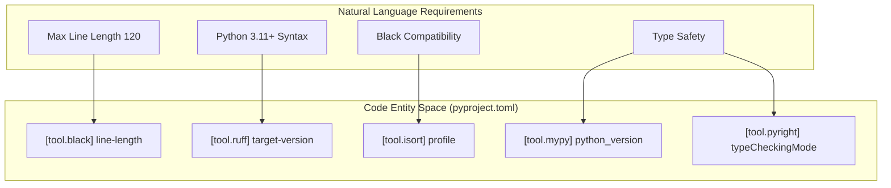

# Code Quality Tools

> **Relevant source files**
> * [.github/workflows/python-publish.yml](https://github.com/MrIbrahem/CopySVGTranslation/blob/d984a401/.github/workflows/python-publish.yml)
> * [pyproject.toml](https://github.com/MrIbrahem/CopySVGTranslation/blob/d984a401/pyproject.toml)

This document describes the code quality tools configured for the `CopySVGTranslation` project, including code formatters, linters, type checkers, and their integration with the development workflow. These tools enforce consistent code style, catch potential issues, and ensure code quality standards are maintained across the codebase.

## Overview

The project uses a comprehensive suite of tools configured primarily through `pyproject.toml`. The configuration targets modern Python standards (Python 3.11+) and ensures interoperability between different formatting and linting engines.

**Configuration Files:**

| Configuration File | Tool(s) | Purpose |
| --- | --- | --- |
| [pyproject.toml L26-L44](https://github.com/MrIbrahem/CopySVGTranslation/blob/d984a401/pyproject.toml#L26-L44) | `black` | Opinionated code formatting |
| [pyproject.toml L49-L74](https://github.com/MrIbrahem/CopySVGTranslation/blob/d984a401/pyproject.toml#L49-L74) | `isort` | Import statement sorting and grouping |
| [pyproject.toml L79-L188](https://github.com/MrIbrahem/CopySVGTranslation/blob/d984a401/pyproject.toml#L79-L188) | `ruff` | High-performance linting and formatting |
| [pyproject.toml L192-L195](https://github.com/MrIbrahem/CopySVGTranslation/blob/d984a401/pyproject.toml#L192-L195) | `flynt` | Automatic conversion to f-strings |
| [pyproject.toml L196-L202](https://github.com/MrIbrahem/CopySVGTranslation/blob/d984a401/pyproject.toml#L196-L202) | `mypy` | Static type checking |
| [pyproject.toml L203-L209](https://github.com/MrIbrahem/CopySVGTranslation/blob/d984a401/pyproject.toml#L203-L209) | `pylint` | Deep static analysis |
| [pyproject.toml L212-L276](https://github.com/MrIbrahem/CopySVGTranslation/blob/d984a401/pyproject.toml#L212-L276) | `pyright` | Fast static type checking (VS Code optimized) |

Sources: [pyproject.toml L26-L276](https://github.com/MrIbrahem/CopySVGTranslation/blob/d984a401/pyproject.toml#L26-L276)

## Code Formatting Tools

### Black Configuration

Black is the primary code formatter, configured with an extended line length to accommodate deep XML processing logic.

```
[tool.black]line-length = 120target-version = ["py311"]exclude = '''    /(        \.git        | \.mypy_cache        | \.venv        | build        | dist    )/'''
```

**Settings:**

* **Line Length**: 120 characters [pyproject.toml L27](https://github.com/MrIbrahem/CopySVGTranslation/blob/d984a401/pyproject.toml#L27-L27)
* **Target Version**: Python 3.11 [pyproject.toml L28](https://github.com/MrIbrahem/CopySVGTranslation/blob/d984a401/pyproject.toml#L28-L28)
* **Exclusions**: Standard build artifacts and virtual environments are ignored [pyproject.toml L30-L44](https://github.com/MrIbrahem/CopySVGTranslation/blob/d984a401/pyproject.toml#L30-L44)

Sources: [pyproject.toml L26-L44](https://github.com/MrIbrahem/CopySVGTranslation/blob/d984a401/pyproject.toml#L26-L44)

### isort Configuration

isort manages imports to prevent merge conflicts and maintain readability. It is configured to be strictly compatible with Black.

```
[tool.isort]profile = "black"line_length = 120multi_line_output = 3include_trailing_comma = true
```

**Settings:**

* **Profile**: `black` ensures no conflicts with Black's formatting [pyproject.toml L50](https://github.com/MrIbrahem/CopySVGTranslation/blob/d984a401/pyproject.toml#L50-L50)
* **Vertical Hanging Indent**: `multi_line_output = 3` forces imports into a clean vertical list when they exceed line length [pyproject.toml L54](https://github.com/MrIbrahem/CopySVGTranslation/blob/d984a401/pyproject.toml#L54-L54)

Sources: [pyproject.toml L49-L74](https://github.com/MrIbrahem/CopySVGTranslation/blob/d984a401/pyproject.toml#L49-L74)

## Linting and Static Analysis

### Ruff Configuration

Ruff serves as a fast replacement for several tools (flake8, isort, pyupgrade). It is configured with a broad selection of rules.

**Key Rule Sets:**

* **E/W**: `pycodestyle` errors and warnings [pyproject.toml L164-L166](https://github.com/MrIbrahem/CopySVGTranslation/blob/d984a401/pyproject.toml#L164-L166)
* **F**: `pyflakes` [pyproject.toml L165](https://github.com/MrIbrahem/CopySVGTranslation/blob/d984a401/pyproject.toml#L165-L165)
* **B**: `flake8-bugbear` for finding likely bugs [pyproject.toml L167](https://github.com/MrIbrahem/CopySVGTranslation/blob/d984a401/pyproject.toml#L167-L167)
* **UP**: `pyupgrade` to keep syntax modern (Python 3.11+) [pyproject.toml L174](https://github.com/MrIbrahem/CopySVGTranslation/blob/d984a401/pyproject.toml#L174-L174)
* **FURB**: `refurb` rules for modernizing Python code [pyproject.toml L181-L184](https://github.com/MrIbrahem/CopySVGTranslation/blob/d984a401/pyproject.toml#L181-L184)

Sources: [pyproject.toml L79-L188](https://github.com/MrIbrahem/CopySVGTranslation/blob/d984a401/pyproject.toml#L79-L188)

### Pylint and Type Checking

The project utilizes `mypy` and `pyright` for static type checking, targeting Python 3.13 features.

* **mypy**: Configured with `warn_return_any = true` and `ignore_missing_imports = true` to handle third-party libraries like `lxml` that may lack stubs [pyproject.toml L196-L202](https://github.com/MrIbrahem/CopySVGTranslation/blob/d984a401/pyproject.toml#L196-L202)
* **pyright**: Uses `standard` type checking mode and defines a `stubPath` for custom type definitions [pyproject.toml L212-L276](https://github.com/MrIbrahem/CopySVGTranslation/blob/d984a401/pyproject.toml#L212-L276)
* **pylint**: Disables specific stylistic warnings like `missing-docstring` (`C0111`) while enforcing the 120-character line limit [pyproject.toml L203-L209](https://github.com/MrIbrahem/CopySVGTranslation/blob/d984a401/pyproject.toml#L203-L209)

Sources: [pyproject.toml L196-L276](https://github.com/MrIbrahem/CopySVGTranslation/blob/d984a401/pyproject.toml#L196-L276)

## Code Entity to Tool Mapping

This diagram maps specific system requirements to the code entities (configuration sections) that enforce them.



Sources: [pyproject.toml L27](https://github.com/MrIbrahem/CopySVGTranslation/blob/d984a401/pyproject.toml#L27-L27)

 [pyproject.toml L131](https://github.com/MrIbrahem/CopySVGTranslation/blob/d984a401/pyproject.toml#L131-L131)

 [pyproject.toml L50](https://github.com/MrIbrahem/CopySVGTranslation/blob/d984a401/pyproject.toml#L50-L50)

 [pyproject.toml L197](https://github.com/MrIbrahem/CopySVGTranslation/blob/d984a401/pyproject.toml#L197-L197)

 [pyproject.toml L272](https://github.com/MrIbrahem/CopySVGTranslation/blob/d984a401/pyproject.toml#L272-L272)

## Tool Execution Flow

The following diagram illustrates how a developer interacts with the toolchain during the development lifecycle.

```

```

Sources: [pyproject.toml L1-L3](https://github.com/MrIbrahem/CopySVGTranslation/blob/d984a401/pyproject.toml#L1-L3)

 [pyproject.toml L26-L276](https://github.com/MrIbrahem/CopySVGTranslation/blob/d984a401/pyproject.toml#L26-L276)

## CI/CD Integration

The code quality tools are integrated into GitHub Actions to ensure every release meets the project's standards.

### Automated Publishing

The `python-publish.yml` workflow triggers on release publication. It uses `hatchling` (configured as the build backend in `pyproject.toml`) to build wheels and source distributions.

**Workflow Steps:**

1. **Build**: Uses `python -m build` to generate artifacts in `dist/` [.github/workflows/python-publish.yml L21-L25](https://github.com/MrIbrahem/CopySVGTranslation/blob/d984a401/.github/workflows/python-publish.yml#L21-L25)
2. **Upload**: Stores distributions as artifacts [.github/workflows/python-publish.yml L27-L31](https://github.com/MrIbrahem/CopySVGTranslation/blob/d984a401/.github/workflows/python-publish.yml#L27-L31)
3. **Publish**: Deploys to PyPI using Trusted Publishing (OIDC) [.github/workflows/python-publish.yml L59-L62](https://github.com/MrIbrahem/CopySVGTranslation/blob/d984a401/.github/workflows/python-publish.yml#L59-L62)

Sources: [.github/workflows/python-publish.yml L1-L62](https://github.com/MrIbrahem/CopySVGTranslation/blob/d984a401/.github/workflows/python-publish.yml#L1-L62)

 [pyproject.toml L1-L3](https://github.com/MrIbrahem/CopySVGTranslation/blob/d984a401/pyproject.toml#L1-L3)

## Summary of Tool Settings

| Tool | Key Setting | Value |
| --- | --- | --- |
| **Black** | `line-length` | 120 |
| **isort** | `profile` | black |
| **Ruff** | `target-version` | py311 |
| **mypy** | `python_version` | 3.13 |
| **pyright** | `typeCheckingMode` | standard |
| **Pylint** | `max-line-length` | 120 |

Sources: [pyproject.toml L27](https://github.com/MrIbrahem/CopySVGTranslation/blob/d984a401/pyproject.toml#L27-L27)

 [pyproject.toml L50](https://github.com/MrIbrahem/CopySVGTranslation/blob/d984a401/pyproject.toml#L50-L50)

 [pyproject.toml L131](https://github.com/MrIbrahem/CopySVGTranslation/blob/d984a401/pyproject.toml#L131-L131)

 [pyproject.toml L197](https://github.com/MrIbrahem/CopySVGTranslation/blob/d984a401/pyproject.toml#L197-L197)

 [pyproject.toml L272](https://github.com/MrIbrahem/CopySVGTranslation/blob/d984a401/pyproject.toml#L272-L272)

 [pyproject.toml L204](https://github.com/MrIbrahem/CopySVGTranslation/blob/d984a401/pyproject.toml#L204-L204)