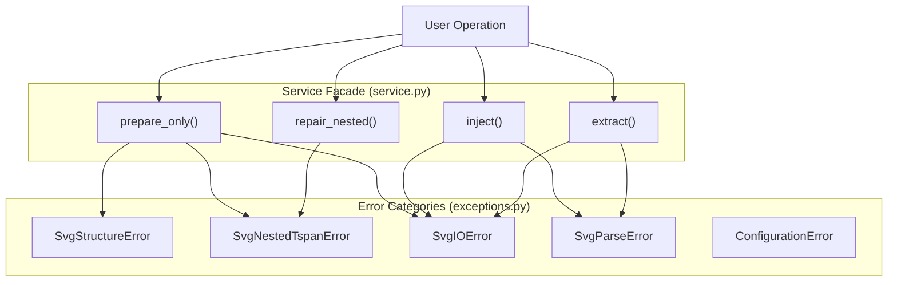
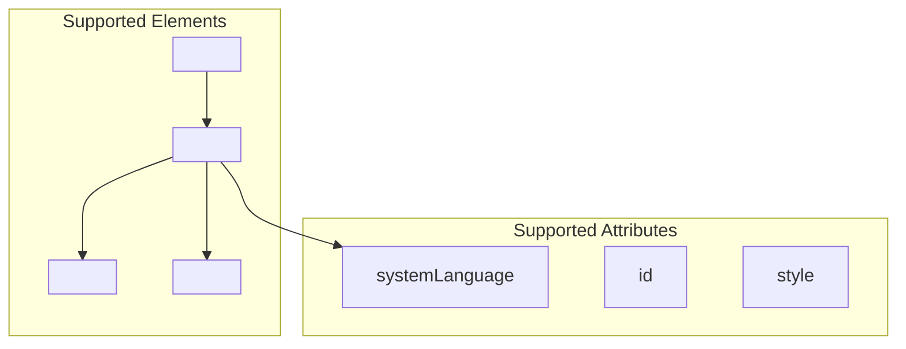

# Troubleshooting and FAQ

> **Relevant source files**
> * [CLAUDE.md](https://github.com/MrIbrahem/CopySVGTranslation/blob/d984a401/CLAUDE.md?plain=1)
> * [CopySVGTranslation/exceptions.py](https://github.com/MrIbrahem/CopySVGTranslation/blob/d984a401/CopySVGTranslation/exceptions.py)
> * [CopySVGTranslation/i18n/en.json](https://github.com/MrIbrahem/CopySVGTranslation/blob/d984a401/CopySVGTranslation/i18n/en.json)
> * [CopySVGTranslation/nested/flattener.py](https://github.com/MrIbrahem/CopySVGTranslation/blob/d984a401/CopySVGTranslation/nested/flattener.py)
> * [CopySVGTranslation/preparation/steps/validate.py](https://github.com/MrIbrahem/CopySVGTranslation/blob/d984a401/CopySVGTranslation/preparation/steps/validate.py)
> * [README.md](https://github.com/MrIbrahem/CopySVGTranslation/blob/d984a401/README.md?plain=1)
> * [requirements.txt](https://github.com/MrIbrahem/CopySVGTranslation/blob/d984a401/requirements.txt)

This page addresses common issues, error messages, and frequently asked questions when using CopySVGTranslation. It covers error diagnosis, SVG compatibility limitations, and performance optimization strategies.

For general usage patterns, see [Getting Started](/MrIbrahem/CopySVGTranslation/2-getting-started). For detailed API documentation, see [API Reference](/MrIbrahem/CopySVGTranslation/6-api-reference). For advanced configuration of SVG preparation, see [SVG Preparation](/MrIbrahem/CopySVGTranslation/5.2-svg-preparation).

## Overview of Common Issues

The CopySVGTranslation system performs strict validation to ensure SVG files are structurally compatible with the translation workflow. Most errors fall into three categories: structural problems detected during preparation, file I/O issues, and data format problems. The `SVGTranslationService` facade wraps these in a uniform `OperationResult` object [README.md L97-L120](https://github.com/MrIbrahem/CopySVGTranslation/blob/d984a401/README.md?plain=1#L97-L120)

Title: Error Handling Flow

**Sources:** [CopySVGTranslation/exceptions.py L27-L177](https://github.com/MrIbrahem/CopySVGTranslation/blob/d984a401/CopySVGTranslation/exceptions.py#L27-L177)

 [CopySVGTranslation/service.py L45-L56](https://github.com/MrIbrahem/CopySVGTranslation/blob/d984a401/CopySVGTranslation/service.py#L45-L56)

---

## Common Error Messages

### SvgStructureError

The `SvgStructureError` class indicates structural problems in the SVG file that prevent translation processing. Each exception includes a `code` attribute identifying the specific issue [CopySVGTranslation/exceptions.py L30-L49](https://github.com/MrIbrahem/CopySVGTranslation/blob/d984a401/CopySVGTranslation/exceptions.py#L30-L49)

| Error Code | Description | Resolution |
| --- | --- | --- |
| `structure-error-multiple-text-same-lang` | Multiple `<text>` elements with the same `systemLanguage` in a `<switch>` | Remove duplicate translations; each language should appear once per `<switch>` |
| `structure-error-css-too-complex` | SVG contains `<style>` elements with complex CSS selectors | Simplify CSS; avoid commas, spaces, or `>` in selectors [CopySVGTranslation/preparation/steps/validate.py L49-L54](https://github.com/MrIbrahem/CopySVGTranslation/blob/d984a401/CopySVGTranslation/preparation/steps/validate.py#L49-L54) |
| `structure-error-css-has-ids` | CSS uses element IDs (`#id`) which may conflict with generated IDs | Use classes instead of IDs in CSS [CopySVGTranslation/preparation/steps/validate.py L43-L47](https://github.com/MrIbrahem/CopySVGTranslation/blob/d984a401/CopySVGTranslation/preparation/steps/validate.py#L43-L47) |
| `structure-error-text-contains-dollar` | Text content contains `$` character, which is reserved for internal logic | Remove or escape `$` characters in text content [CopySVGTranslation/preparation/steps/validate.py L56-L60](https://github.com/MrIbrahem/CopySVGTranslation/blob/d984a401/CopySVGTranslation/preparation/steps/validate.py#L56-L60) |
| `structure-error-contains-tref` | File contains `<tref>` tags, which are deprecated and unsupported | Replace `<tref>` with standard `<text>` nodes [CopySVGTranslation/preparation/steps/validate.py L22-L25](https://github.com/MrIbrahem/CopySVGTranslation/blob/d984a401/CopySVGTranslation/preparation/steps/validate.py#L22-L25) |

**Sources:** [CopySVGTranslation/exceptions.py L6-L24](https://github.com/MrIbrahem/CopySVGTranslation/blob/d984a401/CopySVGTranslation/exceptions.py#L6-L24)

 [CopySVGTranslation/preparation/steps/validate.py L17-L61](https://github.com/MrIbrahem/CopySVGTranslation/blob/d984a401/CopySVGTranslation/preparation/steps/validate.py#L17-L61)

### SvgNestedTspanError

This exception is raised when the SVG contains nested `<tspan>` or `<a>` elements under a `raise` strategy. Nested structures create ambiguity in text matching [CopySVGTranslation/nested/flattener.py L78-L93](https://github.com/MrIbrahem/CopySVGTranslation/blob/d984a401/CopySVGTranslation/nested/flattener.py#L78-L93)

**Workaround:** Use the `repair_nested()` method in `SVGTranslationService` with a strategy like `preserve_style` to flatten the structure before processing [README.md L85](https://github.com/MrIbrahem/CopySVGTranslation/blob/d984a401/README.md?plain=1#L85-L85)

**Sources:** [CopySVGTranslation/nested/flattener.py L66-L71](https://github.com/MrIbrahem/CopySVGTranslation/blob/d984a401/CopySVGTranslation/nested/flattener.py#L66-L71)

 [CopySVGTranslation/exceptions.py L66-L83](https://github.com/MrIbrahem/CopySVGTranslation/blob/d984a401/CopySVGTranslation/exceptions.py#L66-L83)

### File I/O and Parse Errors

Standardized wrappers for filesystem and XML parsing issues.

| Exception | Common Causes |
| --- | --- |
| `SvgIOError` | Missing file, permission denied, or directory instead of file [CopySVGTranslation/exceptions.py L152-L158](https://github.com/MrIbrahem/CopySVGTranslation/blob/d984a401/CopySVGTranslation/exceptions.py#L152-L158) |
| `SvgParseError` | Malformed XML that `lxml` cannot parse [CopySVGTranslation/exceptions.py L144-L150](https://github.com/MrIbrahem/CopySVGTranslation/blob/d984a401/CopySVGTranslation/exceptions.py#L144-L150) |
| `MappingError` | Invalid or malformed JSON translation mapping [CopySVGTranslation/exceptions.py L163-L169](https://github.com/MrIbrahem/CopySVGTranslation/blob/d984a401/CopySVGTranslation/exceptions.py#L163-L169) |

**Sources:** [CopySVGTranslation/exceptions.py L141-L177](https://github.com/MrIbrahem/CopySVGTranslation/blob/d984a401/CopySVGTranslation/exceptions.py#L141-L177)

---

## SVG Compatibility

### Supported SVG Features

The translation system focuses on SVG documents that use `<switch>` elements and `systemLanguage` attributes [README.md L6-L8](https://github.com/MrIbrahem/CopySVGTranslation/blob/d984a401/README.md?plain=1#L6-L8)

Title: Supported Code Entities

**Sources:** [CopySVGTranslation/injection/switch_processor.py L48-L55](https://github.com/MrIbrahem/CopySVGTranslation/blob/d984a401/CopySVGTranslation/injection/switch_processor.py#L48-L55)

 [CopySVGTranslation/preparation/preparer.py L31-L53](https://github.com/MrIbrahem/CopySVGTranslation/blob/d984a401/CopySVGTranslation/preparation/preparer.py#L31-L53)

### Limitations and Workarounds

* **Nested Elements:** By default, the system requires non-nested `<tspan>` elements. If nesting is found, use the `NestedTspanFlattener` with the `preserve_style` strategy to convert them into sibling elements [CopySVGTranslation/nested/flattener.py L112-L127](https://github.com/MrIbrahem/CopySVGTranslation/blob/d984a401/CopySVGTranslation/nested/flattener.py#L112-L127)
* **CSS Selectors:** Complex selectors like `#id` or descendant combinators are blocked to prevent breakage when the injector adds new IDs [CopySVGTranslation/preparation/steps/validate.py L33-L54](https://github.com/MrIbrahem/CopySVGTranslation/blob/d984a401/CopySVGTranslation/preparation/steps/validate.py#L33-L54)
* **ID Constraints:** IDs must be valid XML names and avoid special characters used by the internal matching logic [CopySVGTranslation/exceptions.py L16-L17](https://github.com/MrIbrahem/CopySVGTranslation/blob/d984a401/CopySVGTranslation/exceptions.py#L16-L17)

**Sources:** [CopySVGTranslation/nested/flattener.py L30-L43](https://github.com/MrIbrahem/CopySVGTranslation/blob/d984a401/CopySVGTranslation/nested/flattener.py#L30-L43)

 [CopySVGTranslation/preparation/steps/validate.py L17-L61](https://github.com/MrIbrahem/CopySVGTranslation/blob/d984a401/CopySVGTranslation/preparation/steps/validate.py#L17-L61)

---

## Performance Considerations

For details, see [Performance Considerations](/MrIbrahem/CopySVGTranslation/8.3-performance-considerations).

### Batch Processing

When processing multiple files, use the `start_injects` function or the `SVGTranslationService` to handle aggregated statistics and error reporting [README.md L82-L92](https://github.com/MrIbrahem/CopySVGTranslation/blob/d984a401/README.md?plain=1#L82-L92)

### Memory Usage

Large SVG files are processed using `lxml` trees. For batch operations involving hundreds of files, memory is managed by processing files sequentially and returning individual `OperationResult` objects [README.md L97-L110](https://github.com/MrIbrahem/CopySVGTranslation/blob/d984a401/README.md?plain=1#L97-L110)

### Year Suffix Handling

The `make_title_translations` and `get_titles_translations` functions handle dynamic titles (e.g., "Population 2020") by identifying year patterns, reducing the number of unique translation strings required in the mapping [CopySVGTranslation/titles/year_handler.py L53-L60](https://github.com/MrIbrahem/CopySVGTranslation/blob/d984a401/CopySVGTranslation/titles/year_handler.py#L53-L60)

**Sources:** [CopySVGTranslation/service.py L72-L100](https://github.com/MrIbrahem/CopySVGTranslation/blob/d984a401/CopySVGTranslation/service.py#L72-L100)

 [CopySVGTranslation/titles/year_handler.py L10-L40](https://github.com/MrIbrahem/CopySVGTranslation/blob/d984a401/CopySVGTranslation/titles/year_handler.py#L10-L40)