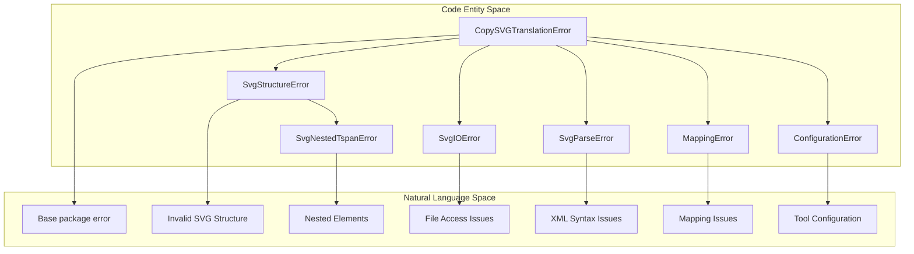
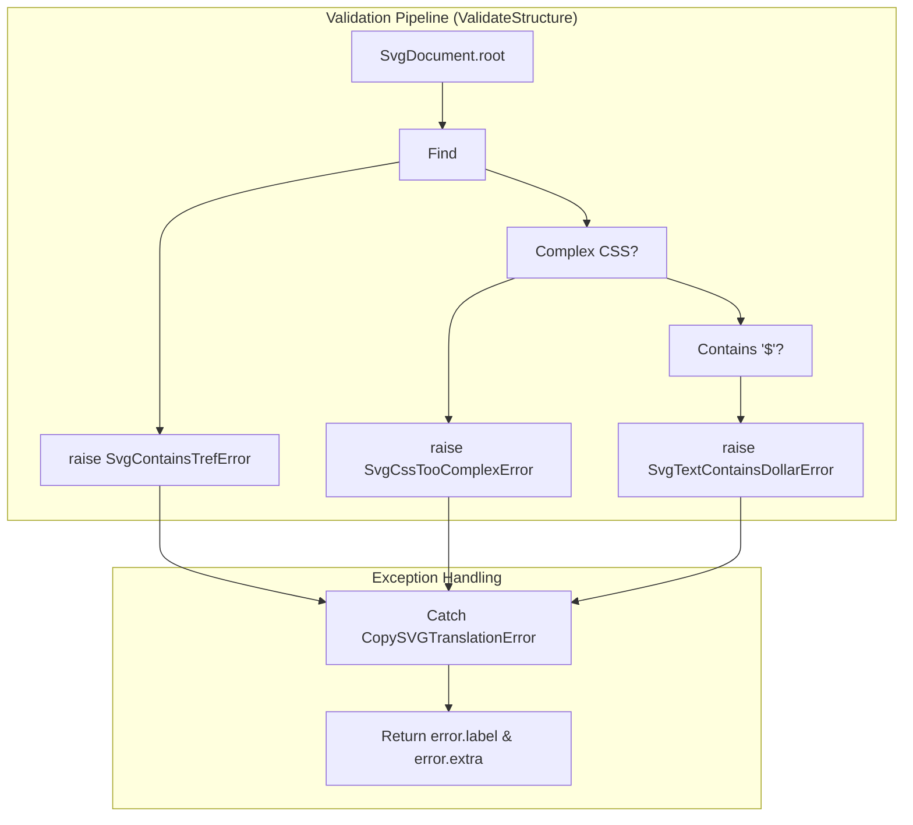

# Common Error Messages

> **Relevant source files**
> * [CopySVGTranslation/exceptions.py](https://github.com/MrIbrahem/CopySVGTranslation/blob/d984a401/CopySVGTranslation/exceptions.py)
> * [CopySVGTranslation/i18n/en.json](https://github.com/MrIbrahem/CopySVGTranslation/blob/d984a401/CopySVGTranslation/i18n/en.json)
> * [CopySVGTranslation/nested/flattener.py](https://github.com/MrIbrahem/CopySVGTranslation/blob/d984a401/CopySVGTranslation/nested/flattener.py)
> * [CopySVGTranslation/preparation/steps/validate.py](https://github.com/MrIbrahem/CopySVGTranslation/blob/d984a401/CopySVGTranslation/preparation/steps/validate.py)
> * [tests/unit/injection/test_id_manager.py](https://github.com/MrIbrahem/CopySVGTranslation/blob/d984a401/tests/unit/injection/test_id_manager.py)
> * [tests/unit/injection/test_injector.py](https://github.com/MrIbrahem/CopySVGTranslation/blob/d984a401/tests/unit/injection/test_injector.py)
> * [tests/unit/io/test_svg_document.py](https://github.com/MrIbrahem/CopySVGTranslation/blob/d984a401/tests/unit/io/test_svg_document.py)
> * [tests/unit/preparation/steps/test_base.py](https://github.com/MrIbrahem/CopySVGTranslation/blob/d984a401/tests/unit/preparation/steps/test_base.py)
> * [tests/unit/test_config.py](https://github.com/MrIbrahem/CopySVGTranslation/blob/d984a401/tests/unit/test_config.py)
> * [tests/unit/test_exceptions.py](https://github.com/MrIbrahem/CopySVGTranslation/blob/d984a401/tests/unit/test_exceptions.py)

This page documents common error messages that users may encounter when using CopySVGTranslation, their causes, and how to resolve them. For information about SVG compatibility limitations and workarounds, see [SVG Compatibility](/MrIbrahem/CopySVGTranslation/8.2-svg-compatibility). For guidance on handling large files and performance issues, see [Performance Considerations](/MrIbrahem/CopySVGTranslation/8.3-performance-considerations).

## Overview

CopySVGTranslation utilizes a structured exception hierarchy to help diagnose issues during SVG translation workflows. The package defines a base exception class `CopySVGTranslationError` from which all specific errors derive [CopySVGTranslation/exceptions.py L27-L52](https://github.com/MrIbrahem/CopySVGTranslation/blob/d984a401/CopySVGTranslation/exceptions.py#L27-L52)

The primary exception categories are:

* **`SvgStructureError`**: Raised when SVG structure validation fails during preparation or extraction [CopySVGTranslation/exceptions.py L58-L64](https://github.com/MrIbrahem/CopySVGTranslation/blob/d984a401/CopySVGTranslation/exceptions.py#L58-L64)
* **`SvgNestedTspanError`**: A specialized exception for nested `<tspan>` or `<a>` element issues [CopySVGTranslation/exceptions.py L66-L90](https://github.com/MrIbrahem/CopySVGTranslation/blob/d984a401/CopySVGTranslation/exceptions.py#L66-L90)
* **`SvgParseError` / `SvgIOError`**: Wrappers for XML parsing and filesystem failures [CopySVGTranslation/exceptions.py L144-L158](https://github.com/MrIbrahem/CopySVGTranslation/blob/d984a401/CopySVGTranslation/exceptions.py#L144-L158)
* **`MappingError` / `ConfigurationError`**: Raised for invalid translation data or tool configuration [CopySVGTranslation/exceptions.py L163-L177](https://github.com/MrIbrahem/CopySVGTranslation/blob/d984a401/CopySVGTranslation/exceptions.py#L163-L177)

## Exception Class Hierarchy

The following diagram maps the natural language error categories to the specific code entities defined in the package.

**Natural Language to Code Entity Mapping: Exception Hierarchy**



**Sources:** [CopySVGTranslation/exceptions.py L27-L177](https://github.com/MrIbrahem/CopySVGTranslation/blob/d984a401/CopySVGTranslation/exceptions.py#L27-L177)

## SvgStructureError Reference

The `SvgStructureError` class (and its subclasses) uses standardized error codes defined in `i18n_data` to provide descriptive feedback [CopySVGTranslation/exceptions.py L6-L24](https://github.com/MrIbrahem/CopySVGTranslation/blob/d984a401/CopySVGTranslation/exceptions.py#L6-L24)

| Error Code | Class | Description | Resolution |
| --- | --- | --- | --- |
| `structure-error-nested-tspans-not-supported` | `SvgNestedTspanError` | Nested `<tspan>` or `<a>` elements detected inside a `<tspan>` [CopySVGTranslation/exceptions.py L10](https://github.com/MrIbrahem/CopySVGTranslation/blob/d984a401/CopySVGTranslation/exceptions.py#L10-L10) | Use `NestedTspanFlattener` with `flatten` or `preserve_style` strategy [CopySVGTranslation/nested/flattener.py L30-L43](https://github.com/MrIbrahem/CopySVGTranslation/blob/d984a401/CopySVGTranslation/nested/flattener.py#L30-L43) |
| `structure-error-contains-tref` | `SvgContainsTrefError` | SVG contains deprecated `<tref>` tags [CopySVGTranslation/exceptions.py L12](https://github.com/MrIbrahem/CopySVGTranslation/blob/d984a401/CopySVGTranslation/exceptions.py#L12-L12) | Remove `<tref>` tags; they are not supported by modern SVG workflows [CopySVGTranslation/preparation/steps/validate.py L22-L25](https://github.com/MrIbrahem/CopySVGTranslation/blob/d984a401/CopySVGTranslation/preparation/steps/validate.py#L22-L25) |
| `structure-error-css-too-complex` | `SvgCssTooComplexError` | CSS contains complex selectors (e.g., `>`, `:`, `,`) [CopySVGTranslation/exceptions.py L13](https://github.com/MrIbrahem/CopySVGTranslation/blob/d984a401/CopySVGTranslation/exceptions.py#L13-L13) | Simplify CSS to single classes or use inline styles [CopySVGTranslation/preparation/steps/validate.py L49-L54](https://github.com/MrIbrahem/CopySVGTranslation/blob/d984a401/CopySVGTranslation/preparation/steps/validate.py#L49-L54) |
| `structure-error-css-has-ids` | `SvgCssHasIdsError` | CSS selectors use `#id` which may break during injection [CopySVGTranslation/exceptions.py L14](https://github.com/MrIbrahem/CopySVGTranslation/blob/d984a401/CopySVGTranslation/exceptions.py#L14-L14) | Change ID-based CSS selectors to class-based selectors [CopySVGTranslation/preparation/steps/validate.py L43-L47](https://github.com/MrIbrahem/CopySVGTranslation/blob/d984a401/CopySVGTranslation/preparation/steps/validate.py#L43-L47) |
| `structure-error-text-contains-dollar` | `SvgTextContainsDollarError` | Text contains `$` character, conflicting with internal logic [CopySVGTranslation/exceptions.py L17](https://github.com/MrIbrahem/CopySVGTranslation/blob/d984a401/CopySVGTranslation/exceptions.py#L17-L17) | Remove or replace `$` symbols in the SVG text content [CopySVGTranslation/preparation/steps/validate.py L56-L60](https://github.com/MrIbrahem/CopySVGTranslation/blob/d984a401/CopySVGTranslation/preparation/steps/validate.py#L56-L60) |
| `structure-error-invalid-node-id` | `SvgInvalidIdError` | Element ID contains characters not permitted by the tool [CopySVGTranslation/exceptions.py L16](https://github.com/MrIbrahem/CopySVGTranslation/blob/d984a401/CopySVGTranslation/exceptions.py#L16-L16) | Ensure IDs use only alphanumeric characters, hyphens, and underscores [tests/unit/injection/test_id_manager.py L116-L119](https://github.com/MrIbrahem/CopySVGTranslation/blob/d984a401/tests/unit/injection/test_id_manager.py#L116-L119) |

**Sources:** [CopySVGTranslation/exceptions.py L6-L24](https://github.com/MrIbrahem/CopySVGTranslation/blob/d984a401/CopySVGTranslation/exceptions.py#L6-L24)

 [CopySVGTranslation/preparation/steps/validate.py L17-L62](https://github.com/MrIbrahem/CopySVGTranslation/blob/d984a401/CopySVGTranslation/preparation/steps/validate.py#L17-L62)

## Detailed Error Descriptions

### 1. SvgNestedTspanError

**When Raised:** During structure validation or if the `NestedTspanFlattener` is configured with the `raise` strategy and encounters nested elements [CopySVGTranslation/nested/flattener.py L51-L53](https://github.com/MrIbrahem/CopySVGTranslation/blob/d984a401/CopySVGTranslation/nested/flattener.py#L51-L53)

**Technical Context:** The tool expects a flat structure within `<text>` elements where children are only direct `<tspan>` siblings.
**Code Implementation:**

```css
# From CopySVGTranslation/nested/flattener.py:82-93tspans = root.findall(f".//{{{SVG_NS}}}tspan")for tspan in tspans:    element_children = [c for c in tspan if isinstance(c.tag, str)]    if element_children:        raise SvgNestedTspanError(element=tspan, extra=[tspan.get("id", "")])
```

**Resolution:** Use `NestedTspanFlattener` to convert nested tspans into siblings, preserving styles [CopySVGTranslation/nested/flattener.py L112-L127](https://github.com/MrIbrahem/CopySVGTranslation/blob/d984a401/CopySVGTranslation/nested/flattener.py#L112-L127)

### 2. SvgCssTooComplexError / SvgCssHasIdsError

**When Raised:** During the `ValidateStructure` preparation step [CopySVGTranslation/preparation/steps/validate.py L33-L54](https://github.com/MrIbrahem/CopySVGTranslation/blob/d984a401/CopySVGTranslation/preparation/steps/validate.py#L33-L54)

**Technical Context:** The `IdManager` generates unique IDs for translated elements (e.g., `base-fr`, `base-fr_1`) [tests/unit/injection/test_id_manager.py L20-L30](https://github.com/MrIbrahem/CopySVGTranslation/blob/d984a401/tests/unit/injection/test_id_manager.py#L20-L30)

 If CSS relies on specific IDs, these styles will fail to apply to the newly generated translated nodes.
**Resolution:** Convert CSS blocks to inline `style` attributes or use simple class selectors.

### 3. SvgTextContainsDollarError

**When Raised:** If a `<text>` element's concatenated text content contains the `$` character [CopySVGTranslation/preparation/steps/validate.py L56-L60](https://github.com/MrIbrahem/CopySVGTranslation/blob/d984a401/CopySVGTranslation/preparation/steps/validate.py#L56-L60)

**Technical Context:** This prevents conflicts with the "dollar-number" syntax used in some translation workflows [CopySVGTranslation/exceptions.py L17](https://github.com/MrIbrahem/CopySVGTranslation/blob/d984a401/CopySVGTranslation/exceptions.py#L17-L17)

## File I/O and Parsing Errors

### SvgIOError / FileNotFoundError

**When Raised:** During `SvgDocument.load()` if the file is missing or inaccessible [tests/unit/io/test_svg_document.py L47-L49](https://github.com/MrIbrahem/CopySVGTranslation/blob/d984a401/tests/unit/io/test_svg_document.py#L47-L49)

**Resolution:** Verify the `svg_file_path` exists and the process has read permissions.

### SvgParseError / XMLSyntaxError

**When Raised:** When `lxml` fails to parse the file as valid XML [tests/unit/io/test_svg_document.py L51-L54](https://github.com/MrIbrahem/CopySVGTranslation/blob/d984a401/tests/unit/io/test_svg_document.py#L51-L54)

**Resolution:** Ensure the file is a valid SVG. CopySVGTranslation specifically checks for the SVG namespace and will attempt to add it if missing [tests/unit/io/test_svg_document.py L67-L75](https://github.com/MrIbrahem/CopySVGTranslation/blob/d984a401/tests/unit/io/test_svg_document.py#L67-L75)

## Error Flow and Data Propagation

The following diagram illustrates how structural errors are identified during the validation pipeline and how they propagate to the user.

**System Data Flow: Validation to Exception**



**Sources:** [CopySVGTranslation/preparation/steps/validate.py L17-L62](https://github.com/MrIbrahem/CopySVGTranslation/blob/d984a401/CopySVGTranslation/preparation/steps/validate.py#L17-L62)

 [CopySVGTranslation/exceptions.py L30-L48](https://github.com/MrIbrahem/CopySVGTranslation/blob/d984a401/CopySVGTranslation/exceptions.py#L30-L48)

## Handling Errors in User Code

When calling the API, wrap operations in a try-except block targeting `CopySVGTranslationError`.

```javascript
from CopySVGTranslation.exceptions import CopySVGTranslationError, SvgNestedTspanErrorfrom CopySVGTranslation.io.svg_document import SvgDocument try:    doc = SvgDocument.load("image.svg")    # ... processing ...except SvgNestedTspanError as e:    # Specific handling for nested elements    print(f"Nesting error in element: {e.extra}")    print(f"Content: {e.node_preview()}") # [CopySVGTranslation/exceptions.py:85-89]except CopySVGTranslationError as e:    # General package errors    print(f"Error [{e.code}]: {e.label}")
```

**Sources:** [CopySVGTranslation/exceptions.py L27-L89](https://github.com/MrIbrahem/CopySVGTranslation/blob/d984a401/CopySVGTranslation/exceptions.py#L27-L89)

 [tests/unit/io/test_svg_document.py L47-L54](https://github.com/MrIbrahem/CopySVGTranslation/blob/d984a401/tests/unit/io/test_svg_document.py#L47-L54)