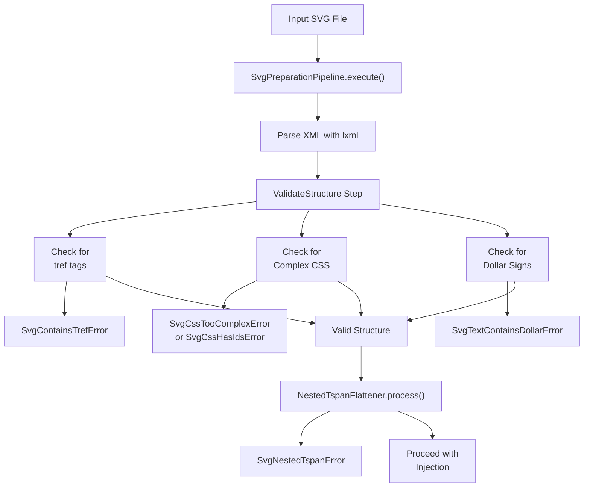
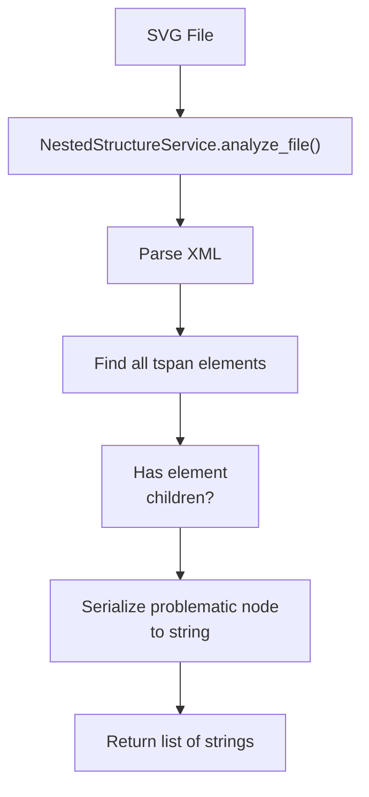
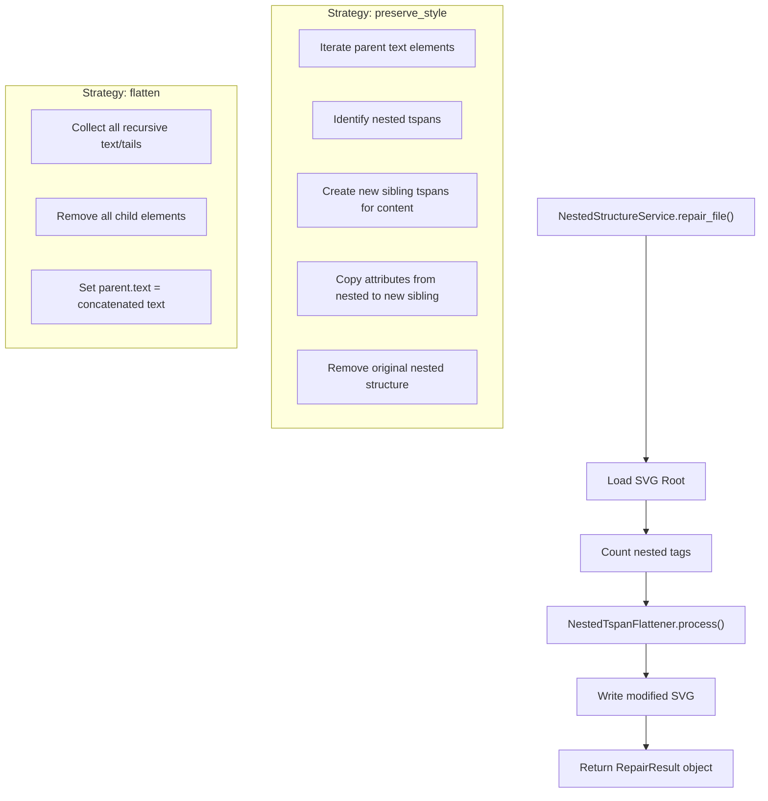

# SVG Compatibility

> **Relevant source files**
> * [CopySVGTranslation/exceptions.py](https://github.com/MrIbrahem/CopySVGTranslation/blob/d984a401/CopySVGTranslation/exceptions.py)
> * [CopySVGTranslation/i18n/en.json](https://github.com/MrIbrahem/CopySVGTranslation/blob/d984a401/CopySVGTranslation/i18n/en.json)
> * [CopySVGTranslation/nested/flattener.py](https://github.com/MrIbrahem/CopySVGTranslation/blob/d984a401/CopySVGTranslation/nested/flattener.py)
> * [CopySVGTranslation/nested/objects.py](https://github.com/MrIbrahem/CopySVGTranslation/blob/d984a401/CopySVGTranslation/nested/objects.py)
> * [CopySVGTranslation/preparation/steps/validate.py](https://github.com/MrIbrahem/CopySVGTranslation/blob/d984a401/CopySVGTranslation/preparation/steps/validate.py)
> * [tests/integration/nested/test_fixer_flatten_strategy.py](https://github.com/MrIbrahem/CopySVGTranslation/blob/d984a401/tests/integration/nested/test_fixer_flatten_strategy.py)
> * [tests/integration/nested/test_fixer_nested_file.py](https://github.com/MrIbrahem/CopySVGTranslation/blob/d984a401/tests/integration/nested/test_fixer_nested_file.py)
> * [tests/integration/nested/test_fixer_nested_links.py](https://github.com/MrIbrahem/CopySVGTranslation/blob/d984a401/tests/integration/nested/test_fixer_nested_links.py)

This page documents which SVG features and structures are supported by CopySVGTranslation, known limitations, and available workarounds. For information about specific error messages encountered during processing, see [Common Error Messages](/MrIbrahem/CopySVGTranslation/8.1-common-error-messages). For guidance on preparing SVG files for translation, see [SVG Preparation](/MrIbrahem/CopySVGTranslation/5.2-svg-preparation).

## Supported SVG Features

CopySVGTranslation is designed to work with multilingual SVG files that follow specific structural conventions. The system supports:

| Feature | Support Level | Notes |
| --- | --- | --- |
| `<text>` elements | Full | Primary target for extraction and injection. |
| `<tspan>` elements | Full | Used for inline text segments; flattened if nested. |
| `<switch>` elements | Full | Used for language variants via `systemLanguage`. |
| `systemLanguage` attribute | Full | Used for language detection and targeting. |
| Basic attributes (id, x, y, style) | Full | Preserved during processing. |
| Unicode text content | Full | All character sets supported. |
| Simple `<a>` anchor elements | Partial | Supported if flattened or treated as text segments. |

The system expects SVG text content to be structured with `<switch>` blocks containing multiple `<text>` elements, each with a `systemLanguage` attribute indicating the language variant.

**Sources:** [CopySVGTranslation/preparation/steps/validate.py L27-L30](https://github.com/MrIbrahem/CopySVGTranslation/blob/d984a401/CopySVGTranslation/preparation/steps/validate.py#L27-L30)

 [CopySVGTranslation/nested/flattener.py L55-L72](https://github.com/MrIbrahem/CopySVGTranslation/blob/d984a401/CopySVGTranslation/nested/flattener.py#L55-L72)

 [CopySVGTranslation/exceptions.py L6-L24](https://github.com/MrIbrahem/CopySVGTranslation/blob/d984a401/CopySVGTranslation/exceptions.py#L6-L24)

## Validation Flow

The `SvgPreparationPipeline` executes several validation steps to ensure the SVG is suitable for translation.



**Sources:** [CopySVGTranslation/preparation/steps/validate.py L17-L62](https://github.com/MrIbrahem/CopySVGTranslation/blob/d984a401/CopySVGTranslation/preparation/steps/validate.py#L17-L62)

 [CopySVGTranslation/nested/flattener.py L47-L73](https://github.com/MrIbrahem/CopySVGTranslation/blob/d984a401/CopySVGTranslation/nested/flattener.py#L47-L73)

 [CopySVGTranslation/exceptions.py L58-L140](https://github.com/MrIbrahem/CopySVGTranslation/blob/d984a401/CopySVGTranslation/exceptions.py#L58-L140)

## Known Limitations

### Nested <tspan> Elements

**Status:** Not supported by default, automatic fix available.

The system does not support `<tspan>` elements nested inside other `<tspan>` elements by default, as this creates ambiguity in text extraction and translation matching.

**Unsupported structure:**

```xml
<text>    <tspan x="16" y="66.5">        Outer text <tspan style="font-weight: 700;">nested bold</tspan> more text    </tspan></text>
```

**Exception raised:** `SvgNestedTspanError` with code `"structure-error-nested-tspans-not-supported"`.

**Workaround:** Use the `NestedStructureService` with the `flatten` or `preserve_style` strategy to automatically fix the file. The `flatten` strategy removes nested tags and concatenates text:

```xml
<text>    <tspan x="16" y="66.5">Outer text nested bold more text</tspan></text>
```

**Sources:** [CopySVGTranslation/nested/flattener.py L78-L93](https://github.com/MrIbrahem/CopySVGTranslation/blob/d984a401/CopySVGTranslation/nested/flattener.py#L78-L93)

 [CopySVGTranslation/nested/flattener.py L98-L108](https://github.com/MrIbrahem/CopySVGTranslation/blob/d984a401/CopySVGTranslation/nested/flattener.py#L98-L108)

 [CopySVGTranslation/exceptions.py L66-L90](https://github.com/MrIbrahem/CopySVGTranslation/blob/d984a401/CopySVGTranslation/exceptions.py#L66-L90)

### Nested <a> Anchor Elements

**Status:** Not supported inside `<text>`/`<tspan>`, automatic fix available.

Many SVG tools fail when `<a>` tags are nested inside `<tspan>` elements. CopySVGTranslation flags these as nested structures.

**Unsupported structure:**

```xml
<text>    <tspan x="10" y="124.0">        Read more: <a href="https://example.com">Link text</a>    </tspan></text>
```

**Workaround:** The `NestedTspanFlattener` (when `also_fix_a=True`) handles these by either flattening the text or splitting the parent into siblings.

**Sources:** [CopySVGTranslation/nested/flattener.py L39-L42](https://github.com/MrIbrahem/CopySVGTranslation/blob/d984a401/CopySVGTranslation/nested/flattener.py#L39-L42)

 [tests/integration/nested/test_fixer_nested_links.py L33-L42](https://github.com/MrIbrahem/CopySVGTranslation/blob/d984a401/tests/integration/nested/test_fixer_nested_links.py#L33-L42)

### Complex CSS Selectors

**Status:** Not supported.

SVG files containing `<style>` tags with complex CSS selectors (comma separated, descendant selectors, or pseudo-classes) are rejected because they can create unpredictable interactions when the tool adds new elements or IDs.

**Unsupported selectors:**

* `div, p { ... }` (comma)
* `g > text { ... }` (descendant)
* `text:hover { ... }` (pseudo-class)

**Exception raised:** `SvgCssTooComplexError` with code `"structure-error-css-too-complex"`.

**Sources:** [CopySVGTranslation/preparation/steps/validate.py L32-L55](https://github.com/MrIbrahem/CopySVGTranslation/blob/d984a401/CopySVGTranslation/preparation/steps/validate.py#L32-L55)

 [CopySVGTranslation/exceptions.py L103-L107](https://github.com/MrIbrahem/CopySVGTranslation/blob/d984a401/CopySVGTranslation/exceptions.py#L103-L107)

### CSS Selectors using IDs

**Status:** Not supported.

The tool rejects CSS that uses element IDs (e.g., `#text123 { ... }`) because translation injection may generate new IDs or modify existing ones, breaking the styles.

**Exception raised:** `SvgCssHasIdsError` with code `"structure-error-css-has-ids"`.

**Sources:** [CopySVGTranslation/preparation/steps/validate.py L38-L47](https://github.com/MrIbrahem/CopySVGTranslation/blob/d984a401/CopySVGTranslation/preparation/steps/validate.py#L38-L47)

 [CopySVGTranslation/exceptions.py L109-L113](https://github.com/MrIbrahem/CopySVGTranslation/blob/d984a401/CopySVGTranslation/exceptions.py#L109-L113)

### Dollar Signs in Text Content

**Status:** Not supported.

Text content containing dollar signs (`$`) is rejected to avoid conflicts with internal placeholder logic or other text processing tools.

**Exception raised:** `SvgTextContainsDollarError` with code `"structure-error-text-contains-dollar"`.

**Sources:** [CopySVGTranslation/preparation/steps/validate.py L56-L60](https://github.com/MrIbrahem/CopySVGTranslation/blob/d984a401/CopySVGTranslation/preparation/steps/validate.py#L56-L60)

 [CopySVGTranslation/exceptions.py L115-L119](https://github.com/MrIbrahem/CopySVGTranslation/blob/d984a401/CopySVGTranslation/exceptions.py#L115-L119)

### <tref> Elements

**Status:** Not supported.

The deprecated `<tref>` element (used for referencing text content from other elements) is explicitly checked and rejected.

**Exception raised:** `SvgContainsTrefError` with code `"structure-error-contains-tref"`.

**Sources:** [CopySVGTranslation/preparation/steps/validate.py L22-L25](https://github.com/MrIbrahem/CopySVGTranslation/blob/d984a401/CopySVGTranslation/preparation/steps/validate.py#L22-L25)

 [CopySVGTranslation/exceptions.py L97-L101](https://github.com/MrIbrahem/CopySVGTranslation/blob/d984a401/CopySVGTranslation/exceptions.py#L97-L101)

## Nested Element Detection and Fixing

### Detection via NestedStructureService

The `NestedStructureService` provides methods to analyze files for problematic nesting.



**Sources:** [CopySVGTranslation/nested/service.py L39-L58](https://github.com/MrIbrahem/CopySVGTranslation/blob/d984a401/CopySVGTranslation/nested/service.py#L39-L58)

 [tests/integration/nested/test_fixer_nested_file.py L28-L30](https://github.com/MrIbrahem/CopySVGTranslation/blob/d984a401/tests/integration/nested/test_fixer_nested_file.py#L28-L30)

### Repair Strategies

The `NestedTspanFlattener` supports different strategies for handling nested elements:

| Strategy | Behavior |
| --- | --- |
| `flatten` | Concatenates all nested text into the parent element and removes child tags. |
| `preserve_style` | (Default) Converts nested children into sibling elements to maintain individual styles/attributes. |
| `raise` | Immediately raises an `SvgNestedTspanError` if any nesting is found. |

**Sources:** [CopySVGTranslation/nested/flattener.py L15-L16](https://github.com/MrIbrahem/CopySVGTranslation/blob/d984a401/CopySVGTranslation/nested/flattener.py#L15-L16)

 [CopySVGTranslation/nested/flattener.py L47-L73](https://github.com/MrIbrahem/CopySVGTranslation/blob/d984a401/CopySVGTranslation/nested/flattener.py#L47-L73)

### The Repair Process



**Sources:** [CopySVGTranslation/nested/service.py L60-L93](https://github.com/MrIbrahem/CopySVGTranslation/blob/d984a401/CopySVGTranslation/nested/service.py#L60-L93)

 [CopySVGTranslation/nested/flattener.py L98-L108](https://github.com/MrIbrahem/CopySVGTranslation/blob/d984a401/CopySVGTranslation/nested/flattener.py#L98-L108)

 [CopySVGTranslation/nested/flattener.py L112-L178](https://github.com/MrIbrahem/CopySVGTranslation/blob/d984a401/CopySVGTranslation/nested/flattener.py#L112-L178)

 [CopySVGTranslation/nested/objects.py L10-L23](https://github.com/MrIbrahem/CopySVGTranslation/blob/d984a401/CopySVGTranslation/nested/objects.py#L10-L23)

## Exception Reference

The system uses specific exception classes to categorize compatibility issues.

| Exception Class | Purpose |
| --- | --- |
| `SvgStructureError` | Base class for all SVG structural suitability issues. |
| `SvgNestedTspanError` | Raised when nested elements are found and strategy is set to `raise`. |
| `SvgContainsTrefError` | Raised if `<tref>` elements are present. |
| `SvgCssTooComplexError` | Raised if CSS contains selectors that are too complex to parse safely. |
| `SvgCssHasIdsError` | Raised if CSS uses `#id` selectors. |
| `SvgTextContainsDollarError` | Raised if text content contains the `$` character. |

**Sources:** [CopySVGTranslation/exceptions.py L58-L140](https://github.com/MrIbrahem/CopySVGTranslation/blob/d984a401/CopySVGTranslation/exceptions.py#L58-L140)