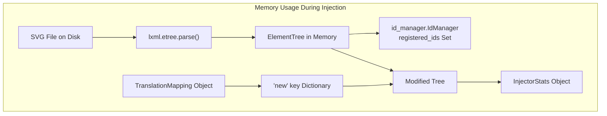
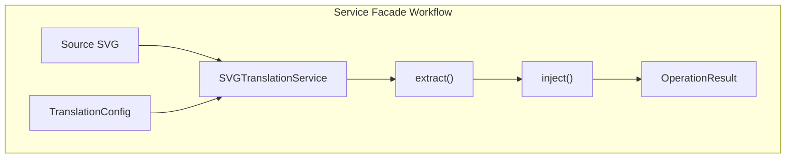
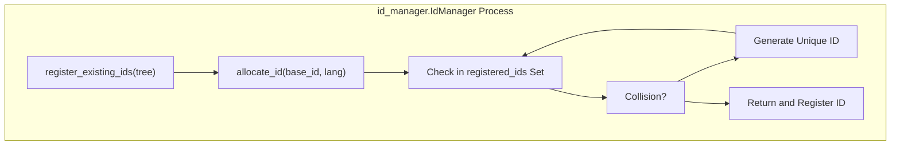

# Performance Considerations

> **Relevant source files**
> * [CLAUDE.md](https://github.com/MrIbrahem/CopySVGTranslation/blob/d984a401/CLAUDE.md?plain=1)
> * [README.md](https://github.com/MrIbrahem/CopySVGTranslation/blob/d984a401/README.md?plain=1)
> * [requirements.txt](https://github.com/MrIbrahem/CopySVGTranslation/blob/d984a401/requirements.txt)
> * [tests/e2e/injection/test_inject_extended.py](https://github.com/MrIbrahem/CopySVGTranslation/blob/d984a401/tests/e2e/injection/test_inject_extended.py)
> * [tests/e2e/test_additional.py](https://github.com/MrIbrahem/CopySVGTranslation/blob/d984a401/tests/e2e/test_additional.py)
> * [tests/e2e/test_full.py](https://github.com/MrIbrahem/CopySVGTranslation/blob/d984a401/tests/e2e/test_full.py)

This page provides guidance on performance characteristics and optimization strategies when working with `CopySVGTranslation`, particularly when handling large SVG files or processing files in batch. The system is designed around a modular pipeline involving **Preparation**, **Extraction**, and **Injection**, coordinated by the `SVGTranslationService` facade [CLAUDE.md L31-L35](https://github.com/MrIbrahem/CopySVGTranslation/blob/d984a401/CLAUDE.md?plain=1#L31-L35)

## XML Parsing and Memory Usage

`CopySVGTranslation` utilizes `lxml` for all XML parsing and manipulation operations [README.md L214](https://github.com/MrIbrahem/CopySVGTranslation/blob/d984a401/README.md?plain=1#L214-L214)

 `lxml` loads the entire SVG structure into memory as a tree, which has important implications for handling large files.

### Memory Footprint

The memory footprint during processing consists of the source tree, the modified tree, and the translation mapping dictionaries.

**Sources:** [CLAUDE.md L59-L81](https://github.com/MrIbrahem/CopySVGTranslation/blob/d984a401/CLAUDE.md?plain=1#L59-L81)

 [README.md L214](https://github.com/MrIbrahem/CopySVGTranslation/blob/d984a401/README.md?plain=1#L214-L214)

### File Size Guidelines

Based on the system architecture and the use of `lxml` [requirements.txt L1](https://github.com/MrIbrahem/CopySVGTranslation/blob/d984a401/requirements.txt#L1-L1)

:

| SVG File Size | Memory Usage (Approximate) | Processing Time | Recommendation |
| --- | --- | --- | --- |
| < 1 MB | 5-10 MB | < 1 second | No special handling needed |
| 1-10 MB | 10-50 MB | 1-5 seconds | Monitor memory usage |
| 10-50 MB | 50-250 MB | 5-30 seconds | Use batch processing carefully |
| > 50 MB | > 250 MB | > 30 seconds | Consider splitting files or increasing memory |

**Note:** These are estimates. Actual usage depends on SVG complexity, such as the number of `<switch>` elements and text segments [CLAUDE.md L48](https://github.com/MrIbrahem/CopySVGTranslation/blob/d984a401/CLAUDE.md?plain=1#L48-L48)

## Batch Processing Performance

The system supports processing multiple files, typically through the `SVGTranslationService` [README.md L72-L91](https://github.com/MrIbrahem/CopySVGTranslation/blob/d984a401/README.md?plain=1#L72-L91)

### Execution Flow

**Key Performance Aspects:**

1. **Service Overhead**: The `SVGTranslationService` acts as a facade, orchestrating internal modules like `SVGTranslationExtractor` and `SVGTranslationInjector` [CLAUDE.md L39-L47](https://github.com/MrIbrahem/CopySVGTranslation/blob/d984a401/CLAUDE.md?plain=1#L39-L47)
2. **Result Wrapping**: Every operation returns an `OperationResult`, which includes `InjectorStats` for injection workflows [README.md L97-L120](https://github.com/MrIbrahem/CopySVGTranslation/blob/d984a401/README.md?plain=1#L97-L120)
3. **Data Reusability**: A `TranslationMapping` extracted from one file can be efficiently reused for multiple `inject()` calls [tests/e2e/test_full.py L21-L36](https://github.com/MrIbrahem/CopySVGTranslation/blob/d984a401/tests/e2e/test_full.py#L21-L36)

**Sources:** [CLAUDE.md L39-L47](https://github.com/MrIbrahem/CopySVGTranslation/blob/d984a401/CLAUDE.md?plain=1#L39-L47)

 [README.md L82-L91](https://github.com/MrIbrahem/CopySVGTranslation/blob/d984a401/README.md?plain=1#L82-L91)

 [tests/e2e/test_full.py L21-L36](https://github.com/MrIbrahem/CopySVGTranslation/blob/d984a401/tests/e2e/test_full.py#L21-L36)

## Text Matching Performance

The system uses text normalization to match source text with translations. This is a critical path for performance during both extraction and injection.

### Text Normalization Cost

| Operation | Implementation | Time Complexity | Notes |
| --- | --- | --- | --- |
| `normalize_text()` | `utils/text.py` | O(n) | Handles whitespace and casing [CLAUDE.md L54](https://github.com/MrIbrahem/CopySVGTranslation/blob/d984a401/CLAUDE.md?plain=1#L54-L54) |
| Case Sensitivity | `TranslationConfig` | O(n) | `case_insensitive=True` adds `.lower()` calls [README.md L43-L44](https://github.com/MrIbrahem/CopySVGTranslation/blob/d984a401/README.md?plain=1#L43-L44) |
| Dictionary lookup | Python `dict` | O(1) average | Matches normalized text to translations [CLAUDE.md L68-L69](https://github.com/MrIbrahem/CopySVGTranslation/blob/d984a401/CLAUDE.md?plain=1#L68-L69) |

**Case Sensitivity Impact:**
Setting `case_insensitive=True` (default in many workflows) ensures that "Hello" and "hello" match the same translation key, but requires additional string processing for every text node [README.md L43-L44](https://github.com/MrIbrahem/CopySVGTranslation/blob/d984a401/README.md?plain=1#L43-L44)

 [tests/e2e/injection/test_inject_extended.py L48-L64](https://github.com/MrIbrahem/CopySVGTranslation/blob/d984a401/tests/e2e/injection/test_inject_extended.py#L48-L64)

**Sources:** [CLAUDE.md L54-L69](https://github.com/MrIbrahem/CopySVGTranslation/blob/d984a401/CLAUDE.md?plain=1#L54-L69)

 [README.md L43-L44](https://github.com/MrIbrahem/CopySVGTranslation/blob/d984a401/README.md?plain=1#L43-L44)

 [tests/e2e/injection/test_inject_extended.py L48-L64](https://github.com/MrIbrahem/CopySVGTranslation/blob/d984a401/tests/e2e/injection/test_inject_extended.py#L48-L64)

## ID Generation and Collision Handling

The `id_manager.IdManager` tracks ID registration and allocations dynamically to prevent collisions when inserting new translation nodes [CLAUDE.md L50](https://github.com/MrIbrahem/CopySVGTranslation/blob/d984a401/CLAUDE.md?plain=1#L50-L50)

### ID Management Process

**Performance Implications:**
The `IdManager` uses a set for O(1) lookups. In SVGs with thousands of existing IDs, the initial `register_existing_ids` pass traverses the entire tree once, which is an O(N) operation relative to the number of elements in the SVG [CLAUDE.md L50](https://github.com/MrIbrahem/CopySVGTranslation/blob/d984a401/CLAUDE.md?plain=1#L50-L50)

**Sources:** [CLAUDE.md L50](https://github.com/MrIbrahem/CopySVGTranslation/blob/d984a401/CLAUDE.md?plain=1#L50-L50)

## Nested Element Detection

Nested `<tspan>` and `<a>` elements are problematic for the translation engine. The `nested` module provides utilities for detecting and repairing these structures [CLAUDE.md L52](https://github.com/MrIbrahem/CopySVGTranslation/blob/d984a401/CLAUDE.md?plain=1#L52-L52)

### Detection and Repair

The `SVGTranslationService` provides `analyze_nested` and `repair_nested` methods [README.md L84-L85](https://github.com/MrIbrahem/CopySVGTranslation/blob/d984a401/README.md?plain=1#L84-L85)

| Method | Performance Cost | Purpose |
| --- | --- | --- |
| `analyze_nested()` | Low (Traversal) | Detects findings without modifying the tree. |
| `repair_nested()` | Medium (Traversal + Modification) | Fixes structures based on a selected strategy. |

If `TranslationConfig.nested_strategy` is set to `"raise"`, the system will abort early if nested structures are found, preventing wasted processing time on incompatible files [README.md L47](https://github.com/MrIbrahem/CopySVGTranslation/blob/d984a401/README.md?plain=1#L47-L47)

 [CLAUDE.md L88](https://github.com/MrIbrahem/CopySVGTranslation/blob/d984a401/CLAUDE.md?plain=1#L88-L88)

**Sources:** [CLAUDE.md L52-L88](https://github.com/MrIbrahem/CopySVGTranslation/blob/d984a401/CLAUDE.md?plain=1#L52-L88)

 [README.md L47-L85](https://github.com/MrIbrahem/CopySVGTranslation/blob/d984a401/README.md?plain=1#L47-L85)

## Statistics Collection Overhead

The `InjectorStats` class tracks insertion, update, and skip counts [README.md L116](https://github.com/MrIbrahem/CopySVGTranslation/blob/d984a401/README.md?plain=1#L116-L116)

 These stats are always collected during injection and returned within the `InjectorData` payload [CLAUDE.md L78-L82](https://github.com/MrIbrahem/CopySVGTranslation/blob/d984a401/CLAUDE.md?plain=1#L78-L82)

 [tests/e2e/test_full.py L71-L93](https://github.com/MrIbrahem/CopySVGTranslation/blob/d984a401/tests/e2e/test_full.py#L71-L93)

**Performance Impact:**
The overhead of incrementing integer counters is negligible. However, calculating `languages_before` and `languages_after` requires scanning the SVG for `systemLanguage` attributes, which adds two additional traversals of the `<switch>` elements [tests/e2e/test_full.py L207-L217](https://github.com/MrIbrahem/CopySVGTranslation/blob/d984a401/tests/e2e/test_full.py#L207-L217)

**Sources:** [CLAUDE.md L78-L82](https://github.com/MrIbrahem/CopySVGTranslation/blob/d984a401/CLAUDE.md?plain=1#L78-L82)

 [README.md L116](https://github.com/MrIbrahem/CopySVGTranslation/blob/d984a401/README.md?plain=1#L116-L116)

 [tests/e2e/test_full.py L71-L217](https://github.com/MrIbrahem/CopySVGTranslation/blob/d984a401/tests/e2e/test_full.py#L71-L217)

## Optimization Strategies

1. **Reuse Service Instances**: Instantiate `SVGTranslationService` once and reuse it for multiple operations to benefit from shared configuration [README.md L36-L58](https://github.com/MrIbrahem/CopySVGTranslation/blob/d984a401/README.md?plain=1#L36-L58)
2. **Pre-Repair SVGs**: Use `repair_nested` once on source files to avoid repeated structure errors during high-volume injection [README.md L85](https://github.com/MrIbrahem/CopySVGTranslation/blob/d984a401/README.md?plain=1#L85-L85)
3. **Selective Saving**: Set `save=False` in `inject()` if you only need the in-memory `lxml` tree for further processing, avoiding disk I/O [tests/e2e/test_full.py L52-L70](https://github.com/MrIbrahem/CopySVGTranslation/blob/d984a401/tests/e2e/test_full.py#L52-L70)
4. **Case Matching**: If your translation pipeline ensures case consistency, setting `case_insensitive=False` reduces string normalization overhead [tests/e2e/injection/test_inject_extended.py L48-L64](https://github.com/MrIbrahem/CopySVGTranslation/blob/d984a401/tests/e2e/injection/test_inject_extended.py#L48-L64)

**Sources:** [README.md L36-L85](https://github.com/MrIbrahem/CopySVGTranslation/blob/d984a401/README.md?plain=1#L36-L85)

 [tests/e2e/test_full.py L52-L70](https://github.com/MrIbrahem/CopySVGTranslation/blob/d984a401/tests/e2e/test_full.py#L52-L70)

 [tests/e2e/injection/test_inject_extended.py L48-L64](https://github.com/MrIbrahem/CopySVGTranslation/blob/d984a401/tests/e2e/injection/test_inject_extended.py#L48-L64)